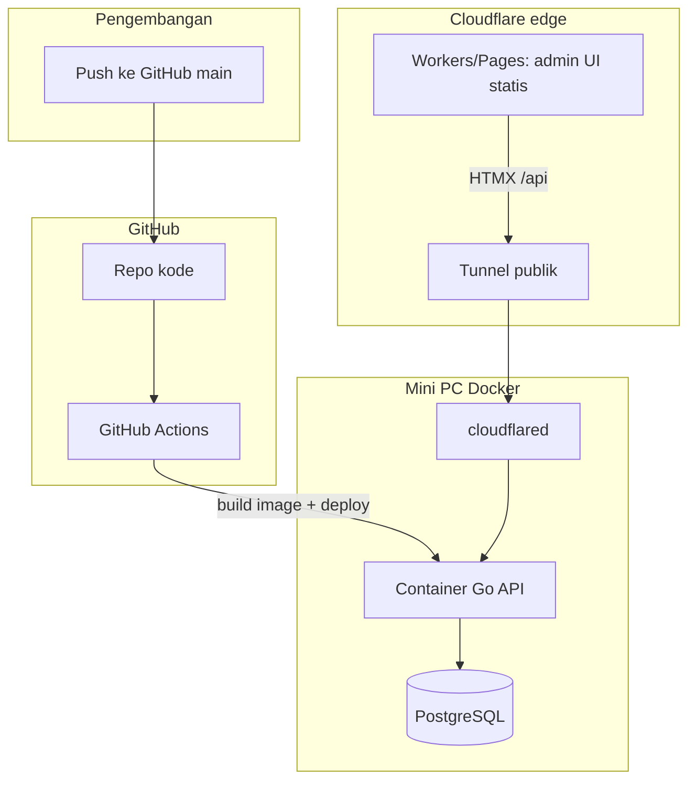

# Deploy Backend Go: GitHub → Mini PC (bukan manual `git pull`)

## Penting: apa peran GitHub?

| Peran | Bukan |
|-------|--------|
| GitHub = **gudang kode** + pemicu CI | GitHub **tidak menjalankan** Docker di rumah Anda secara otomatis tanpa pipeline |

Tanpa **GitHub Actions**, **runner di mini PC**, atau **webhook deploy**, server di mini PC **tidak tahu** ada push baru.  
`git pull` manual hanya salah satu cara update — Anda ingin cara **otomatis**; itu dibuat dengan CI/CD di bawah.

---

## Arsitektur lengkap

| Komponen | Di mana jalan |
|----------|----------------|
| Admin UI (`Frontend-admin/public`) | **Cloudflare Workers** (dari GitHub → CF build) — sudah Anda pakai |
| Backend Go | **Docker di mini PC** |
| PostgreSQL | **Docker di mini PC** (atau NAS) |
| cloudflared | **Mini PC** (systemd atau container) |
| Kredensial CF | **DB mini PC** (form admin Settings → Cloudflare) |

---

## Opsi deploy otomatis ke mini PC (pilih satu)

### Opsi A — GitHub Actions + SSH (paling umum)

1. Push ke `main` memicu workflow.
2. Action: `docker build` Backend → push image ke **GHCR** atau Docker Hub.
3. Action: SSH ke mini PC → `docker compose pull && docker compose up -d`.

Anda **tidak** perlu `git pull` di mini PC; yang di-pull adalah **image Docker** siap jalan.

### Opsi B — Self-hosted runner di mini PC (GitHub “build di rumah”)

1. Install **GitHub Actions runner** di mini PC (service).
2. Workflow jalan **langsung di mini PC**: build + `docker compose up -d --build`.
3. Kode di-clone runner dari GitHub otomatis tiap job.

Ini paling dekat dengan “GitHub yang build ke mini PC”.

### Opsi C — Watchtower (image sudah di registry)

1. CI hanya push image baru ke registry.
2. **Watchtower** di mini PC mendeteksi tag baru → restart container.

Mini PC tetap tidak perlu `git pull`.

### Opsi D — Webhook (Portainer / custom)

Mini PC jalankan webhook; GitHub Actions `curl` webhook setelah build sukses.

---

## Yang TIDAK disimpan di GitHub

- `DATABASE_URL`, `PIXEL_ENCRYPTION_KEY`, token Cloudflare (plaintext)
- Isi database production
- File `.env` di mini PC

Form admin **Settings → Cloudflare** mengisi DB di server; GitHub hanya menyimpan **kode** yang memproses form itu.

---

## Alur Super Admin (tanpa dashboard Cloudflare)

1. **Settings → Cloudflare → Koneksi** — API Token / Global API Key → Test & Simpan  
2. **Domain & env** — `API_BASE_URL`, `PRIMARY_DOMAIN`, sync Pages  
3. **Tunnel** — buat tunnel, salin `cloudflared service install`, atur routes `/api`  
4. **Pages** — repo/branch/build (mirror konfigurasi CF)  
5. **DNS** — Apply record ke zone  

Backend Go memanggil Cloudflare API; UI prototype di Workers memanggil backend via Tunnel setelah API hidup.

---

## Ringkas

| Pertanyaan | Jawaban |
|------------|---------|
| Backend di GitHub, jalan di mini PC? | Ya — via **Docker** di mini PC |
| Harus `git pull` manual? | **Tidak wajib** — pakai **CI/CD** (Actions + SSH atau self-hosted runner) |
| GitHub menjalankan server? | Tidak — GitHub **membangun & mengirim**; yang jalan tetap **mini PC** |
| Admin UI di workers.dev? | Terpisah — statis di Cloudflare; API di mini PC lewat Tunnel |

**Opsi A sudah di repo:** lihat `Frontend-admin/DEPLOY-OPSI-A.md`, workflow `.github/workflows/deploy-backend.yml`, dan `docker-compose.prod.yml`.
