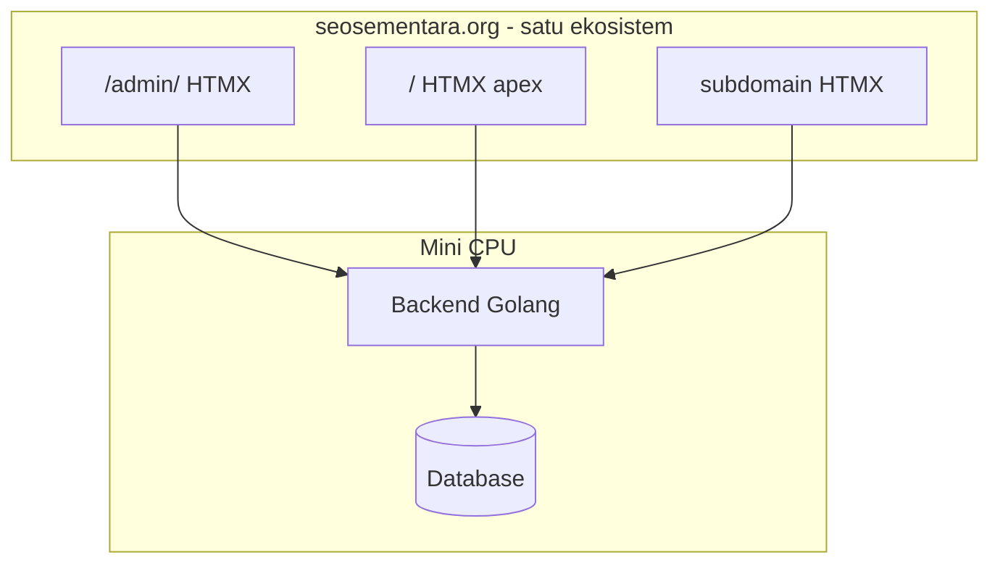

# 01 — Visi dan Gambaran Sistem CMS

## 1. Tujuan Produk

**Seosementara CMS** adalah sistem manajemen konten terpusat yang memungkinkan:

1. **Pekerja/internal** mengelola **ribuan domain portfolio**, konten, SEO, dan konfigurasi dari **`seosementara.org/admin/`** — dengan banyak pengguna bersamaan.
2. **Pengunjung publik** mengakses UI produk di **`seosementara.org`** dan **subdomain** (`bola.`, `cdn.`, `url.`, …) — bukan hostname terpisah per domain portfolio.
3. **Backend** berjalan efisien di **mini CPU**, melayani admin, API, dan semua frontend HTMX dari satu origin.

CMS ini dirancang untuk **skala operasional massal**: ribuan domain dikelola, banyak pekerja, subdomain layanan berbeda-beda.

## 2. Ruang Lingkup Sistem

### Dalam Lingkup

- Manajemen **ribuan domain portfolio** dari satu panel admin (`/admin/`)
- Konfigurasi **host & subdomain produk** (`/admin/setup/host`)
- CRUD konten (post, page, kategori, tag)
- Pengaturan SEO per konten dan per situs
- Manajemen media (upload, organisasi, optimasi dasar)
- Pengguna, peran, dan hak akses
- Operasi batch (publish massal, update meta, sinkronisasi)
- Dashboard monitoring ringan (status job, error, ringkasan)
- API REST/JSON untuk admin panel dan frontend customer

### Di Luar Lingkup (Fase Awal)

- Page builder drag-and-drop penuh
- E-commerce lengkap (cart, payment gateway)
- Hosting WordPress tradisional di dalam CMS ini
- Plugin marketplace pihak ketiga

Hal di luar lingkup dapat masuk roadmap fase berikutnya jika dibutuhkan.

## 3. Pembagian Tiga Lapisan

| Lapisan | URL | Pengguna |
|---------|-----|----------|
| Backend (Golang) | `/api/*` | Sistem |
| Admin Panel | `/admin/*` | Banyak pekerja — kelola ribuan domain |
| Frontend publik | `/` + `*.seosementara.org` | Pengunjung internet |
| Domain portfolio | Hanya data di DB | Bukan hostname frontend CMS |

Detail: [09-model-domain-host-dan-subdomain.md](./09-model-domain-host-dan-subdomain.md)

## 4. Prinsip Desain

### 4.1 Performa di Server Terbatas

Mini CPU memiliki batas CPU, RAM, dan I/O. Backend harus:

- Menghindari query yang memuat ribuan baris sekaligus
- Memakai pagination dan filter wajib di setiap list endpoint
- Menjalankan operasi massal sebagai **job terjadwal** dengan chunk, bukan satu request panjang
- Memperpanjang timeout hanya untuk job yang sudah diisolasi (bukan request web biasa)

### 4.2 Pemisahan Tampilan dan Data

Admin panel dan frontend customer **tidak** menyimpan state bisnis di browser. Semua data melalui API backend. HTMX hanya menukar fragmen HTML yang di-render server-side atau di-hydrate dari partial template.

### 4.3 Keamanan

- Autentikasi admin: session/token via backend
- Frontend publik: sebagian besar read-only; form (kontak, komentar jika ada) divalidasi dan di-rate-limit
- CORS ketat: hanya origin Cloudflare Pages yang diizinkan memanggil API
- Tidak mengekspos kredensial database ke edge (Pages)

### 4.4 Observabilitas Ringan

Log terstruktur (JSON), metric dasar (request count, latency, job queue depth), dan health endpoint `/health` untuk monitoring dari mini CPU.

## 5. Model Data Inti (Konsep)

Entitas utama yang akan dibahas lebih dalam di file **04** dan **07**:

| Entitas | Deskripsi singkat |
|---------|-------------------|
| `Site` | Satu domain / properti web |
| `User` | Akun admin dengan peran |
| `Post` / `Page` | Konten editorial |
| `Taxonomy` | Kategori, tag |
| `Media` | File gambar/dokumen |
| `SeoMeta` | Title, description, canonical, schema |
| `Job` | Antrian operasi batch |
| `Setting` | Konfigurasi per situs atau global |

## 6. Alur Kerja Utama

### Admin membuat konten

1. Login ke Admin Panel (Cloudflare Pages → API mini CPU)
2. Pilih situs target → buat draft post
3. Isi konten + meta SEO → simpan draft
4. Preview (partial HTMX) → publish
5. Backend invalidasi cache → frontend customer menampilkan versi baru

### Operasi massal

1. Admin memilih filter (mis. 500 post di situs X)
2. Panel mengirim permintaan job ke backend
3. Backend memproses per chunk (mis. 50 per iterasi)
4. Admin melihat progress di menu **Jobs / Antrian**

## 7. Pertanyaan Terbuka (Untuk Iterasi Berikutnya)

- Database utama: PostgreSQL vs SQLite (untuk mini CPU)?
- Apakah Redis wajib di fase 1 atau cukup cache in-memory + file?
- Strategi multi-tenant: satu DB dengan `site_id` vs DB per situs?
- CDN untuk media: R2 Cloudflare vs storage lokal mini CPU?

Catatan jawaban akan ditambahkan ke file **02**, **04**, dan **08** setelah keputusan diambil.

## 8. Dokumen Terkait

- Menu lengkap CMS → [03-menu-dan-modul-cms.md](./03-menu-dan-modul-cms.md)
- Stack & hosting → [02-arsitektur-dan-infrastruktur.md](./02-arsitektur-dan-infrastruktur.md)
- Roadmap → [08-roadmap-implementasi.md](./08-roadmap-implementasi.md)
