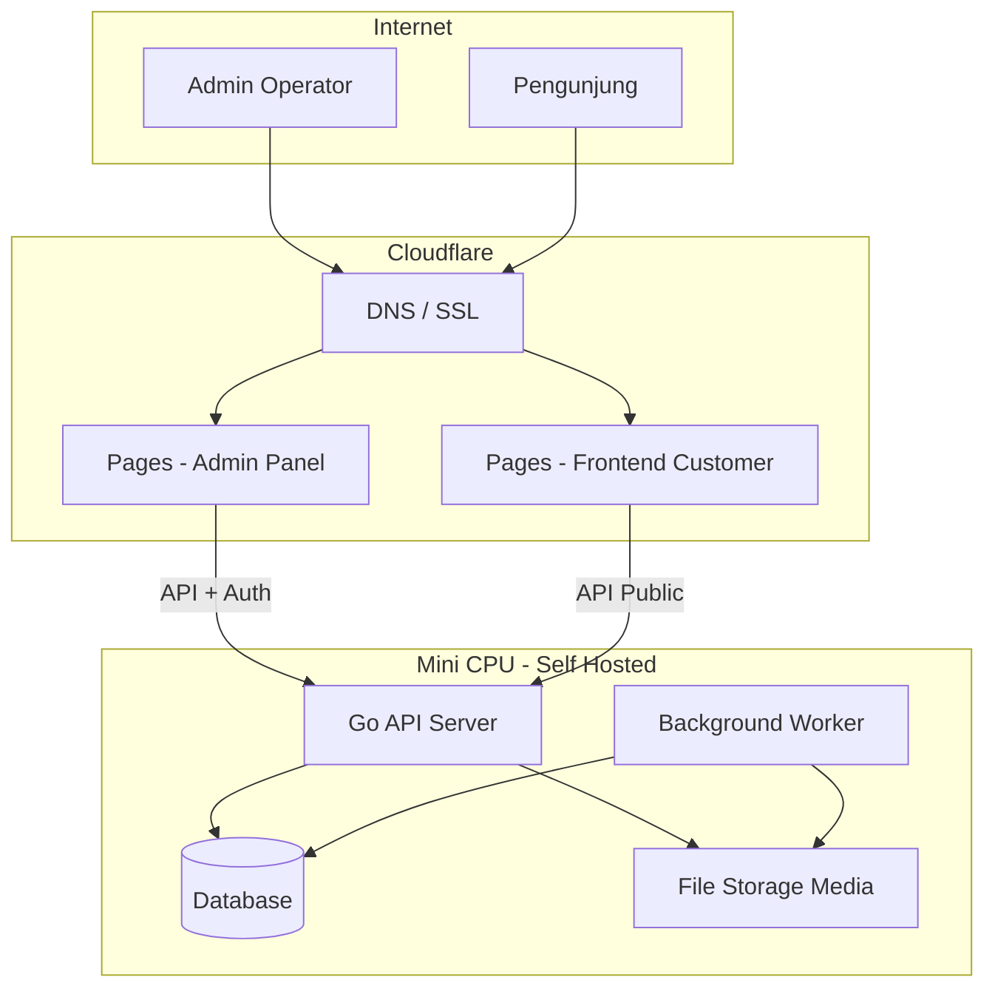

# 02 — Arsitektur dan Infrastruktur

## 1. Gambaran Deployment

## 2. Peran Setiap Komponen

### 2.1 Mini CPU — Backend Golang

**Fungsi:** satu-satunya mesin yang menyentuh database dan menjalankan logika bisnis.

| Aspek | Rekomendasi awal |
|-------|------------------|
| OS | Linux (Debian/Ubuntu minimal) |
| Proses | `api` (HTTP) + `worker` (job queue) — bisa satu binary dua mode |
| Reverse proxy | Caddy atau Nginx (TLS termination, rate limit) |
| Port | Hanya expose 443 ke internet; SSH terbatas/VPN |
| Resource | Monitor CPU/RAM; batasi worker concurrency (mis. 2–4 goroutine job) |

**Mengapa tidak host admin/users di mini CPU?**

- Traffic publik dan admin UI lebih cocok di edge (Cloudflare Pages) — CDN global, SSL otomatis, tanpa membebani CPU rumah.
- Mini CPU fokus ke API + DB + batch — beban yang bisa diprediksi.

### 2.2 Cloudflare Pages — Admin Panel

| Aspek | Detail |
|-------|--------|
| Isi | HTML statis + partial HTMX, CSS, JS minimal |
| Build | Opsional: templating saat build (Go `templ`, atau hand-written HTML) |
| Env | `API_BASE_URL` menunjuk ke domain API mini CPU (HTTPS) |
| Auth | Cookie/token dikelola via HTMX request ke API; tidak simpan secret di repo |

### 2.3 Cloudflare Pages — Frontend Customer

| Aspek | Detail |
|-------|--------|
| Isi | Template HTMX per tema/situs |
| Multi-site | Satu proyek Pages dengan routing per domain, atau beberapa proyek Pages per kelompok domain |
| Data | Hampir semua konten di-fetch dari API; halaman sangat cacheable di edge |

## 3. Jalur Jaringan dan Keamanan

### 3.1 DNS

- `api.seosementara.example` → tunnel atau IP rumah (Cloudflare Tunnel disarankan untuk mini CPU di belakang NAT)
- `admin.seosementara.example` → Cloudflare Pages (admin)
- `*.customer-domain.com` → Cloudflare Pages (users) atau proxy ke Pages project

### 3.2 Cloudflare Tunnel (Disarankan)

Mini CPU sering berada di jaringan rumah tanpa IP publik stabil. **cloudflared** tunnel:

- Menghindari buka port router
- TLS end-to-end
- DDoS protection di edge

### 3.3 CORS dan Origin

| Origin | Akses API |
|--------|-----------|
| Admin Pages URL | `/api/admin/*` + credentials |
| Customer Pages URL | `/api/public/*` read + form terbatas |
| Lainnya | Ditolak |

## 4. Penyimpanan

| Jenis | Lokasi | Catatan |
|-------|--------|---------|
| Data relasional | Mini CPU (PostgreSQL/SQLite) | Indeks pada `site_id`, `slug`, `status` |
| Media file | Lokal mini CPU atau R2 | R2 mengurangi beban disk rumah |
| Cache response | Redis lokal atau in-memory | TTL + invalidasi saat publish |
| Log | File rotasi + opsional forward | Jangan log isi konten sensitif |

## 5. Skalabilitas dalam Batas Mini CPU

| Risiko | Mitigasi |
|--------|----------|
| CPU spike saat batch | Queue + max concurrent jobs |
| RAM habis saat query besar | `LIMIT` wajib, cursor pagination |
| Disk penuh (media) | Kuota per situs, kompresi gambar, offload ke R2 |
| 503 timeout | Job async; response API < 2 detik untuk read |

## 6. Lingkungan (Environments)

| Env | Backend | Pages |
|-----|---------|-------|
| Local dev | `go run` di laptop | `wrangler pages dev` |
| Staging | Mini CPU atau VM kecil | Preview branch Pages |
| Production | Mini CPU | Production branch Pages |

## 7. Backup dan Recovery

- Database: dump harian otomatis ke storage eksternal
- Media: sync ke R2 atau NAS
- Konfigurasi: infrastruktur sebagai kode (script systemd, Caddyfile) di repo terpisah

## 8. Dokumen Terkait

- Backend detail → [04-backend-golang.md](./04-backend-golang.md)
- API & CORS → [07-api-dan-integrasi.md](./07-api-dan-integrasi.md)
- Admin / Users UI → [05](./05-admin-panel-htmx.md), [06](./06-frontend-users-htmx.md)
