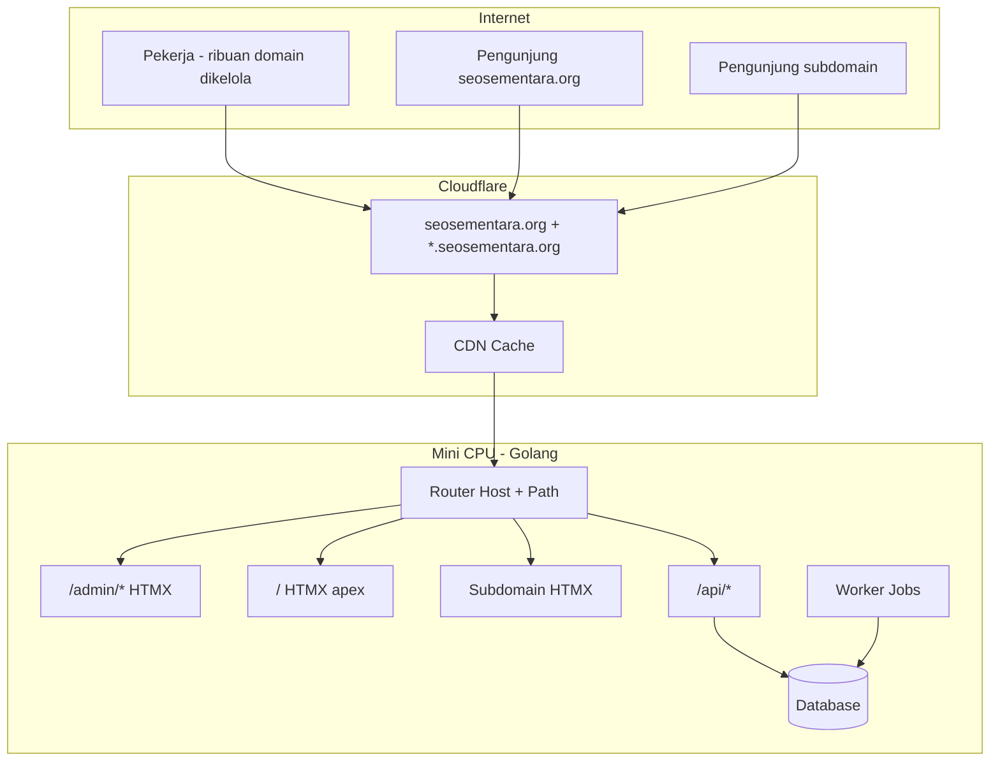

# 02 — Arsitektur dan Infrastruktur

> **Model domain lengkap:** [09-model-domain-host-dan-subdomain.md](./09-model-domain-host-dan-subdomain.md)

## 1. Gambaran Deployment (Revisi)

Satu ekosistem hostname **`seosementara.org`** (nama contoh) — backend, admin, dan frontend publik **satu origin** di mini CPU, dengan Cloudflare di depan sebagai DNS + proxy + cache.

## 2. Peran Setiap Komponen

### 2.1 Mini CPU — Backend Golang (Origin tunggal)

| Tugas | Detail |
|-------|--------|
| HTTP server | Melayani **semua** route: `/admin/`, `/`, subdomain, `/api/` |
| Router | `Host` header + `path` → template HTMX yang benar |
| Worker | Job batch untuk ribuan domain portfolio |
| DB | Domain portfolio, konten, config host/subdomain, user pekerja |

| Aspek | Rekomendasi |
|-------|-------------|
| Reverse proxy | Caddy/Nginx di depan Go (opsional jika Go langsung listen) |
| TLS | Cloudflare Tunnel atau Full SSL |
| Concurrency worker | 2–4 job paralel (sesuaikan mini CPU) |

### 2.2 Cloudflare (Edge)

| Fungsi | Detail |
|--------|--------|
| DNS apex | `seosementara.org` → Tunnel / origin |
| DNS wildcard | `*.seosementara.org` → Tunnel / origin |
| Cache | Static asset + response publik (hati-hati jangan cache `/admin/` dengan cookie) |
| Tunnel | Disarankan untuk mini CPU di belakang NAT |

**Bukan:** ribuan custom domain di Pages untuk setiap domain portfolio.

### 2.3 Folder repo `Frontend-admin/` & `Frontend-Users/`

Sumber **template** HTMX/CSS:

- Di-embed ke Go (`embed.FS`) **atau**
- Di-copy saat build/deploy ke mini CPU

Routing dilakukan Go — bukan proyek hostname terpisah per domain customer.

## 3. Peta Path & Host

| Request | Handler |
|---------|---------|
| `seosementara.org/` | Frontend customer (apex) |
| `seosementara.org/admin/*` | Admin panel HTMX |
| `seosementara.org/api/admin/*` | API admin |
| `seosementara.org/api/public/*` | API publik |
| `bola.seosementara.org/*` | Template subdomain (config DB) |
| `cdn.seosementara.org/*` | Template subdomain CDN |
| … | Didaftarkan di **admin/setup/host** |

Lihat contoh subdomain di [09](./09-model-domain-host-dan-subdomain.md).

## 4. Domain Portfolio vs Domain Produk

| | Domain produk | Domain portfolio |
|--|---------------|------------------|
| Jumlah | Sedikit (1 apex + N subdomain) | **Ribuan** |
| DNS publik domain portfolio | Mungkin mengarah ke infrastruktur publik domain tersebut (terpisah dari UI produk) |
| Frontend HTMX | Ya | **Tidak** — hanya data di admin |
| Contoh | `url.seosementara.org` | `toko-abc.com`, `blog-xyz.net` |

## 5. Skala: Ribuan Domain + Banyak Pekerja

| Area | Strategi |
|------|----------|
| Admin list domain | Pagination 50, search indexed, filter status |
| Site switcher | Hanya domain **milik** + **dibagikan** ke pekerja |
| RBAC | Super Admin global; pekerja terisolasi per ownership + share |
| Session | Banyak login simultan; audit log |
| Bulk | Job async — tidak satu request untuk 1000 domain |

## 6. Penyimpanan

| Jenis | Lokasi |
|-------|--------|
| DB | PostgreSQL/SQLite di mini CPU |
| `hosts` table | Config subdomain → template |
| `managed_domains` | Ribuan domain portfolio |
| Media | Lokal atau R2 (`cdn.` subdomain bisa expose aset) |
| Cache | Redis/in-memory + Cloudflare cache rules |

## 7. Aturan Cache Cloudflare

| Path / Host | Cache |
|-------------|-------|
| `/admin/*` | **Bypass** (private) |
| `/api/admin/*` | Bypass |
| `/` publik | Cache sesuai `Cache-Control` |
| Subdomain publik | Per-host rule |
| Static `/assets/*` | Long cache |

## 8. Lingkungan

| Env | URL contoh |
|-----|------------|
| Local | `localhost:8080/admin/` |
| Staging | `staging.seosementara.org` |
| Production | `seosementara.org` |

## 9. Dokumen Terkait

- Model domain → [09](./09-model-domain-host-dan-subdomain.md)
- Menu Setup → Host → [03](./03-menu-dan-modul-cms.md)
- Backend routing → [04](./04-backend-golang.md)
