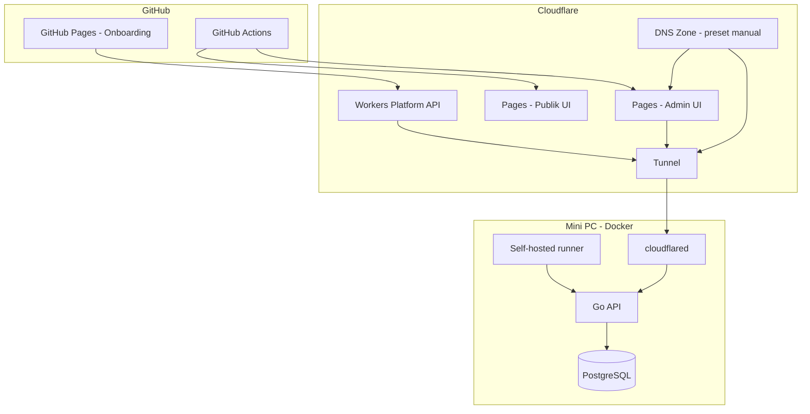

# 02 — Arsitektur dan Infrastruktur

> **Model domain:** [09-model-domain-host-dan-subdomain.md](./09-model-domain-host-dan-subdomain.md)  
> **Bootstrap pertama:** [28-platform-github-workers.md](./28-platform-github-workers.md)

## 1. Gambaran Deployment

Satu ekosistem **`seosementara.org`**:

- **Onboarding (sekali):** GitHub Pages → Workers Platform API  
- **Admin CMS:** Cloudflare Pages → Tunnel → Go API (mini PC)  
- **Frontend publik:** Cloudflare Pages (+ subdomain via Tunnel)  
- **Backend + DB:** Docker di mini PC — **tanpa** source code di disk

## 2. Peran Komponen

### 2.1 Mini PC (Docker only)

| Tugas | Detail |
|-------|--------|
| HTTP API | `127.0.0.1:8080` — `/api/*` |
| cloudflared | Outbound Tunnel |
| PostgreSQL | Container + volume |
| Runner | GitHub Actions self-hosted |
| Job worker | Batch CMS |

**Tidak ada:** repo Git, `.env` file, binary manual di `/opt/`.

### 2.2 Cloudflare Pages

| Proyek | Folder | URL |
|--------|--------|-----|
| Admin CMS | `Frontend-Ui-Admin/public/` | `seosementara.org/admin/*` |
| Publik | `Frontend-Publik/public/` | `seosementara.org/` |

Deploy pertama via onboarding ([28](./28-platform-github-workers.md) §4 langkah 9).

### 2.3 GitHub Pages (Onboarding saja)

| Folder | URL |
|--------|-----|
| `Frontend-Onboarding/public/` | `https://<org>.github.io/Seosementara/` |

Auto-deploy tiap push — **tanpa** Tunnel/CF token untuk hosting HTML onboarding.

### 2.4 Cloudflare Tunnel

| Route | Target |
|-------|--------|
| `/api/*` | `http://127.0.0.1:8080` |
| `*.seosementara.org` (subdomain) | Go router |

Dibuat dari onboarding via CF API ([28](./28-platform-github-workers.md)).

## 3. Peta Path & Host

| Request | Handler |
|---------|---------|
| `seosementara.org/admin/*` | Admin UI (CF Pages) + HTMX → `/api/admin/*` |
| `seosementara.org/api/*` | Go API (Tunnel) |
| `seosementara.org/` | Frontend publik |
| `bola.seosementara.org/*` | Subdomain template (DB `hosts`) |

Kelola host produk: `/admin/settings/host` ([27](./27-admin-panel-desain-ui-navigasi.md)).

## 4. Domain Portfolio vs Produk

| | Domain produk | Domain portfolio |
|--|---------------|------------------|
| Frontend HTMX | Ya (CF Pages + subdomain) | **Tidak** — data di DB admin |
| Jumlah | Sedikit | Ribuan |

## 5. Skala

Strategi pagination, RBAC, job async — unchanged ([03](./03-menu-dan-modul-cms.md), [10](./10-database-postgresql.md)).

## 6. Penyimpanan

| Jenis | Lokasi |
|-------|--------|
| DB | PostgreSQL container mini PC |
| Secrets infra | GitHub Secrets + Workers Secrets |
| Config operasional | PostgreSQL `system_settings` (post-bootstrap) |
| Media | Volume Docker / R2 (fase lanjut) |

## 7. Cache Cloudflare

| Path | Cache |
|------|-------|
| `/admin/*` | Bypass |
| `/api/admin/*` | Bypass |
| Publik GET | Sesuai `Cache-Control` |

## 8. Lingkungan

| Env | Catatan |
|-----|---------|
| **Bootstrap** | GitHub Pages onboarding → prod infra |
| **Production** | `seosementara.org` |

Tidak ada dependency **localhost** untuk deploy produksi. Detail CI/CD: [16](./16-deploy-dan-lingkungan.md).

## 9. Dokumen Terkait

- Bootstrap → [28](./28-platform-github-workers.md)
- Frontend → [29](./29-frontend-admin-dan-onboarding.md)
- Deploy → [16](./16-deploy-dan-lingkungan.md)
- Cloudflare Settings → [15](./15-setup-cloudflare-integrasi.md)
