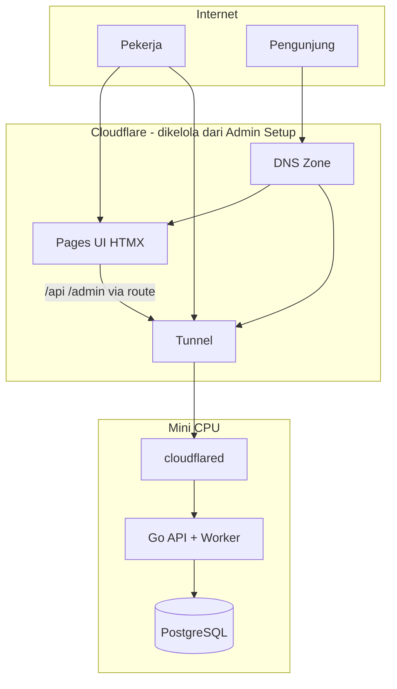

# 02 — Arsitektur dan Infrastruktur

> **Model domain lengkap:** [09-model-domain-host-dan-subdomain.md](./09-model-domain-host-dan-subdomain.md)

## 1. Gambaran Deployment (Revisi)

Satu ekosistem **`seosementara.org`** — **UI di Cloudflare Pages**, **API/backend di mini CPU** via **Cloudflare Tunnel**, dikonfigurasi dari **admin panel** ([15-setup-cloudflare-integrasi.md](./15-setup-cloudflare-integrasi.md)).

## 2. Peran Setiap Komponen

### 2.1 Mini CPU — Backend Golang + cloudflared

| Tugas | Detail |
|-------|--------|
| HTTP server | `127.0.0.1:8080` — API `/api/*`, logic, HTMX partial (jika route ke Go) |
| cloudflared | Outbound Tunnel — **tanpa buka port router** |
| Worker | Job batch, wrangler deploy (opsional), sync Cloudflare |
| DB | PostgreSQL + config CF terenkripsi |

| Aspek | Rekomendasi |
|-------|-------------|
| TLS | Di terminasi Cloudflare (edge) |
| Concurrency worker | 2–4 job paralel |

### 2.2 Cloudflare Pages — UI HTMX

| Proyek | Folder | URL |
|--------|--------|-----|
| Admin UI | `Frontend-admin/` | `seosementara.org/admin/*` |
| Publik | `Frontend-Users/` | `seosementara.org/` |

Env vars (`PRIMARY_DOMAIN`, `API_BASE_URL`, …) di-sync dari **Setup → Cloudflare → Domain utama**.

### 2.3 Cloudflare Tunnel — backend

| Route contoh | Target |
|--------------|--------|
| `/api/*` | `http://127.0.0.1:8080` |
| `*.seosementara.org` (subdomain) | Go router (template per host) |

Setup lengkap: [15-setup-cloudflare-integrasi.md](./15-setup-cloudflare-integrasi.md).

**Bukan:** ribuan domain portfolio di Pages — hanya UI produk Seosementara.

## 3. Peta Path & Host

| Request | Handler |
|---------|---------|
| `seosementara.org/` | Frontend customer (apex) |
| `seosementara.org/admin/*` | Admin panel HTMX |
| `seosementara.org/api/admin/*` | API admin |
| `seosementara.org/api/public/*` | API publik |
| `bola.seosementara.org/*` | Template subdomain (config DB) |
| `cdn.seosementara.org/*` | Template subdomain CDN |
| … | Didaftarkan di **admin/setup/host** |

Lihat contoh subdomain di [09](./09-model-domain-host-dan-subdomain.md).

## 4. Domain Portfolio vs Domain Produk

| | Domain produk | Domain portfolio |
|--|---------------|------------------|
| Jumlah | Sedikit (1 apex + N subdomain) | **Ribuan** |
| DNS publik domain portfolio | Mungkin mengarah ke infrastruktur publik domain tersebut (terpisah dari UI produk) |
| Frontend HTMX | Ya | **Tidak** — hanya data di admin |
| Contoh | `url.seosementara.org` | `toko-abc.com`, `blog-xyz.net` |

## 5. Skala: Ribuan Domain + Banyak Pekerja

| Area | Strategi |
|------|----------|
| Admin list domain | Pagination 50, search indexed, filter status |
| Site switcher | Hanya domain **milik** + **dibagikan** ke pekerja |
| RBAC | Super Admin global; pekerja terisolasi per ownership + share |
| Session | Banyak login simultan; audit log |
| Bulk | Job async — tidak satu request untuk 1000 domain |

## 6. Penyimpanan

| Jenis | Lokasi |
|-------|--------|
| DB | PostgreSQL/SQLite di mini CPU |
| `hosts` table | Config subdomain → template |
| `managed_domains` | Ribuan domain portfolio |
| Media | Lokal atau R2 (`cdn.` subdomain bisa expose aset) |
| Cache | Redis/in-memory + Cloudflare cache rules |

## 7. Aturan Cache Cloudflare

| Path / Host | Cache |
|-------------|-------|
| `/admin/*` | **Bypass** (private) |
| `/api/admin/*` | Bypass |
| `/` publik | Cache sesuai `Cache-Control` |
| Subdomain publik | Per-host rule |
| Static `/assets/*` | Long cache |

## 8. Lingkungan & Deploy

| Env | URL contoh |
|-----|------------|
| Local | `localhost:8080/admin/` |
| Staging | `staging.seosementara.org` |
| Production | `seosementara.org` |

Runbook lengkap: **[16-deploy-dan-lingkungan.md](./16-deploy-dan-lingkungan.md)**.

## 9. Dokumen Terkait

- Deploy → [16-deploy-dan-lingkungan.md](./16-deploy-dan-lingkungan.md)
- Model domain → [09](./09-model-domain-host-dan-subdomain.md)
- Menu Setup → Host → [03](./03-menu-dan-modul-cms.md)
- Backend routing → [04](./04-backend-golang.md)
