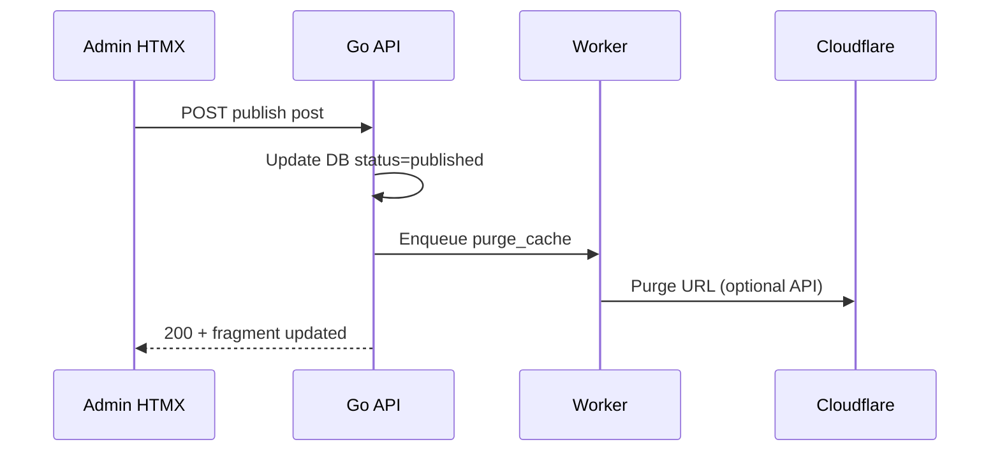

# 07 — API dan Integrasi Antar Lapisan

## 1. Prinsip API

| Prinsip | Implementasi |
|---------|--------------|
| RESTful | Resource-oriented URL, verb HTTP standar |
| Versioning | Prefix `/api/v1` (opsional di MVP) |
| Format admin | HTML partial **atau** JSON — MVP: partial HTML untuk HTMX admin |
| Format public | HTML partial untuk HTMX customer |
| Error | JSON `{ "error": { "code", "message" } }` atau HTML alert fragment |

## 2. Pembagian Namespace

```
/api/admin/*     → Auth required, RBAC
/api/public/*    → Read mostly, rate limited
/health            → No auth
```

## 3. Routing Request (Host + Path)

Backend memilih handler berdasarkan:

1. **`Host`** — `seosementara.org` vs `bola.seosementara.org` (lookup tabel `hosts`)
2. **`Path`** — `/admin/`, `/api/`, `/` 

| Host | Path | Handler |
|------|------|---------|
| apex | `/admin/*` | HTML admin HTMX |
| apex | `/api/admin/*` | JSON/HTML admin API |
| apex | `/api/public/*` | API publik apex |
| apex | `/` | HTML publik apex |
| subdomain | `/*` | HTML/API sesuai `template_id` di Setup → Host |

## 3b. Autentikasi

### Login admin

```http
POST /api/admin/auth/login
Content-Type: application/json

{ "email": "...", "password": "..." }
```

Response:

```http
Set-Cookie: session=...; HttpOnly; Secure; SameSite=None; Path=/
```

### Request berikutnya

```http
GET /api/admin/posts?site_id=1&limit=20
Cookie: session=...
X-Site-ID: 1
```

### Logout

```http
POST /api/admin/auth/logout
```

## 4. CORS

Dengan model **sama origin** (`seosementara.org` untuk `/admin/` dan `/api/`), CORS **minimal** untuk HTMX admin.

| Skenario | CORS |
|----------|------|
| HTMX `/admin/` → `/api/admin/` | Tidak perlu (same origin) |
| Subdomain → API apex | Opsional: tentukan apakah API terpusat di apex saja |
| Integrasi eksternal | Whitelist origin khusus |

Jika API publik subdomain memanggil apex: set `Access-Control-Allow-Origin` hanya untuk host produk yang dikenal.

### Header sesi admin

| Header | Fungsi |
|--------|--------|
| `X-Managed-Domain-ID` | Domain portfolio yang sedang aktif di UI |
| `HX-Request` | Deteksi partial response |

## 5. Endpoint Admin (Ringkas)

### Domain portfolio (ribuan — native CMS, bukan WP)

| Method | Path | Deskripsi | Akses |
|--------|------|-----------|-------|
| GET | `/api/admin/managed-domains` | List milik + shared (+ semua jika super) | Owner/share/SA |
| POST | `/api/admin/managed-domains` | Tambah domain; owner = user login | Authenticated |
| GET | `/api/admin/managed-domains/{id}` | Detail | Owner/share/SA |
| PATCH | `/api/admin/managed-domains/{id}` | Update | Owner/co_admin share/SA |
| DELETE | `/api/admin/managed-domains/{id}` | Hapus / arsip | Owner/SA |

### Berbagi kepemilikan domain

| Method | Path | Deskripsi | Perilaku |
|--------|------|-----------|----------|
| GET | `/api/admin/managed-domains/{id}/shares` | Daftar share aktif | — |
| POST | `/api/admin/managed-domains/{id}/shares` | Body: `user_id`, `preset`, `permissions` {} | Owner/SA: aktif; Co-admin: pending |
| DELETE | `/api/admin/managed-domains/{id}/shares/{userId}` | Cabut share | Owner / SA |

### Undangan share (persetujuan owner)

| Method | Path | Deskripsi | Siapa |
|--------|------|-----------|-------|
| GET | `/api/admin/managed-domains/{id}/share-invitations` | List pending | Owner, SA |
| GET | `/api/admin/share-invitations/pending` | Semua pending untuk owner (notifikasi) | Owner |
| POST | `/api/admin/share-invitations/{id}/approve` | Setujui → aktifkan share | Owner, SA |
| POST | `/api/admin/share-invitations/{id}/reject` | Tolak undangan | Owner, SA |
| DELETE | `/api/admin/share-invitations/{id}` | Batalkan (pembuat co-admin) | Co-admin pembuat |

### Transfer ownership (Super Admin)

| Method | Path | Deskripsi |
|--------|------|-----------|
| POST | `/api/admin/managed-domains/{id}/transfer-owner` | Body: `{ "new_owner_user_id" }` — owner lama **tanpa akses** |
| | | Hanya **Super Admin**; hapus share owner lama; audit + notifikasi wajib |

### Notifikasi

| Method | Path | Deskripsi |
|--------|------|-----------|
| GET | `/api/admin/notifications` | List belum dibaca (paginated) |
| PATCH | `/api/admin/notifications/{id}/read` | Tandai dibaca |

### Auth — [12](./12-autentikasi-dan-login-aman.md)

| Method | Path |
|--------|------|
| POST | `/api/admin/auth/login` |
| POST | `/api/admin/auth/logout` |
| GET | `/api/admin/auth/me` |

### Setup — [13](./13-setup-backend-dan-sistem.md), [14](./14-setup-meta-dan-seo.md)

| Method | Path |
|--------|------|
| GET/PATCH | `/api/admin/setup/settings` |
| GET/PATCH | `/api/admin/setup/meta/global` |
| GET/PATCH | `/api/admin/hosts/{id}/meta` |
| GET/PATCH | `/api/admin/managed-domains/{id}/meta` |

### Setup → Host (Super Admin saja)

Middleware: `RequireSuperAdmin` pada semua `/api/admin/hosts/*`.

### Setup → Host (subdomain produk)

| Method | Path | Deskripsi |
|--------|------|-----------|
| GET | `/api/admin/hosts` | List host/subdomain |
| POST | `/api/admin/hosts` | Daftarkan host baru |
| PATCH | `/api/admin/hosts/{id}` | Update template / enabled |
| DELETE | `/api/admin/hosts/{id}` | Nonaktifkan |

### Post

| Method | Path | Deskripsi |
|--------|------|-----------|
| GET | `/api/admin/posts` | List (`site_id`, `status`, `cursor`, `limit`) |
| POST | `/api/admin/posts` | Buat draft |
| GET | `/api/admin/posts/{id}` | Detail + SEO meta |
| PATCH | `/api/admin/posts/{id}` | Update |
| POST | `/api/admin/posts/{id}/publish` | Publish |
| DELETE | `/api/admin/posts/{id}` | Soft delete |

### Media

| Method | Path | Deskripsi |
|--------|------|-----------|
| GET | `/api/admin/media` | List |
| POST | `/api/admin/media/upload` | Multipart upload |
| DELETE | `/api/admin/media/{id}` | Hapus |

### SEO

| Method | Path | Deskripsi |
|--------|------|-----------|
| GET | `/api/admin/seo/site/{site_id}` | Settings |
| PATCH | `/api/admin/seo/site/{site_id}` | Update |
| POST | `/api/admin/seo/bulk` | Enqueue bulk job |

### Jobs

| Method | Path | Deskripsi |
|--------|------|-----------|
| GET | `/api/admin/jobs` | List |
| GET | `/api/admin/jobs/{id}` | Status + progress |
| POST | `/api/admin/jobs/{id}/retry` | Retry failed |

### Dashboard

| Method | Path | Deskripsi |
|--------|------|-----------|
| GET | `/api/admin/dashboard` | HTML partial ringkasan |

## 6. Endpoint Public (Customer)

| Method | Path | Deskripsi | Cache |
|--------|------|-----------|-------|
| GET | `/api/public/sites/by-host` | Resolve site dari Host header | 5m |
| GET | `/api/public/home` | Fragment beranda | 60s |
| GET | `/api/public/posts` | List published | 60s |
| GET | `/api/public/posts/{slug}` | Artikel | 5m |
| GET | `/api/public/pages/{slug}` | Halaman statis | 5m |
| GET | `/api/public/sitemap.xml` | Sitemap | 1h |
| POST | `/api/public/forms/contact` | Form kontak | no cache |

Semua public list **wajib** `limit` default 20, max 50.

## 7. Header HTMX

Backend dapat mendeteksi request HTMX:

| Header | Penggunaan |
|--------|------------|
| `HX-Request: true` | Return partial tanpa layout penuh |
| `HX-Target` | Validasi target yang diizinkan |
| `HX-Trigger` | Logging / analytics |

Response:

| Header | Penggunaan |
|--------|------------|
| `HX-Redirect` | Redirect setelah login |
| `HX-Trigger` | Toast notification client |
| `HX-Retarget` | Ganti elemen swap |

## 8. Rate Limiting

| Kelompok | Limit (contoh) |
|----------|----------------|
| Public read | 120 req/menit per IP |
| Public form POST | 10 req/menit per IP |
| Admin API | 300 req/menit per user |
| Login | 5 percobaan/menit per IP |

Implementasi: middleware token bucket in-memory atau Redis.

## 9. Invalidasi Cache (Alur Publish)



## 10. Kontrak Error

| HTTP | Code | Arti |
|------|------|------|
| 400 | `validation_error` | Input tidak valid |
| 401 | `unauthorized` | Belum login |
| 403 | `forbidden` | RBAC gagal |
| 404 | `not_found` | Resource tidak ada |
| 409 | `conflict` | Slug duplikat |
| 429 | `rate_limited` | Terlalu banyak request |
| 500 | `internal_error` | Log di server, pesan generik ke client |

## 11. Webhook (Opsional)

Admin pengaturan dapat mendaftarkan webhook:

- `content.published`
- `job.completed`
- `job.failed`

Payload JSON + HMAC signature.

## 12. Dokumen Terkait

- Backend implementasi → [04-backend-golang.md](./04-backend-golang.md)
- Admin HTMX → [05-admin-panel-htmx.md](./05-admin-panel-htmx.md)
- Users HTMX → [06-frontend-users-htmx.md](./06-frontend-users-htmx.md)
