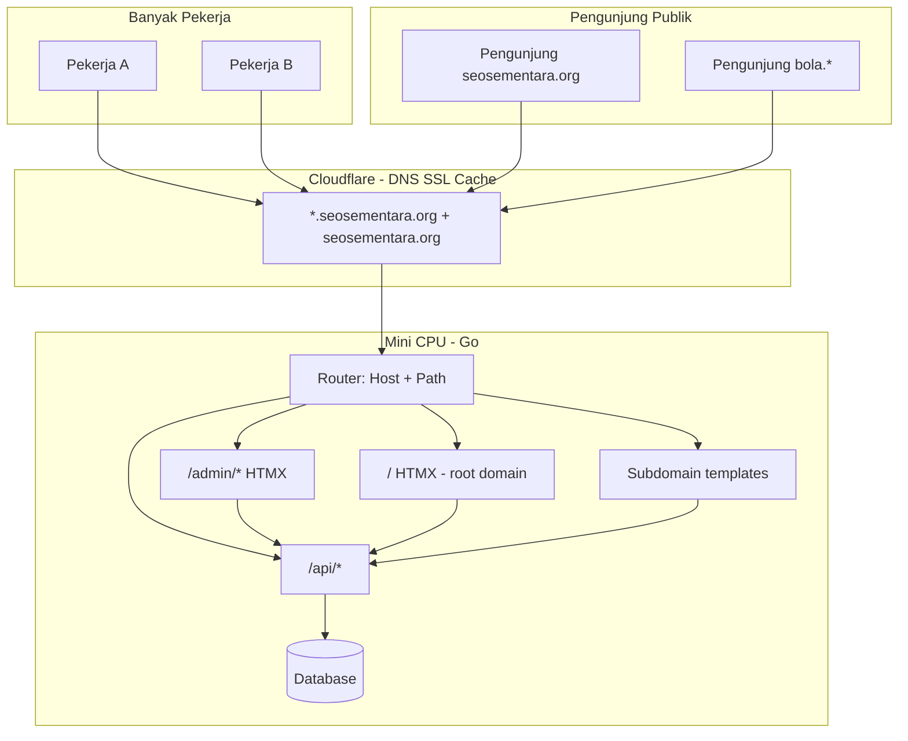

# 09 — Model Domain, Host, dan Subdomain

Dokumen ini merangkum keputusan arsitektur dari diskusi desain. File lain (01–08) harus selaras dengan model di sini.

## 1. Konsep Inti (Wajib Dipahami)

Ada **dua kelompok "domain"** yang berbeda:

| Kelompok | Contoh | Fungsi |
|----------|--------|--------|
| **Domain produk (sistem)** | `seosementara.org`, `bola.seosementara.org` | Tempat UI admin, UI publik produk, dan layanan subdomain berjalan |
| **Domain yang dikelola (portfolio)** | Ribuan domain proyek (milik pekerja) | **Situs native CMS** di database — **bukan** WordPress, **bukan** hostname frontend terpisah |

**Frontend customer** = tampilan publik **domain backend** (`seosementara.org` dan subdomain-nya), **bukan** satu frontend HTMX per domain portfolio.

**Admin panel** = path **`/admin/`** di domain utama, mis. `https://seosementara.org/admin/`.

## 2. Peta URL

### 2.1 Domain utama — `seosementara.org`

| Path / area | Pengguna | Contoh URL |
|-------------|----------|------------|
| `/` | Pengunjung produk | `https://seosementara.org/` |
| `/blog/...` | Konten publik (jika ada) | `https://seosementara.org/blog/artikel` |
| `/admin/` | Pekerja / operator internal | `https://seosementara.org/admin/` |
| `/admin/login` | Login pekerja | `https://seosementara.org/admin/login` |
| `/api/admin/*` | API admin (sama origin) | `https://seosementara.org/api/admin/posts` |
| `/api/public/*` | API publik | `https://seosementara.org/api/public/home` |

### 2.2 Subdomain — layanan berbeda, UI berbeda

Setiap subdomain punya **tampilan HTMX sendiri** (template, menu, fungsi), tetap di ekosistem `seosementara.org`:

| Subdomain (contoh) | Peran (draft) |
|--------------------|---------------|
| `bola.seosementara.org` | Modul/layanan Bola — UI khusus |
| `cdn.seosementara.org` | CDN / aset / delivery |
| `url.seosementara.org` | Short URL / redirect |
| `ads.seosementara.org` | Iklan / kampanye |
| `comments.seosementara.org` | Komentar |
| `review.seosementara.org` | Ulasan |
| *(dinamis)* | Super Admin bisa **tambah / ubah / nonaktifkan** kapan saja |

Subdomain **bukan** domain portfolio ribuan — itu entri terpisah di modul **Setup → Host**.

**Hak subdomain:** hanya **Super Admin** yang boleh menambah, mengganti, atau menonaktifkan host/subdomain. Pekerja biasa **tidak** mengakses `/admin/setup/host`.

### 2.3 Domain portfolio (ribuan) — situs native CMS

- Disimpan sebagai record: `managed_domains` — **bukan instalasi WordPress**
- Setiap domain punya **pemilik** (`owner_user_id`) — pekerja yang mendaftarkan / ditetapkan sebagai owner
- Konten, SEO, media, batch di dalam CMS untuk domain tersebut
- Pekerja hanya melihat & mengedit domain **milik sendiri**, kecuali ada **shared ownership** (lihat §7)

## 3. Diagram Arsitektur



## 4. Konfigurasi Host di Admin

Semua subdomain dan binding host dikelola di:

**`https://seosementara.org/admin/setup/host`**

| Field (konsep) | Keterangan |
|----------------|------------|
| `hostname` | `bola.seosementara.org` atau apex |
| `type` | `apex` \| `subdomain` \| `path_prefix` |
| `template_id` | UI HTMX mana yang dipakai |
| `enabled` | Aktif / maintenance |
| `notes` | Keterangan operator |

Tanpa entri di **Setup → Host**, subdomain tidak dilayani (404 atau halaman default).

**Lifecycle subdomain (Super Admin):**

1. Tambah host baru (hostname + template)
2. Ubah template / catatan / status aktif
3. Nonaktifkan atau ganti subdomain (hostname lama → redirect/maintenance opsional)
4. Daftar subdomain selalu **dinamis** — tidak fixed di kode

## 5. Routing di Backend (Go)

Pseudo-logic:

```go
func route(req) {
  host := normalizeHost(req.Host)   // bola.seosementara.org
  path := req.URL.Path

  switch {
  case host == "seosementara.org" && strings.HasPrefix(path, "/admin/"):
    serveAdminHTMX(host, path)
  case host == "seosementara.org" && strings.HasPrefix(path, "/api/"):
    serveAPI(path)
  case host == "seosementara.org":
    servePublicHTMX(path)           // frontend customer - apex
  default:
    h := lookupHostConfig(host)     // dari DB, diisi via admin/setup/host
    if h == nil { return 404 }
    serveSubdomainHTMX(h, path)
  }
}
```

## 6. Skala: Ribuan Domain + Banyak Pekerja

### 6.1 Ribuan domain (portfolio)

| Tantangan | Solusi |
|-----------|--------|
| List domain lambat | Pagination + search + index `(status, name)` |
| Filter operasi | Wajib pilih / filter domain sebelum bulk job |
| Batch | Job queue per chunk; tidak load 1000 sekaligus |
| Audit | Siapa mengubah domain X — log aktivitas |

### 6.2 Banyak pekerja (concurrent)

| Tantangan | Solusi |
|-----------|--------|
| Tabrakan edit | Optional: lock optimistik `updated_at` / pesan konflik |
| Isolasi data | Query selalu filter `owner OR shared` — lihat §7 |
| Beban login | Session terpisah; rate limit login |
| Dashboard pekerja | Hanya agregat domain milik + shared — bukan global 1000 domain |

## 7. Kepemilikan Domain & Berbagi (Ownership)

### 7.1 Aturan utama

| Aturan | Detail |
|--------|--------|
| Bukan WordPress | Domain portfolio = entitas CMS native; tidak ada plugin/tema WP |
| Pemilik | Setiap `managed_domain` punya **satu owner** (`owner_user_id`) |
| Akses default | Pekerja **hanya** CRUD domain yang mereka miliki |
| Super Admin | Melihat **semua** domain; bisa ubah owner; kelola subdomain |
| Berbagi | Owner bisa **share** ke pekerja/admin lain → co-admin pada domain itu |

### 7.2 Model data (konsep)

```
managed_domains
  id, name, owner_user_id, status, ...

domain_shares
  managed_domain_id, user_id, role (co_admin | editor | viewer), invited_by, created_at
```

### 7.3 Alur berbagi kepemilikan

1. Owner buka domain → **Berbagi akses** → pilih user + peran share
2. User yang di-share melihat domain di site switcher & daftar "Domain dibagikan"
3. Owner bisa cabut share kapan saja
4. Super Admin bisa override (audit, pindah owner, hapus share)

### 7.4 Query scope (wajib di backend)

```sql
-- List domain untuk user biasa (bukan super admin)
WHERE owner_user_id = :uid
   OR id IN (SELECT managed_domain_id FROM domain_shares WHERE user_id = :uid)
```

Semua endpoint `/api/admin/managed-domains/{id}/*` harus cek akses ini sebelum mutasi.

### 7.5 Matriks akses ringkas

| Aksi | Super Admin | Owner domain | User di-share |
|------|:-----------:|:------------:|:-------------:|
| Lihat semua domain | ✓ | — | — |
| Lihat domain sendiri | ✓ | ✓ | ✓ (hanya yang di-share) |
| Tambah domain baru | ✓ | ✓ | — |
| Edit konten/SEO domain | ✓ | ✓ | Sesuai `role` share |
| Share ke user lain | ✓ | ✓ | Co-admin share saja (opsional) |
| Setup → Host (subdomain) | ✓ | — | — |

## 8. Hosting (Revisi dari Draft Awal)

| Komponen | Revisi |
|----------|--------|
| Backend Go | Mini CPU — **tetap** |
| Admin HTMX | **`seosementara.org/admin/`** — dilayani origin (Go), bukan proyek terpisah per domain |
| Frontend customer | **`seosementara.org/`** + subdomain — dilayani origin (Go) |
| Cloudflare | DNS wildcard, proxy/Tunnel, cache — **bukan** satu Pages per domain portfolio |
| Folder `Frontend-admin/` & `Frontend-Users/` | Sumber template HTML/HTMX di repo; di-build atau di-embed ke binary Go |

Cloudflare Pages masih bisa dipakai untuk **asset statis** (CSS/JS) jika diinginkan, asalkan routing `/admin/` dan subdomain tetap konsisten di DNS (Workers route → origin).

## 9. Perbedaan dengan Asumsi Lama (Catatan Migrasi Plan)

| Asumsi lama (salah) | Model baru (benar) |
|---------------------|-------------------|
| Frontend customer = domain per situs portfolio | Frontend customer = UI domain produk `seosementara.org` |
| Admin di subdomain `admin.` atau Pages terpisah | Admin di path `/admin/` |
| Ribuan hostname frontend | Ribuan **record domain** di DB, satu panel admin |
| Subdomain = customer site | Subdomain = **layanan produk** — dinamis oleh Super Admin |
| Situs = WordPress | Situs = **native CMS** di platform ini |
| Admin assign semua domain ke pekerja | **Ownership** + optional **share** |

## 10. Keputusan (Diperbarui)

| Tanggal | Keputusan |
|---------|-----------|
| 2026-05-21 | Domain portfolio **bukan WordPress** — situs native CMS |
| 2026-05-21 | Subdomain produk: **Super Admin** tambah/ubah/ganti |
| 2026-05-21 | Pekerja: hanya domain **milik sendiri** + yang **di-share** ke mereka |

## 11. Pertanyaan Terbuka

- Apakah `www.seosementara.org` redirect ke apex?
- Peran share `co_admin` boleh invite share lagi atau hanya owner?
- Template per subdomain: satu folder repo per host atau config-driven?

## 12. Dokumen Terkait

- [10-database-postgresql.md](./10-database-postgresql.md) — schema, index, ownership di DB
- [02-arsitektur-dan-infrastruktur.md](./02-arsitektur-dan-infrastruktur.md)
- [03-menu-dan-modul-cms.md](./03-menu-dan-modul-cms.md) — menu Setup → Host
- [05-admin-panel-htmx.md](./05-admin-panel-htmx.md)
- [06-frontend-users-htmx.md](./06-frontend-users-htmx.md)
