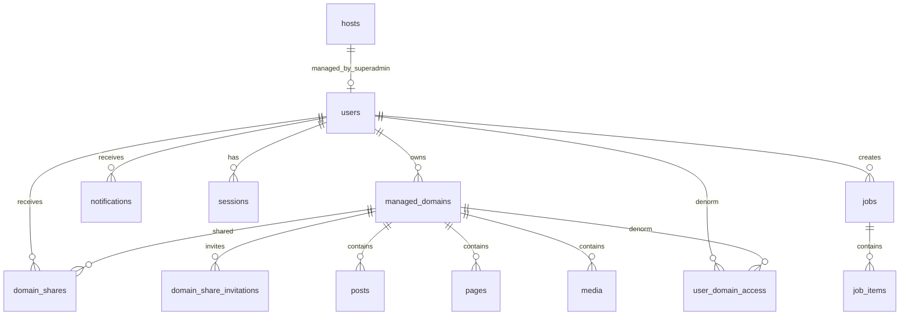

# 10 — Rencana Database PostgreSQL

> **Konteks:** Backend Golang di mini CPU, ribuan `managed_domains`, banyak pekerja (ownership + share), subdomain produk dinamis.  
> **Prasyarat:** [09-model-domain-host-dan-subdomain.md](./09-model-domain-host-dan-subdomain.md)

## 1. Tujuan Desain

| Prioritas | Target |
|-----------|--------|
| **Cepat** | Query list admin < 50 ms (p95) pada dataset realistis |
| **Efisien** | Mini CPU: CPU/RAM/disk I/O minimal — tidak ada full scan tak perlu |
| **Aman multi-tenant** | Isolasi data per owner/share di layer query + index |
| **Profesional** | Migrasi versioned, backup, observabilitas, dokumentasi dampak |
| **Skala** | 3.000+ domain, 10⁶+ post (akumulasi), puluhan pekerja simultan |

PostgreSQL dipilih karena: ACID, index kuat, partial index, partitioning, JSONB terkontrol, dan matur untuk operasi di satu node (mini CPU).

---

## 2. Batasan Mini CPU & Dampaknya

| Resource | Risiko jika abaikan | Kebijakan DB |
|----------|---------------------|--------------|
| RAM 2–8 GB | OOM, cache miss | `shared_buffers` moderat; pool kecil; hindari sort/hash besar |
| CPU 2–4 core | Query paralel mahal | `max_parallel_workers_per_gather = 0` (umumnya) untuk OLTP |
| Disk I/O | Latency spike | Index selective; batch write; WAL jangan di disk lambat |
| Koneksi | 100+ conn menghabisi RAM | **PgBouncer** transaction mode, 20–40 conn aktif ke PG |

**Dampak positif** satu node: tidak ada network latency ke DB terpisah; **dampak negatif**: tidak bisa scale read replica tanpa hardware tambahan → desain harus **efisien per query**.

---

## 3. Prinsip Schema (Wajib)

1. **Setiap list endpoint** punya index yang cocok + `LIMIT` + keyset pagination.
2. **Scope domain** selalu filter `managed_domain_id` (atau tabel akses denormalized).
3. **Tidak ada** `DELETE` massal tanpa `WHERE` spesifik.
4. **Bulk** lewat tabel `jobs` + batch kecil (50–200 row).
5. **Audit log** append-only, partition by month, retensi terbatas.
6. **COUNT(\*)** global dihindari — gunakan tabel agregat `stats_*` atau cache.

---

## 4. Diagram Relasi (Ringkas)



---

## 5. Tipe Data & Konvensi

| Konvensi | Pilihan | Dampak |
|----------|---------|--------|
| PK | `BIGSERIAL` / `BIGINT` | Join lebih ringan dari UUID |
| ID publik opsional | `UUID` hanya di API eksternal | Jangan jadikan PK utama |
| Waktu | `TIMESTAMPTZ` UTC | Konsisten audit |
| Status | `SMALLINT` + lookup table atau `TEXT` CHECK | Index partial per status |
| Soft delete | `deleted_at TIMESTAMPTZ` | Partial index `WHERE deleted_at IS NULL` |
| SEO / meta fleksibel | `JSONB` pada `posts`, `pages` | Hindari EAV 10+ join; GIN hanya jika search JSON wajib |
| Hostname | `TEXT` + `UNIQUE` lower-case | Lookup O(1) |

---

## 6. Definisi Tabel Inti

### 6.1 `users`

```sql
CREATE TABLE users (
  id              BIGSERIAL PRIMARY KEY,
  email           CITEXT NOT NULL UNIQUE,
  password_hash   TEXT NOT NULL,
  display_name    TEXT NOT NULL,
  role            TEXT NOT NULL CHECK (role IN ('super_admin','worker')),
  is_active       BOOLEAN NOT NULL DEFAULT true,
  created_at      TIMESTAMPTZ NOT NULL DEFAULT now(),
  updated_at      TIMESTAMPTZ NOT NULL DEFAULT now()
);

CREATE INDEX idx_users_role_active ON users (role) WHERE is_active;
```

| Dampak | |
|--------|--|
| `CITEXT` | Email case-insensitive tanpa `LOWER()` — index tetap efisien |
| Hanya 2 role sistem | `super_admin` vs `worker`; detail akses domain di share |

---

### 6.2 `managed_domains` (portfolio — ribuan)

```sql
CREATE TABLE managed_domains (
  id              BIGSERIAL PRIMARY KEY,
  name            TEXT NOT NULL,                    -- label internal
  hostname        TEXT NOT NULL,                    -- contoh: tokosepatu.com
  owner_user_id   BIGINT NOT NULL REFERENCES users(id),
  status          SMALLINT NOT NULL DEFAULT 1,      -- 1=active, 2=suspended, 9=archived
  settings        JSONB NOT NULL DEFAULT '{}',
  created_at      TIMESTAMPTZ NOT NULL DEFAULT now(),
  updated_at      TIMESTAMPTZ NOT NULL DEFAULT now(),
  deleted_at      TIMESTAMPTZ
);

CREATE UNIQUE INDEX uq_managed_domains_hostname_active
  ON managed_domains (lower(hostname))
  WHERE deleted_at IS NULL;

CREATE INDEX idx_managed_domains_owner_status
  ON managed_domains (owner_user_id, status, updated_at DESC)
  WHERE deleted_at IS NULL;

CREATE INDEX idx_managed_domains_status_updated
  ON managed_domains (status, updated_at DESC)
  WHERE deleted_at IS NULL;
```

| Skenario | Query | Index yang dipakai |
|----------|-------|-------------------|
| Pekerja: domain saya | `owner_user_id = $1` | `idx_managed_domains_owner_status` |
| Super Admin: semua domain | `status + ORDER BY updated_at` | `idx_managed_domains_status_updated` |
| Cek duplikat hostname | `lower(hostname) = $1` | `uq_managed_domains_hostname_active` |

**Dampak:** ribuan row — **tanpa masalah** jika selalu `LIMIT 50` + keyset.

---

### 6.3 `domain_shares` (akses aktif)

```sql
CREATE TABLE domain_shares (
  managed_domain_id BIGINT NOT NULL REFERENCES managed_domains(id) ON DELETE CASCADE,
  user_id           BIGINT NOT NULL REFERENCES users(id) ON DELETE CASCADE,
  role              TEXT NOT NULL CHECK (role IN ('co_admin','editor','viewer')),
  invited_by        BIGINT NOT NULL REFERENCES users(id),
  invitation_id     BIGINT,  -- FK ke share_invitations jika via approval
  created_at        TIMESTAMPTZ NOT NULL DEFAULT now(),
  PRIMARY KEY (managed_domain_id, user_id)
);

CREATE INDEX idx_domain_shares_user
  ON domain_shares (user_id, managed_domain_id);
```

| Dampak | |
|--------|--|
| PK komposit | Mencegah duplikat share; cepat untuk revoke |
| Hanya baris **approved** | User pending tidak masuk tabel ini |

---

### 6.3b `domain_share_invitations` (co-admin → butuh persetujuan owner)

```sql
CREATE TABLE domain_share_invitations (
  id                BIGSERIAL PRIMARY KEY,
  managed_domain_id BIGINT NOT NULL REFERENCES managed_domains(id) ON DELETE CASCADE,
  invitee_user_id   BIGINT NOT NULL REFERENCES users(id),
  role              TEXT NOT NULL CHECK (role IN ('co_admin','editor','viewer')),
  invited_by        BIGINT NOT NULL REFERENCES users(id),
  status            SMALLINT NOT NULL DEFAULT 0,
  -- 0=pending_approval, 1=approved, 2=rejected, 3=cancelled
  reviewed_by       BIGINT REFERENCES users(id),
  reviewed_at       TIMESTAMPTZ,
  created_at        TIMESTAMPTZ NOT NULL DEFAULT now()
);

CREATE INDEX idx_share_invitations_domain_pending
  ON domain_share_invitations (managed_domain_id, created_at DESC)
  WHERE status = 0;

CREATE INDEX idx_share_invitations_owner_queue
  ON domain_share_invitations (managed_domain_id)
  WHERE status = 0;
  -- Owner poll/notifikasi via JOIN managed_domains.owner_user_id
```

| Skenario | Dampak |
|----------|--------|
| Co-admin undang 10 user | 10 row pending — **tanpa** update `user_domain_access` dulu |
| Owner approve 1 | INSERT `domain_shares` + `user_domain_access` + UPDATE status=1 |
| Owner reject | status=2 — tidak ada share |
| Transfer ownership (SA) | Batalkan semua `status=0` untuk domain itu (disarankan) |

**Aturan aplikasi:**

| Pembuat undangan | Hasil |
|------------------|-------|
| Owner | Langsung ke `domain_shares` (skip tabel invitation) |
| Super Admin | Langsung aktif (sama owner) |
| Co-admin | Wajib `domain_share_invitations` pending |

---

### 6.3c `notifications`

```sql
CREATE TABLE notifications (
  id                BIGSERIAL PRIMARY KEY,
  user_id           BIGINT NOT NULL REFERENCES users(id) ON DELETE CASCADE,
  type              TEXT NOT NULL,
  -- share_invitation_pending, share_invitation_approved, ownership_transferred, ...
  payload           JSONB NOT NULL DEFAULT '{}',
  is_read           BOOLEAN NOT NULL DEFAULT false,
  created_at        TIMESTAMPTZ NOT NULL DEFAULT now()
);

CREATE INDEX idx_notifications_user_unread
  ON notifications (user_id, created_at DESC)
  WHERE is_read = false;
```

| Dampak | |
|--------|--|
| Owner dapat notifikasi co-admin mengundang | Poll ringan atau HTMX `every 30s` |
| Index partial unread | List notifikasi cepat |

---

### 6.4 `user_domain_access` (denormalized — **kunci performa list**)

Materialisasi akses untuk menghindari `OR` + subquery lambat di setiap list.

```sql
CREATE TABLE user_domain_access (
  user_id           BIGINT NOT NULL REFERENCES users(id) ON DELETE CASCADE,
  managed_domain_id BIGINT NOT NULL REFERENCES managed_domains(id) ON DELETE CASCADE,
  access_type       TEXT NOT NULL CHECK (access_type IN ('owner','co_admin','editor','viewer')),
  PRIMARY KEY (user_id, managed_domain_id)
);

CREATE INDEX idx_uda_domain ON user_domain_access (managed_domain_id, user_id);
```

**Sinkronisasi (wajib di aplikasi atau trigger):**

| Event | Aksi |
|-------|------|
| Insert `managed_domains` | Insert `user_domain_access (owner)` |
| Insert/update `domain_shares` | Upsert baris share (hanya setelah approved) |
| Approve invitation | Insert share + upsert access |
| Delete share | Delete baris share |
| Transfer owner (SA) | Update owner; **hapus** akses owner lama; insert owner baru; cancel pending invites |

| Tanpa denorm | Dengan denorm |
|--------------|---------------|
| Query `OR` + subquery tiap list | `JOIN user_domain_access WHERE user_id = $1` — **satu index scan** |
| Dampak tulis | +1–2 write per perubahan share (jarang) |

---

### 6.5 `hosts` (subdomain produk — Super Admin)

```sql
CREATE TABLE hosts (
  id              BIGSERIAL PRIMARY KEY,
  hostname        TEXT NOT NULL,           -- bola.seosementara.org
  host_type       TEXT NOT NULL CHECK (host_type IN ('apex','subdomain')),
  template_id     TEXT NOT NULL,
  is_enabled      BOOLEAN NOT NULL DEFAULT true,
  maintenance     BOOLEAN NOT NULL DEFAULT false,
  config          JSONB NOT NULL DEFAULT '{}',
  created_at      TIMESTAMPTZ NOT NULL DEFAULT now(),
  updated_at      TIMESTAMPTZ NOT NULL DEFAULT now()
);

CREATE UNIQUE INDEX uq_hosts_hostname ON hosts (lower(hostname));
CREATE INDEX idx_hosts_enabled ON hosts (is_enabled) WHERE is_enabled;
```

| Skenario | Dampak |
|----------|--------|
| Request masuk `Host: bola...` | 1 lookup by `hostname` — **cache in-memory 60s** di Go |
| Super Admin tambah subdomain | Insert kecil; invalidate cache |
| Ganti hostname | Update + redirect logic di app |

Jumlah row kecil (< 100) — tidak perlu partition.

---

### 6.6 `posts` (volume besar per domain)

```sql
CREATE TABLE posts (
  id                BIGSERIAL PRIMARY KEY,
  managed_domain_id BIGINT NOT NULL REFERENCES managed_domains(id),
  slug              TEXT NOT NULL,
  title             TEXT NOT NULL,
  body              TEXT,
  status            SMALLINT NOT NULL DEFAULT 0,  -- 0=draft, 1=published, 2=scheduled, 9=trash
  seo_meta          JSONB NOT NULL DEFAULT '{}',
  author_user_id    BIGINT NOT NULL REFERENCES users(id),
  published_at      TIMESTAMPTZ,
  created_at        TIMESTAMPTZ NOT NULL DEFAULT now(),
  updated_at        TIMESTAMPTZ NOT NULL DEFAULT now(),
  deleted_at        TIMESTAMPTZ
);

CREATE UNIQUE INDEX uq_posts_domain_slug_active
  ON posts (managed_domain_id, lower(slug))
  WHERE deleted_at IS NULL;

CREATE INDEX idx_posts_domain_status_updated
  ON posts (managed_domain_id, status, updated_at DESC)
  WHERE deleted_at IS NULL;

CREATE INDEX idx_posts_domain_published
  ON posts (managed_domain_id, published_at DESC)
  WHERE status = 1 AND deleted_at IS NULL;
```

**Estimasi:** 1 domain × 2.000 post × 3.000 domain = **6 juta** row (worst case lama).

| Strategi | Kapan | Dampak |
|----------|-------|--------|
| Index di atas | MVP – ~10M row | Cukup jika selalu filter `managed_domain_id` |
| **Partition** `RANGE (managed_domain_id)` atau `HASH` | > 20M row atau vacuum lambat | Maintenance lebih kompleks; scan satu domain tetap cepat |
| Archive ke `posts_archive` | Domain archived | Tabel aktif kecil |

**Pagination wajib (keyset):**

```sql
SELECT id, title, status, updated_at
FROM posts
WHERE managed_domain_id = $1 AND status = $2 AND deleted_at IS NULL
  AND (updated_at, id) < ($3, $4)
ORDER BY updated_at DESC, id DESC
LIMIT 50;
```

**Dampak OFFSET:** `OFFSET 10000` — **dilarang** (sequential scan skip mahal).

---

### 6.7 `pages`, `media`

Struktur mirip `posts` dengan index `(managed_domain_id, status, updated_at DESC)`.

```sql
-- media: tambahkan size_bytes, mime_type, storage_path
CREATE INDEX idx_media_domain_created
  ON media (managed_domain_id, created_at DESC)
  WHERE deleted_at IS NULL;
```

---

### 6.8 `jobs` & `job_items` (operasi massal)

```sql
CREATE TABLE jobs (
  id                BIGSERIAL PRIMARY KEY,
  type              TEXT NOT NULL,
  managed_domain_id BIGINT REFERENCES managed_domains(id),
  created_by        BIGINT NOT NULL REFERENCES users(id),
  status            SMALLINT NOT NULL DEFAULT 0,  -- 0=pending,1=running,2=done,3=failed
  payload           JSONB NOT NULL DEFAULT '{}',
  progress          INT NOT NULL DEFAULT 0,
  total             INT NOT NULL DEFAULT 0,
  error_message     TEXT,
  created_at        TIMESTAMPTZ NOT NULL DEFAULT now(),
  finished_at       TIMESTAMPTZ
);

CREATE INDEX idx_jobs_status_created ON jobs (status, created_at DESC);
CREATE INDEX idx_jobs_user_created ON jobs (created_by, created_at DESC);

CREATE TABLE job_items (
  job_id    BIGINT NOT NULL REFERENCES jobs(id) ON DELETE CASCADE,
  item_id   BIGINT NOT NULL,
  status    SMALLINT NOT NULL DEFAULT 0,
  PRIMARY KEY (job_id, item_id)
);
```

| Skenario | Pola | Dampak |
|----------|------|--------|
| Bulk publish 2.000 post | Worker: loop batch `UPDATE posts SET status=1 WHERE id = ANY($1::bigint[])` 100 id | Lock row singkat; tidak satu transaksi 2000 row |
| Banyak job paralel | Max 2–4 worker | Hindari thundering herd di disk |

---

### 6.9 `audit_logs` (partitioned)

```sql
CREATE TABLE audit_logs (
  id                BIGSERIAL,
  user_id           BIGINT,
  managed_domain_id BIGINT,
  action            TEXT NOT NULL,
  entity_type       TEXT,
  entity_id         BIGINT,
  meta              JSONB NOT NULL DEFAULT '{}',
  created_at        TIMESTAMPTZ NOT NULL DEFAULT now(),
  PRIMARY KEY (id, created_at)
) PARTITION BY RANGE (created_at);

-- Partisi bulanan: audit_logs_2026_05, ...
```

```sql
CREATE INDEX idx_audit_domain_time
  ON audit_logs (managed_domain_id, created_at DESC);
CREATE INDEX idx_audit_user_time
  ON audit_logs (user_id, created_at DESC);
```

| Dampak | |
|--------|--|
| Partition by month | Drop partition > 12 bulan — **cepat**, tanpa `DELETE` besar |
| Insert-only | Tidak update — cocok BRIN pada `created_at` opsional |

---

### 6.10 `stats_domain` (agregat dashboard — hindari COUNT realtime)

```sql
CREATE TABLE stats_domain (
  managed_domain_id BIGINT PRIMARY KEY REFERENCES managed_domains(id),
  posts_published   INT NOT NULL DEFAULT 0,
  posts_draft       INT NOT NULL DEFAULT 0,
  updated_at        TIMESTAMPTZ NOT NULL DEFAULT now()
);
```

Di-update via:
- trigger ringan (hati-hati beban), **atau**
- increment di aplikasi saat publish/unpublish, **atau**
- job rekonsiliasi harian

| Skenario | Tanpa stats | Dengan stats |
|----------|-------------|--------------|
| Dashboard 50 domain milik user | 50× COUNT | 1 query `JOIN stats_domain` — **< 5 ms** |

---

### 6.11 `sessions`

```sql
CREATE TABLE sessions (
  id           UUID PRIMARY KEY DEFAULT gen_random_uuid(),
  user_id      BIGINT NOT NULL REFERENCES users(id) ON DELETE CASCADE,
  expires_at   TIMESTAMPTZ NOT NULL,
  created_at   TIMESTAMPTZ NOT NULL DEFAULT now()
);

CREATE INDEX idx_sessions_user ON sessions (user_id);
CREATE INDEX idx_sessions_expires ON sessions (expires_at);
```

Job cron: `DELETE FROM sessions WHERE expires_at < now()` — batch 1000.

---

## 7. Matriks Skenario & Dampak

| # | Skenario | Beban | Desain | Dampak jika salah |
|---|----------|-------|--------|-------------------|
| S1 | 50 pekerja login bersamaan | 50 session read/write | Pool + index `sessions` | Too many connections → PG down |
| S2 | Pekerja buka list domain (milik+share) | 50–200 row | `user_domain_access` | OR subquery → CPU spike |
| S3 | Super Admin list 5.000 domain | Page 50 | Index `status, updated_at` | OFFSET besar → lambat |
| S4 | Edit post 1 domain (2.000 post) | 1 row update | PK lookup | Tanpa `managed_domain_id` di WHERE → risiko salah domain |
| S5 | List post domain (page 1–100) | 5.000 row scan | Keyset + index domain | OFFSET → timeout 503 |
| S6 | Bulk SEO 1.000 post | 1.000 update | `jobs` + batch 100 | Satu UPDATE global → lock panjang |
| S7 | Lookup host `bola.` | 1 row | UNIQUE hostname + cache | Full table scan tiap request → latency |
| S8 | Co-admin undang 5 user | 5 row pending | Index pending | Approve tanpa transaksi → access tidak konsisten |
| S8b | Owner approve undangan | 1 insert share + access | Transaksi | Lupa `user_domain_access` → user tidak lihat domain |
| S13 | SA transfer ownership | Update owner; DELETE akses lama | Transaksi + audit | Owner lama masih di access → kebocoran data |
| S9 | Hapus domain | Cascade | FK cascade + soft delete | Hard delete massal → orphan / lock |
| S10 | Audit 1 juta/bulan | Insert-heavy | Partition bulanan | Satu tabel → vacuum bloat |
| S11 | Dashboard agregat | Read ringan | `stats_domain` | COUNT(*) tiap load → mini CPU 100% |
| S12 | 10 pekerja edit domain sama | Row lock | Optimistic `updated_at` | Lost update tanpa cek versi |

---

## 8. Query Wajib vs Terlarang

### Wajib

```sql
-- Akses domain untuk worker (setelah cek di middleware)
SELECT md.*
FROM managed_domains md
JOIN user_domain_access uda ON uda.managed_domain_id = md.id
WHERE uda.user_id = $1 AND md.deleted_at IS NULL
ORDER BY md.updated_at DESC, md.id DESC
LIMIT 50;
```

```sql
-- Cek akses satu domain
SELECT 1 FROM user_domain_access
WHERE user_id = $1 AND managed_domain_id = $2;
```

### Terlarang

| Query | Dampak |
|-------|--------|
| `SELECT * FROM posts WHERE managed_domain_id = $1` (tanpa LIMIT) | Memuat ribuan row → OOM |
| `SELECT COUNT(*) FROM posts` global | Sequential scan besar |
| `DELETE FROM posts` | Hilang semua data |
| `UPDATE posts SET status = 1` tanpa WHERE domain | Publish semua domain |

---

## 9. Connection Pool & Konfigurasi PostgreSQL (Mini CPU)

### 9.1 PgBouncer (disarankan)

```ini
pool_mode = transaction
default_pool_size = 20
max_client_conn = 200
```

| Dampak | |
|--------|--|
| Go app | Buka banyak goroutine, pool DB tetap 20 ke PG |
| Tanpa PgBouncer | `max_connections=100` boros RAM ~100–300 MB |

### 9.2 Parameter `postgresql.conf` (contoh 4 GB RAM)

| Parameter | Nilai contoh | Dampak |
|-----------|--------------|--------|
| `shared_buffers` | 512MB–1GB | Cache data hot |
| `effective_cache_size` | 2GB | Planner pilih index scan |
| `work_mem` | 4–8MB | Sort kecil; hindari 64MB × 20 conn |
| `maintenance_work_mem` | 128MB | VACUUM/INDEX lebih cepat |
| `max_connections` | 50–80 | Tanpa pool — tetap rendah |
| `random_page_cost` | 1.1 (SSD) | Index lebih sering dipilih |
| `max_parallel_workers_per_gather` | 0–1 | OLTP stabil di CPU kecil |
| `autovacuum_vacuum_scale_factor` | 0.05 pada tabel besar | Kurangi bloat `posts` |

---

## 10. Migrasi & Versioning

```
Backend/migrations/
├── 00001_init_users.sql
├── 00002_managed_domains.sql
├── 00003_domain_shares_invitations.sql
├── 00003b_notifications.sql
├── 00004_hosts.sql
├── 00005_posts_pages_media.sql
├── 00006_jobs.sql
├── 00007_audit_partitions.sql
└── 00008_stats_domain.sql
```

| Tool | goose / golang-migrate |
| Aturan | Forward-only di prod; backup sebelum migrate |
| Dampak zero-downtime | Tambah index `CONCURRENTLY`; hindari lock tabel lama di jam sibuk |

---

## 11. Backup, Maintenance, Monitoring

| Tugas | Frekuensi | Dampak |
|-------|-----------|--------|
| `pg_dump` custom format | Harian | Recovery ribuan domain |
| WAL archiving (opsional) | Kontinyu | RPO lebih kecil |
| `VACUUM (ANALYZE)` tabel besar | Mingguan / autovacuum | Tanpa ini → bloat → scan lambat |
| Retensi audit | Drop partition > 12 bln | Disk tidak penuh |
| Monitor | `pg_stat_statements`, slow > 100ms | Temukan query buruk |

---

## 12. Roadmap Skala DB

| Fase | Ukuran perkiraan | Tindakan |
|------|------------------|----------|
| MVP | < 100 domain, < 100k post | Schema di atas cukup |
| Growth | 1k domain, 1M post | Pastikan keyset; stats_domain wajib |
| Heavy | 3k domain, 10M post | Pertimbangkan partition `posts`; archive trash |
| Critical | CPU > 80% sustained | Read replica atau hardware upgrade; bukan optimasi query lagi |

---

## 13. Keputusan Rekaman

| Keputusan | Alasan |
|-----------|--------|
| PostgreSQL | ACID, index, partition — satu node mini CPU |
| PK `BIGINT` | Performa join vs UUID |
| `user_domain_access` denorm | List domain pekerja cepat — share jarang berubah |
| Keyset pagination | OFFSET dilarang pada tabel besar |
| `stats_domain` | Dashboard tanpa COUNT realtime |
| Partition `audit_logs` | Insert besar + retensi mudah |
| JSONB `seo_meta` | Fleksibel tanpa 15 tabel meta |
| PgBouncer | Proteksi koneksi di mini CPU |

---

## 14. Dokumen Terkait

- Model domain & ownership → [09](./09-model-domain-host-dan-subdomain.md)
- Backend & query rules → [04](./04-backend-golang.md)
- API → [07](./07-api-dan-integrasi.md)
- Roadmap → [08](./08-roadmap-implementasi.md)
