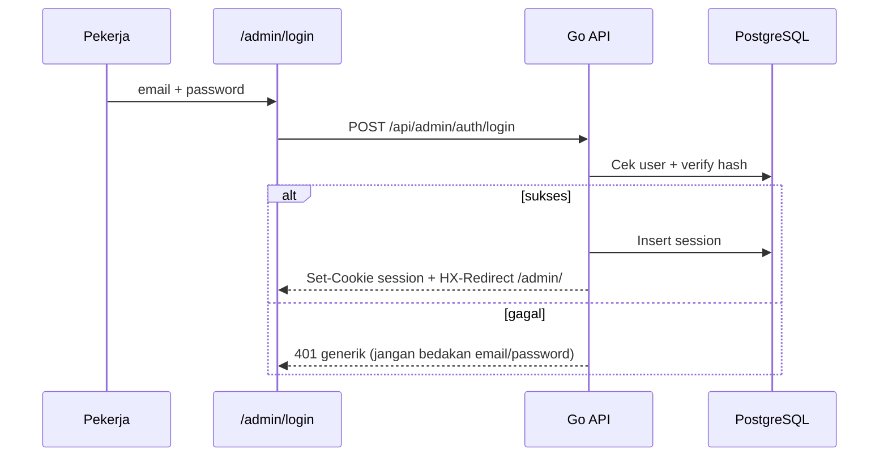

# 12 — Autentikasi & Login Aman

> Admin: `https://seosementara.org/admin/login` — same origin API.  
> **Semua parameter** (password, session, lockout, CSRF) dikonfigurasi dari admin panel:  
> **`/admin/setup/backend/autentikasi/`** — lihat [13-setup-backend-dan-sistem.md](./13-setup-backend-dan-sistem.md) §4.

## 1. Tujuan Keamanan

| Ancaman | Mitigasi |
|---------|----------|
| Brute force password | Rate limit + lockout sementara |
| Credential stuffing | Rate limit per IP + per email |
| Session hijack | HttpOnly, Secure, SameSite, rotasi session |
| CSRF | SameSite cookie + token untuk form sensitif |
| XSS mencuri cookie | HttpOnly + CSP ketat di admin |
| Password lemah | Kebijakan panjang + hash kuat |

---

## 2. Alur Login



---

## 3. Password

Nilai di bawah = **default**; override via `system_settings` group `auth` di [Setup Backend §4](./13-setup-backend-dan-sistem.md).

| Aturan | Default |
|--------|---------|
| Hash | **Argon2id** (prefer) atau bcrypt cost ≥ 12 |
| Panjang minimum | `auth.password.min_length` = 10 |
| Kompleksitas | Sesuai checkbox di admin |
| Storage | Hanya hash — tidak pernah log password |

```go
// Contoh: argon2id dengan parameter moderat untuk mini CPU
// memory 64MB, iterations 3, parallelism 2
```

---

## 4. Session

### 4.1 Cookie

| Atribut | Nilai |
|---------|-------|
| Nama | `sse_session` (contoh) |
| `HttpOnly` | `true` |
| `Secure` | `true` (production) |
| `SameSite` | `Lax` (same site admin + api) |
| `Path` | `/` |
| `Max-Age` | 7 hari (refresh on activity) |

### 4.2 Tabel `sessions`

| Field | Fungsi |
|-------|--------|
| `id` | UUID random |
| `user_id` | FK users |
| `ip_hash` | Hash IP (audit, deteksi anomali) |
| `user_agent_hash` | Opsional |
| `expires_at` | TTL |
| `last_seen_at` | Perpanjang session |

**Rotasi:** setiap login baru → invalidate session lama user (opsional: max 3 device).

### 4.3 Middleware

Setiap `/admin/*` dan `/api/admin/*`:

1. Parse cookie → load session
2. Cek `expires_at`, `users.is_active`
3. Inject `user_id`, `role` ke context
4. Super Admin bypass domain scope; worker → cek domain permission

---

## 5. Rate Limiting & Lockout

**Wajib selaras** dengan Cloudflare WAF — konfigurasi di [13 §5](./13-setup-backend-dan-sistem.md).

| Lapisan | Login limit (default) |
|---------|----------------------|
| Cloudflare edge | 5 req/menit/IP (sync dari admin) |
| Go origin | `auth.lockout.per_ip` = 5 / 15 menit |
| Go origin | `auth.lockout.per_email` = 10 / jam |
| Lock akun | `auth.lockout.duration_min` = 30 |

Response gagal selalu sama:

```json
{ "error": "email_or_password_invalid" }
```

Tidak mengungkap apakah email terdaftar.

---

## 6. CSRF

| Request | Proteksi |
|---------|----------|
| HTMX GET | Tidak perlu token |
| HTMX POST/PUT/DELETE | Header `X-CSRF-Token` dari cookie `csrf_token` (double-submit) atau SameSite=Lax |

Generate CSRF saat render halaman login / layout admin.

---

## 7. Logout & Manajemen Session

| Aksi | Endpoint |
|------|----------|
| Logout | `POST /api/admin/auth/logout` → hapus session + clear cookie |
| Logout semua device | `POST /api/admin/auth/logout-all` |
| Daftar session aktif | `GET /api/admin/auth/sessions` (user sendiri) |

Super Admin: bisa revoke session user lain (suspend pekerja).

---

## 8. Fase 2 (Opsional)

| Fitur | Prioritas |
|-------|-----------|
| 2FA TOTP | Tinggi untuk Super Admin |
| Remember device | Rendah |
| Login magic link | Tidak direncanakan MVP |
| OAuth Google | Opsional |

---

## 9. Audit & Monitoring

Log ke `audit_logs`:

- `auth.login.success` / `auth.login.failed`
- `auth.logout`
- `auth.lockout`

Jangan log password, token, atau cookie penuh.

---

## 10. Checklist Implementasi MVP

- [ ] Argon2id / bcrypt
- [ ] Session table + cookie flags
- [ ] Rate limit login
- [ ] Account lockout
- [ ] CSRF pada form POST admin
- [ ] Middleware auth semua route admin
- [ ] Pesan error generik
- [ ] Cron hapus session expired

---

## 11. Dokumen Terkait

- RBAC → [11](./11-rbac-dan-permission-share.md)
- API → [07](./07-api-dan-integrasi.md)
- DB sessions → [10](./10-database-postgresql.md)
