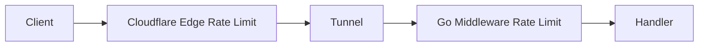

# 13 — Setup Backend (Pusat Pengaturan di Admin Panel)

> **Semua** konfigurasi yang mempengaruhi backend Go, keamanan, RBAC, dan perilaku API **harus** dapat diatur dari admin panel — bukan hanya file `.env` manual.  
> Path induk: **`/admin/settings/backend/`**  
> Akses: **Super Admin** (default); role sistem kustom bisa diberi akses subset (§2).

Dokumen detail:
- RBAC → [11-rbac-dan-permission-share.md](./11-rbac-dan-permission-share.md)
- Login → [12-autentikasi-dan-login-aman.md](./12-autentikasi-dan-login-aman.md)
- Cloudflare (edge) → [15-setup-cloudflare-integrasi.md](./15-setup-cloudflare-integrasi.md) — **selaras** dengan rate limit §5

---

## 1. Prinsip

| Prinsip | Artinya |
|---------|---------|
| **Satu pusat** | Operator tidak edit `postgresql.conf` / env untuk hal yang boleh UI |
| **Simpan ke DB** | `system_settings` + tabel khusus; reload tanpa rebuild binary |
| **Audit** | Setiap ubah setting → `audit_logs` |
| **Selaras Cloudflare** | Rate limit & auth publik koordinasi edge + origin (§5) |
| **Bukan domain portfolio** | Setting per domain tetap di `/admin/sites/{id}/` |

---

## 2. Peta Menu Lengkap — Settings Backend

```
/admin/settings/
│
├── backend/                          ← PUSAT (dokumen ini)
│   ├── ringkasan/                    → health, versi, uptime, deploy info [16]
│   ├── rbac/                         → §3
│   │   ├── peran-sistem/             → CRUD role admin
│   │   ├── pengguna/                 → user + assign role
│   │   └── permission-sistem/      → daftar key (read-only doc)
│   ├── autentikasi/                  → §4 [12]
│   │   ├── kebijakan-password/
│   │   ├── sesi-login/
│   │   ├── lockout-brute-force/
│   │   └── csrf-cookie/
│   ├── rate-limit/                   → §5
│   │   ├── aplikasi-origin/          → Go middleware
│   │   └── cloudflare-edge/          → sync WAF (butuh [15])
│   ├── operasional/                  → §6
│   │   ├── umum-maintenance/
│   │   ├── database-performa/
│   │   ├── worker-job/
│   │   └── cache/
│   ├── media-storage/                → §7
│   ├── api-webhook/                  → §8
│   └── audit-log/                    → view config retensi
│
├── cloudflare/                       → [15] infrastruktur edge
├── host/                             → subdomain produk [09]
├── meta/                             → [14]
└── notifications/                    → channel alert platform
```

Sidebar **Settings** → submenu dikelompokkan: **Backend**, **Cloudflare**, **Host**, **Meta**.

---

## 3. RBAC — Peran & Admin (di Admin Panel)

> Detail permission domain (share checklist): [11](./11-rbac-dan-permission-share.md).  
> Di sini fokus **lapisan sistem** yang dikelola Super Admin.

### 3.1 UI (`/admin/settings/backend/rbac/`)

| Halaman | Fungsi |
|---------|--------|
| **Peran sistem** | Daftar + tambah + edit + nonaktifkan role |
| **Pengguna admin** | CRUD pekerja, assign peran, reset password, suspend |
| **Permission sistem** | Referensi key yang bisa dicentang per role |

### 3.2 Model peran (diperluas)

Selain bawaan, Super Admin bisa **menambah role admin**:

| Role bawaan | Kode | Tidak bisa dihapus |
|-------------|------|-------------------|
| Super Admin | `super_admin` | Ya |
| Worker | `worker` | Ya |

| Role kustom (contoh) | Kode contoh | Permission sistem |
|----------------------|-------------|------------------|
| Platform Manager | `platform_manager` | User CRUD, lihat setup backend, **tanpa** Cloudflare |
| Support Read-only | `support_viewer` | Dashboard global read, **tanpa** setup |

```sql
CREATE TABLE system_roles (
  id            BIGSERIAL PRIMARY KEY,
  slug          TEXT NOT NULL UNIQUE,
  display_name  TEXT NOT NULL,
  is_system     BOOLEAN NOT NULL DEFAULT false,  -- super_admin, worker
  permissions   JSONB NOT NULL DEFAULT '{}',    -- key sistem §3.3
  is_active     BOOLEAN NOT NULL DEFAULT true,
  created_at    TIMESTAMPTZ NOT NULL DEFAULT now()
);

ALTER TABLE users
  ADD COLUMN system_role_id BIGINT REFERENCES system_roles(id);
-- super_admin: bypass cek JSON (hardcoded)
```

### 3.3 Permission sistem (checklist per role)

Key untuk **akses menu Setup & operasi global** — terpisah dari permission domain (share).

| Key | Label | Super Admin |
|-----|-------|:-----------:|
| `setup.backend.view` | Lihat Setup Backend | ✓ |
| `setup.backend.edit` | Ubah setting backend | ✓ |
| `setup.cloudflare.view` | Lihat Setup Cloudflare | ✓ |
| `setup.cloudflare.edit` | Ubah Cloudflare | ✓ |
| `setup.host.edit` | Kelola host/subdomain | ✓ |
| `setup.meta.edit` | Meta global | ✓ |
| `users.manage` | Kelola pengguna admin | ✓ |
| `roles.manage` | Kelola peran sistem | ✓ |
| `domains.view_all` | Lihat semua domain portfolio | ✓ |
| `domains.transfer` | Transfer ownership | ✓ |
| `audit.view` | Lihat audit log global | ✓ |

Role kustom: centang subset di form HTMX.

### 3.4 Dampak

| Skenario | Tanpa UI RBAC | Dengan UI RBAC |
|----------|---------------|----------------|
| Tambah pekerja baru | SSH / SQL manual | Form admin |
| Role salah | Kebocoran setup | Audit + permission check middleware |
| Hapus role masih dipakai | FK error | UI cegah + soft-disable |

---

## 4. Autentikasi & Login Aman (di Admin Panel)

> Implementasi teknis: [12-autentikasi-dan-login-aman.md](./12-autentikasi-dan-login-aman.md).  
> **Semua parameter** di bawah ini editable di `/admin/settings/backend/autentikasi/`.

### 4.1 Kebijakan password (`system_settings` group `auth`)

| Setting | Key default | Contoh |
|---------|-------------|--------|
| Panjang minimum | `auth.password.min_length` | 10 |
| Wajib angka | `auth.password.require_number` | true |
| Wajib huruf besar | `auth.password.require_upper` | false |
| Hash algorithm | `auth.password.hash` | `argon2id` (read-only UI) |
| Masa berlaku password (hari) | `auth.password.max_age_days` | 0 = tidak kedaluwarsa |

### 4.2 Sesi & cookie

| Setting | Key | Contoh |
|---------|-----|--------|
| Masa session (hari) | `auth.session.ttl_days` | 7 |
| Perpanjang saat aktivitas | `auth.session.rolling` | true |
| Max session per user | `auth.session.max_per_user` | 5 |
| Nama cookie | `auth.session.cookie_name` | `sse_session` |
| SameSite | `auth.session.same_site` | `Lax` |

### 4.3 Brute force & lockout

| Setting | Key | Contoh |
|---------|-----|--------|
| Max gagal login / IP / 15 menit | `auth.lockout.per_ip` | 5 |
| Max gagal / email / jam | `auth.lockout.per_email` | 10 |
| Durasi lock (menit) | `auth.lockout.duration_min` | 30 |

### 4.4 CSRF & header keamanan

| Setting | Key | Contoh |
|---------|-----|--------|
| CSRF enabled | `auth.csrf.enabled` | true |
| Secure cookie only | `auth.cookie.secure` | true |

### 4.5 UI form

Satu halaman per grup + tombol **Simpan** → `PATCH /api/admin/settings/backend/auth`  
Tombol **Terapkan ke runtime** → refresh cache settings di Go (tanpa restart jika memungkinkan).

| Dampak ubah session TTL | User harus login ulang setelah TTL baru — tampilkan peringatan di UI |

---

## 5. Rate Limit — Aplikasi & Cloudflare (Selaras)

Rate limiting **dua lapis** — keduanya dikonfigurasi dari admin, nilai **tidak boleh saling bertabrakan** (origin lebih ketat atau sama dengan edge).



### 5.1 Lapisan Cloudflare (`/admin/settings/backend/rate-limit/cloudflare-edge/`)

Membutuhkan kredensial [Setup Cloudflare](./15-setup-cloudflare-integrasi.md).

| Aksi UI | CF produk | Contoh |
|---------|-----------|--------|
| Rate limit rule API publik | WAF / Rate Limiting | 120 req/menit/IP `/api/public/*` |
| Rate limit login | WAF | 5 req/menit/IP ke path login |
| Challenge / Block | WAF | Opsional bot fight |

| Setting DB | Sync ke CF |
|------------|------------|
| `ratelimit.cf.public_rpm` | Rule ID disimpan untuk update |
| `ratelimit.cf.login_rpm` | |
| `ratelimit.cf.enabled` | Toggle |

Tombol: **Push ke Cloudflare** → panggil API CF → simpan `rule_id` di `cloudflare_rate_rules`.

```sql
CREATE TABLE cloudflare_rate_rules (
  id          BIGSERIAL PRIMARY KEY,
  name        TEXT NOT NULL,
  cf_rule_id  TEXT,
  path_pattern TEXT NOT NULL,
  limit_rpm   INT NOT NULL,
  action      TEXT NOT NULL DEFAULT 'block',
  is_enabled  BOOLEAN NOT NULL DEFAULT true,
  synced_at   TIMESTAMPTZ
);
```

### 5.2 Lapisan aplikasi — Go (`/admin/settings/backend/rate-limit/aplikasi-origin/`)

| Setting | Key | Default | Harus ≤ CF? |
|---------|-----|---------|-------------|
| Global API admin rpm/user | `ratelimit.app.admin_rpm` | 300 | Ya |
| Public API rpm/IP | `ratelimit.app.public_rpm` | 100 | ≤ CF rule |
| Login rpm/IP | `ratelimit.app.login_rpm` | 5 | ≤ CF rule |
| Form contact rpm/IP | `ratelimit.app.form_rpm` | 10 | |
| Burst | `ratelimit.app.burst` | 20 | |

**Validasi UI:** jika `app.public_rpm` > `cf.public_rpm` → warning: *"Origin limit lebih longgar dari Cloudflare — traffic bisa membebani mini CPU"*.

### 5.3 Tabel sinkronisasi (panel ringkasan)

| Endpoint | CF (edge) | Go (origin) | Rekomendasi |
|----------|-----------|-------------|-------------|
| `POST /auth/login` | 5/min/IP | 5/min/IP | Sama |
| `GET /api/public/*` | 120/min/IP | 100/min/IP | CF ≥ origin |
| `GET /api/admin/*` | 300/min/IP | 300/min/user | Beda dimensi (IP vs user) |

### 5.4 Dampak

| Skenario | Dampak |
|----------|--------|
| Hanya CF, tanpa Go | Attacker bypass via tunnel direct — **wajib** origin limit |
| Hanya Go, tanpa CF | Mini CPU kewalahan sebelum block — **wajib** edge |
| CF longgar, Go ketat | OK — ideal |
| Keduanya longgar | DDoS / brute force |

---

## 6. Operasional Backend

Path: `/admin/settings/backend/operasional/`

### 6.1 Umum & maintenance

| Key | Contoh |
|-----|--------|
| `app.name` | Seosementara |
| `app.timezone` | Asia/Jakarta |
| `app.maintenance` | false |
| `app.maintenance_message` | Sedang pemeliharaan |

### 6.2 Database & performa

| Key | Contoh |
|-----|--------|
| `db.pool_size` | 20 |
| `db.query_timeout_ms` | 5000 |
| `app.page_size_default` | 50 |
| `app.page_size_max` | 100 |

### 6.3 Worker & job

| Key | Contoh | Validasi UI max |
|-----|--------|-----------------|
| `worker.concurrency` | 2 | 4 (mini CPU) |
| `worker.batch_size` | 100 | 200 |
| `worker.job_timeout_sec` | 3600 | |

### 6.4 Cache

| Key | Contoh |
|-----|--------|
| `cache.enabled` | true |
| `cache.public_ttl_sec` | 60 |
| `cache.stats_ttl_sec` | 300 |

Tombol **Purge cache aplikasi** + link ke Cloudflare purge [15].

---

## 7. Media & Storage

Path: `/admin/settings/backend/media-storage/`

| Key | Contoh |
|-----|--------|
| `media.max_upload_mb` | 10 |
| `media.allowed_mimes` | `["image/webp","image/jpeg"]` |
| `media.driver` | `local` \| `r2` |
| `media.r2_*` | dari integrasi CF [15] |

---

## 8. API, Webhook, Turnstile

Path: `/admin/settings/backend/api-webhook/`

| Key | Contoh |
|-----|--------|
| `webhook.secret` | (encrypted) |
| `turnstile.site_key` | publik |
| `turnstile.secret_key` | (encrypted) |
| `api.cors_allowed_origins` | dari domain utama [15] |

---

## 9. Penyimpanan & API

### 9.1 Tabel

- `system_settings` — key/value by group (`auth`, `ratelimit`, `worker`, …)
- `system_roles` — role admin kustom
- `cloudflare_rate_rules` — sync rate limit edge

### 9.2 API (semua `RequireSuperAdmin` atau `setup.backend.edit`)

| Method | Path |
|--------|------|
| GET | `/api/admin/settings/backend/overview` |
| GET/PATCH | `/api/admin/settings/backend/settings?group=auth` |
| GET/POST/PATCH/DELETE | `/api/admin/settings/backend/roles` |
| GET/POST/PATCH | `/api/admin/settings/backend/users` |
| GET/PATCH | `/api/admin/settings/backend/rate-limit/app` |
| GET/POST | `/api/admin/settings/backend/rate-limit/cloudflare/sync` |
| GET | `/api/admin/settings/backend/audit-config` |

Setelah simpan: `POST /api/admin/settings/backend/reload` → invalidate settings cache.

---

## 10. Matriks: Harus di Admin Panel

| Area | Di panel? | Path |
|------|:---------:|------|
| RBAC & role admin | ✅ | `/admin/settings/backend/rbac/` |
| Rate limit app + CF | ✅ | `/admin/settings/backend/rate-limit/` |
| Autentikasi / login | ✅ | `/admin/settings/backend/autentikasi/` |
| Worker, cache, DB | ✅ | `/admin/settings/backend/operasional/` |
| Media / API keys | ✅ | `/admin/settings/backend/` |
| Cloudflare Tunnel/Pages | ✅ | `/admin/settings/cloudflare/` [15] |
| Share permission domain | ✅ | `/admin/sites/{id}/sharing` [11] |

| Bukan di panel (tetap env server) | Alasan |
|-----------------------------------|--------|
| `DATABASE_URL` | Bootstrap; tidak boleh diubah dari web |
| `MASTER_ENCRYPTION_KEY` | Root secret |
| `SESSION_SECRET` bootstrap | Bisa rotate via CLI fase 2 |

---

## 11. Skenario & Dampak

| # | Skenario | Dampak |
|---|----------|--------|
| B1 | Nonaktifkan role masih dipakai 50 user | Block delete — force reassign |
| B2 | Rate limit CF tidak di-sync | Mini CPU overload |
| B3 | Session TTL 365 hari | Cookie dicuri lama valid — UI warning |
| B4 | Matikan CSRF | XSS → aksi admin — default ON |
| B5 | Dua Super Admin ubah setting bersamaan | Last write wins — audit log |

---

## 12. Roadmap

| Fase | Deliverable |
|------|-------------|
| MVP | RBAC users + role bawaan; auth settings UI; rate limit app |
| Fase 2 | Role kustom + permission checklist; CF rate sync |
| Fase 3 | 2FA settings; import/export backend config |

---

## 13. Dokumen Terkait

- [11-rbac-dan-permission-share.md](./11-rbac-dan-permission-share.md)
- [12-autentikasi-dan-login-aman.md](./12-autentikasi-dan-login-aman.md)
- [16-deploy-dan-lingkungan.md](./16-deploy-dan-lingkungan.md)
- [15-setup-cloudflare-integrasi.md](./15-setup-cloudflare-integrasi.md)
- [10-database-postgresql.md](./10-database-postgresql.md)
- [03-menu-dan-modul-cms.md](./03-menu-dan-modul-cms.md)
