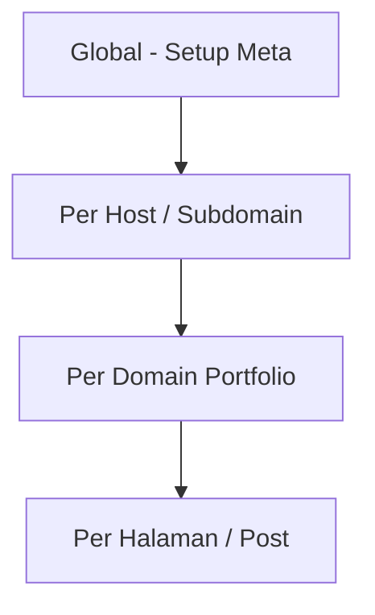

# 14 — Setup Meta (Subdomain, Halaman, Domain, Global)

> Hierarki inherit: **Global → Host (subdomain) → Domain portfolio → Halaman/Konten**

## 1. Hierarki Meta



| Level | Scope | Contoh path admin |
|-------|-------|-------------------|
| **Global** | Seluruh produk `seosementara.org` | `/admin/setup/meta` |
| **Host** | `bola.seosementara.org`, apex, … | `/admin/setup/host/{id}/meta` |
| **Domain portfolio** | `toko-abc.com` (managed) | `/admin/sites/{id}/seo` |
| **Konten** | Satu post / page | Sidebar editor konten |

**Resolve saat render publik:** konten → domain → host → global (field kosong naik ke parent).

---

## 2. Field Meta (Standar)

| Field | Key | Keterangan |
|-------|-----|------------|
| Title | `title` | `<title>` |
| Meta description | `description` | `<meta name="description">` |
| Canonical URL | `canonical` | Opsional override |
| Robots | `robots` | index,follow / noindex,… |
| OG title | `og:title` | Social |
| OG description | `og:description` | |
| OG image | `og:image` | URL media |
| Twitter card | `twitter:card` | summary_large_image |
| JSON-LD | `schema_json` | Object atau `@graph` |
| Hreflang | `hreflang` | Array `{lang, url}` opsional |
| Custom meta tags | `custom_meta` | Array `{name, content}` |

Disimpan sebagai **JSONB** `meta` pada masing-masing tabel.

---

## 3. Per Level — Detail

### 3.1 Global (`/admin/setup/meta`)

| Field | Contoh |
|-------|--------|
| Site name | Seosementara |
| Default title suffix | `\| Seosementara` |
| Default description | Platform … |
| Default OG image | URL logo |
| Default robots | index,follow |
| Organization schema | JSON-LD Organization |

**Siapa edit:** Super Admin.

---

### 3.2 Per Host / Subdomain (`/admin/setup/host/{id}/meta`)

Override untuk tampilan publik di hostname tersebut.

| Contoh host | Meta khusus |
|-------------|-------------|
| `seosementara.org` (apex) | Brand utama, marketing |
| `bola.seosementara.org` | Title prefix "Bola", schema SportsOrganization |
| `url.seosementara.org` | noindex pada halaman admin shortlink |
| `cdn.seosementara.org` | robots noindex (jika hanya aset) |

| Field inherit | Perilaku |
|---------------|----------|
| Kosong | Pakai global |
| Diisi | Override field tersebut saja |

**Siapa edit:** Super Admin (bersama Setup Host).

---

### 3.3 Per Domain Portfolio (`/admin/sites/{id}/seo`)

Default SEO untuk seluruh konten di domain `toko-abc.com`:

| Field | Contoh |
|-------|--------|
| Title template | `{page_title} - Toko Sepatu` |
| Default description | Toko sepatu terpercaya… |
| Default OG image | Logo toko |
| Sitemap enabled | true |
| Sitemap base URL | https://toko-abc.com |

**Siapa edit:** Owner / share dengan permission `seo.edit` atau `domain.settings.edit`.

**Permission:** lihat [11](./11-rbac-dan-permission-share.md).

---

### 3.4 Per Halaman / Post (editor konten)

Sidebar **SEO** pada edit post/page:

| Field | Prioritas |
|-------|-----------|
| SEO title | Override title template |
| Slug | URL path |
| Meta description | |
| Canonical | Opsional |
| OG override | Opsional per artikel |
| Schema type | Article, WebPage, Product, … |

**Preview SERP** (opsional): HTMX partial mock Google snippet.

**Siapa edit:** Sesuai `content.*.edit` + `seo.edit`.

---

## 4. Tabel Database

```sql
-- Global & grup backend
-- system_settings key: meta.global → JSONB

CREATE TABLE host_meta (
  host_id     BIGINT PRIMARY KEY REFERENCES hosts(id) ON DELETE CASCADE,
  meta        JSONB NOT NULL DEFAULT '{}',
  updated_at  TIMESTAMPTZ NOT NULL DEFAULT now()
);

CREATE TABLE managed_domain_meta (
  managed_domain_id BIGINT PRIMARY KEY REFERENCES managed_domains(id) ON DELETE CASCADE,
  meta              JSONB NOT NULL DEFAULT '{}',
  sitemap_config    JSONB NOT NULL DEFAULT '{}',
  updated_at        TIMESTAMPTZ NOT NULL DEFAULT now()
);

-- posts.pages sudah punya seo_meta JSONB (lihat plan 10)
```

| Dampak | |
|--------|--|
| Tabel terpisah dari row utama | Update meta tanpa touch `posts.body` — lock lebih kecil |
| JSONB | Fleksibel; hindari GIN kecuali search meta internal |

---

## 5. Resolusi Merge (Backend)

```go
func ResolveMeta(ctx MetaContext) Meta {
  m := GlobalMeta()
  m = m.Merge(HostMeta(ctx.HostID))       // hanya field non-empty
  m = m.Merge(DomainMeta(ctx.DomainID))
  m = m.Merge(ContentMeta(ctx.PostID))
  return m
}
```

| Skenario | Dampak |
|----------|--------|
| Hanya global | Semua halaman dapat default |
| Domain override OG image | Semua post pakai kecuali post punya OG sendiri |
| Post override title | Hanya halaman itu |

---

## 6. Sitemap & Robots

| Level | Config |
|-------|--------|
| Domain | `sitemap_config`: enabled, changefreq default, priority |
| Host | `robots.txt` template per subdomain |
| Global | `robots.txt` apex |

Generate:

- Job `regenerate_sitemap` per domain — chunk post published
- File diserve `GET /api/public/.../sitemap.xml` atau static cache

---

## 7. Bulk Meta Editor

| Fitur | Path | Permission |
|-------|------|------------|
| Spreadsheet bulk SEO | `/admin/sites/{id}/seo/bulk` | `seo.edit` + `jobs.create` |
| Filter post | status, kategori | |
| Update field | description, og:image | Via job batch |

---

## 8. Menu Admin (Ringkas)

```
Setup (Super Admin)
└── Meta global

Setup → Host → [host] → Meta subdomain

Situs → [domain] → SEO
                  → Bulk SEO
                  → Sitemap / Redirect

Konten → Edit → Sidebar SEO
```

---

## 9. API Ringkas

| Method | Path |
|--------|------|
| GET/PATCH | `/api/admin/setup/meta/global` |
| GET/PATCH | `/api/admin/hosts/{id}/meta` |
| GET/PATCH | `/api/admin/managed-domains/{id}/meta` |
| GET/PATCH | `/api/admin/posts/{id}/seo` |
| POST | `/api/admin/managed-domains/{id}/sitemap/regenerate` |

Public render:

| Method | Path |
|--------|------|
| GET | `/api/public/resolve-meta?host=&path=` | HTMX `<head>` injection |

---

## 10. Skenario & Dampak

| Skenario | Risiko | Mitigasi |
|----------|--------|----------|
| JSON-LD invalid | Rich result gagal | Validasi JSON di save |
| Canonical salah | Duplicate SEO | Preview + warning |
| Meta 10MB per post | Bloat DB | Limit size JSONB |
| 50k URL sitemap | Generate lambat | Job async + cache file |
| Subdomain noindex salah | Seluruh host hilang SERP | Konfirmasi UI host meta |

---

## 11. Dokumen Terkait

- RBAC permission `seo.*` → [11](./11-rbac-dan-permission-share.md)
- Setup backend → [13](./13-setup-backend-dan-sistem.md)
- Host model → [09](./09-model-domain-host-dan-subdomain.md)
- DB posts.seo_meta → [10](./10-database-postgresql.md)
