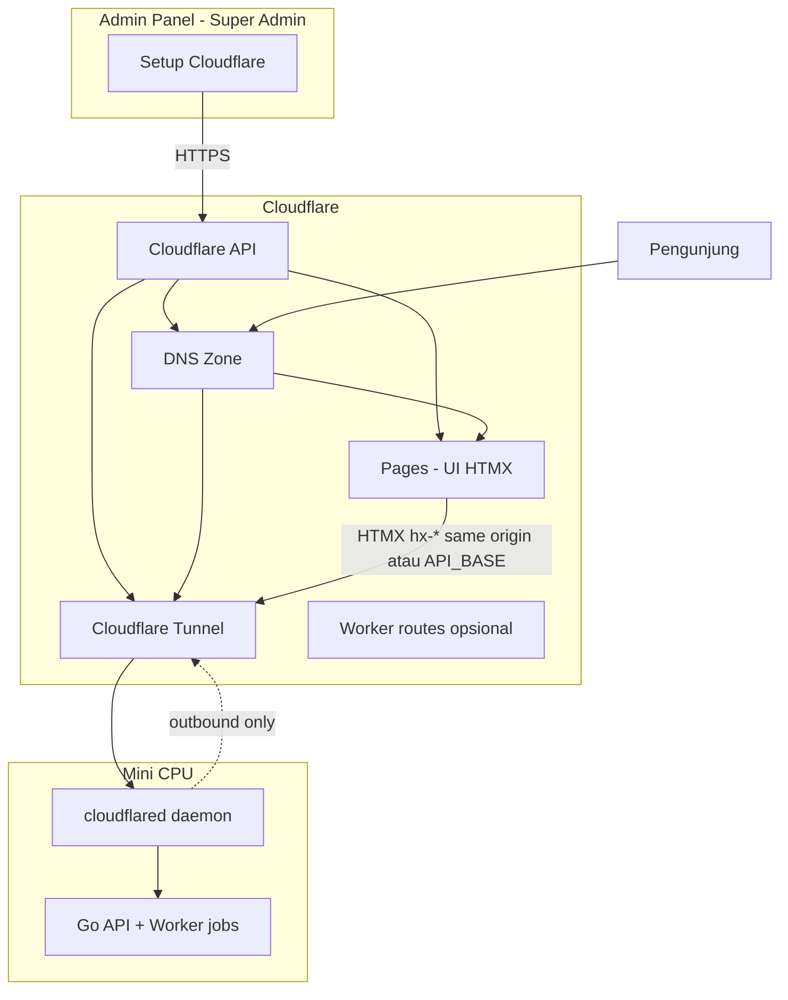

# 15 — Setup Cloudflare (Integrasi dari Admin Panel)

> **Super Admin** mengelola koneksi Cloudflare sepenuhnya dari `/admin/setup/cloudflare/*`  
> Tanpa harus login dashboard Cloudflare untuk tugas rutin.  
> Prasyarat: [02-arsitektur](./02-arsitektur-dan-infrastruktur.md), [13-setup-backend](./13-setup-backend-dan-sistem.md)

## 1. Tujuan

| Tujuan | Keterangan |
|--------|------------|
| Satu panel | API key/token, Tunnel, Pages UI, DNS, .env domain utama |
| Terhubung langsung | Backend Go memanggil **Cloudflare API** saat simpan / sync / test |
| Mini CPU aman | Backend API tidak perlu port publik — pakai **Cloudflare Tunnel** |
| UI di edge | **Cloudflare Pages** untuk HTMX admin & publik (repo `Frontend-admin`, `Frontend-Users`) |

---

## 2. Arsitektur Target (Setelah Setup)



### Pembagian beban (disarankan)

| Komponen | Hosting | Hostname contoh |
|----------|---------|-----------------|
| **UI Admin HTMX** | Cloudflare Pages | `seosementara.org` path `/admin/*` via route |
| **UI Publik HTMX** | Cloudflare Pages | `seosementara.org` `/` + aset statis |
| **Subdomain UI** | Pages custom domain **atau** Tunnel → Go | `bola.seosementara.org` |
| **Backend API** | Mini CPU + Tunnel | `seosementara.org/api/*` atau `api.seosementara.org` |
| **PostgreSQL** | Mini CPU lokal | Tidak diekspos ke internet |

**Keputusan routing** disimpan di DB (`cloudflare_tunnel_routes`, `cloudflare_worker_routes`) dan bisa diubah dari admin.

---

## 3. Menu Setup Cloudflare (Admin)

```
/admin/setup/cloudflare/
├── koneksi/           → API Token / Global API Key, validasi, Account ID
├── domain-utama/      → .env domain utama (apex), Zone ID, sync DNS
├── tunnel/            → Buat/kelola tunnel, route, status connector
├── pages/             → Proyek Pages (admin UI, publik), env vars, deploy
├── dns/               → Record otomatis (CNAME tunnel, Pages)
└── log/               → Riwayat panggilan API CF (audit)
```

Sidebar **Setup → Cloudflare** hanya `super_admin`.

---

## 4. Kredensial Cloudflare (Global API Key / Token)

### 4.1 Jenis kredensial

| Jenis | Rekomendasi | Permission minimal |
|-------|-------------|-------------------|
| **API Token** (scoped) | ✅ **Utama** | Account: Cloudflare Pages Edit, Tunnel Edit, DNS Edit; Zone: DNS Edit |
| **Global API Key** | Legacy, hindari jika bisa | Full account — risiko tinggi |

### 4.2 Penyimpanan aman

```sql
CREATE TABLE cloudflare_credentials (
  id              SMALLINT PRIMARY KEY DEFAULT 1 CHECK (id = 1),  -- singleton
  auth_type       TEXT NOT NULL CHECK (auth_type IN ('api_token','global_api_key')),
  token_ciphertext BYTEA NOT NULL,      -- AES-256-GCM
  token_nonce     BYTEA NOT NULL,
  account_id      TEXT,
  account_email   TEXT,
  last_validated_at TIMESTAMPTZ,
  validation_error  TEXT,
  updated_by      BIGINT REFERENCES users(id),
  updated_at      TIMESTAMPTZ NOT NULL DEFAULT now()
);
```

| Aturan | Dampak |
|--------|--------|
| `MASTER_ENCRYPTION_KEY` hanya di **env mini CPU** | DB bocor → token masih terenkripsi |
| GET API **tidak** mengembalikan token lengkap | UI tampil `cfpat_****…xxxx` |
| Setiap simpan → `POST /test-connection` ke CF API | Token salah ketahuan segera |

### 4.3 UI form (`/admin/setup/cloudflare/koneksi`)

| Field | Fungsi |
|-------|--------|
| Tipe | API Token / Global API Key |
| Token / Key | Input password, sekali tampil |
| Account ID | Auto-fill setelah test OK |
| Tombol **Test & Simpan** | `GET /accounts/{id}/tokens/verify` atau zone list |

---

## 5. Domain Utama & .env (`/admin/setup/cloudflare/domain-utama`)

Konfigurasi setara file **`.env`** untuk domain produk — disimpan DB + disinkronkan ke **Pages environment variables** via API.

### 5.1 Variabel wajib

| Key | Contoh | Dipakai oleh |
|-----|--------|--------------|
| `PRIMARY_DOMAIN` | `seosementara.org` | DNS, cookie domain, link |
| `APEX_URL` | `https://seosementara.org` | HTMX base, canonical |
| `API_BASE_URL` | `https://seosementara.org` | HTMX `hx-*` (same-origin) **atau** `https://api.seosementara.org` |
| `ADMIN_BASE_PATH` | `/admin` | Prefix route admin |
| `ENVIRONMENT` | `production` \| `staging` | Log, cache |
| `TURNSTILE_SITE_KEY` | `0x...` | Form publik (non-secret) |
| `CDN_ASSETS_URL` | `https://cdn.seosementara.org` | Static (opsional) |

Secret **tidak** masuk sync Pages (hanya server):

| Key | Lokasi |
|-----|--------|
| `DATABASE_URL` | Env mini CPU saja |
| `SESSION_SECRET` | Env mini CPU saja |
| `MASTER_ENCRYPTION_KEY` | Env mini CPU saja |

### 5.2 Tabel

```sql
CREATE TABLE domain_env_config (
  key         TEXT PRIMARY KEY,
  value       TEXT NOT NULL,
  is_public   BOOLEAN NOT NULL DEFAULT true,  -- boleh sync ke Pages
  updated_at  TIMESTAMPTZ NOT NULL DEFAULT now()
);
```

### 5.3 Alur sync

1. Super Admin edit form domain utama  
2. Simpan ke `domain_env_config`  
3. Backend panggil **Cloudflare Pages API** → update env vars proyek admin + publik  
4. Trigger **redeploy** Pages (opsional, atau tunggu build berikutnya)  
5. Invalidate cache Cloudflare untuk apex jika perlu  

| Skenario | Dampak |
|----------|--------|
| `API_BASE_URL` salah | HTMX 404 / CORS error — test button wajib di UI |
| Sync Pages gagal | Tampilkan error CF API; DB tetap konsisten |

---

## 6. Cloudflare Tunnel (Backend di Mini CPU)

### 6.1 Konsep

- **cloudflared** jalan di mini CPU (systemd)
- Koneksi **outbound** ke Cloudflare — tidak perlu buka port router
- Hostname publik (`seosementara.org`, `*.seosementara.org`) diarahkan ke `http://127.0.0.1:8080` (Go)

### 6.2 Yang dikelola dari admin

| Aksi | Cloudflare API (contoh) |
|------|-------------------------|
| Buat tunnel | `POST /accounts/{account_id}/cfd_tunnel` |
| Token instalasi | `GET .../cfd_tunnel/{id}/token` → tampilkan perintah `cloudflared service install` |
| Tambah public hostname | `PUT .../configurations` routes |
| Cek status | Metrics / connector health (polling) |

### 6.3 Tabel

```sql
CREATE TABLE cloudflare_tunnel_config (
  id              SMALLINT PRIMARY KEY DEFAULT 1 CHECK (id = 1),
  tunnel_id       TEXT NOT NULL,
  tunnel_name     TEXT NOT NULL,
  install_command TEXT,               -- masked token di UI
  is_active       BOOLEAN NOT NULL DEFAULT false,
  connector_status TEXT,              -- healthy | down | unknown
  last_seen_at    TIMESTAMPTZ,
  origin_url      TEXT NOT NULL DEFAULT 'http://127.0.0.1:8080',
  updated_at      TIMESTAMPTZ NOT NULL DEFAULT now()
);

CREATE TABLE cloudflare_tunnel_routes (
  id          BIGSERIAL PRIMARY KEY,
  hostname    TEXT NOT NULL,          -- seosementara.org, *.seosementara.org
  path_prefix TEXT,                   -- /api, /admin, NULL = all
  service_url TEXT NOT NULL,          -- http://127.0.0.1:8080
  is_enabled  BOOLEAN NOT NULL DEFAULT true,
  UNIQUE (hostname, path_prefix)
);
```

### 6.4 Route default (disarankan)

| Hostname | Path | Service | Keterangan |
|----------|------|---------|------------|
| `seosementara.org` | `/api` | `http://127.0.0.1:8080` | API backend |
| `seosementara.org` | `/admin` | `http://127.0.0.1:8080` | Admin HTMX dari Go **atau** Pages |
| `*.seosementara.org` | `*` | `http://127.0.0.1:8080` | Subdomain layanan |

**Mode hybrid Pages + Tunnel:**

| Path | Destinasi |
|------|-----------|
| `/`, `/assets/*` | **Pages** (UI publik) |
| `/admin/*` | **Pages** (UI admin) atau Go |
| `/api/*` | **Tunnel** → Go |

Implementasi: **Cloudflare Rules** / **Worker** route — konfigurasi disimpan di `cloudflare_worker_routes` (fase 2) atau manual satu kali di dashboard dengan dokumentasi dari admin.

### 6.5 UI Tunnel (`/admin/setup/cloudflare/tunnel`)

| Elemen | Fungsi |
|--------|--------|
| Status connector | Hijau/merah (poll 30s) |
| Tombol **Buat tunnel** | CF API + simpan ID |
| **Salin perintah install** | Untuk SSH ke mini CPU |
| Tabel routes | Edit hostname, path, upstream |
| **Apply routes** | Push config ke CF API |
| Test | `GET /api/admin/setup/cloudflare/tunnel/health` |

| Skenario | Dampak |
|----------|--------|
| cloudflared mati | Seluruh API down — alert di dashboard |
| Route salah | 502 / wrong service |
| Wildcard *. tidak ada | Subdomain baru tidak resolve |

---

## 7. Cloudflare Pages (UI HTMX)

### 7.1 Dua proyek (disarankan)

| Proyek | Repo folder | Custom domain |
|--------|-------------|---------------|
| `seosementara-admin` | `Frontend-admin/` | `seosementara.org` (+ path `/admin` di Pages redirects) |
| `seosementara-public` | `Frontend-Users/` | `seosementara.org` (root) |

**Alternatif:** satu proyek Pages dengan monorepo — admin tetap path `/admin/*`.

### 7.2 Tabel

```sql
CREATE TABLE cloudflare_pages_projects (
  id              BIGSERIAL PRIMARY KEY,
  project_type    TEXT NOT NULL CHECK (project_type IN ('admin','public')),
  project_id      TEXT NOT NULL,
  project_name    TEXT NOT NULL,
  production_branch TEXT DEFAULT 'main',
  build_command   TEXT,
  build_output_dir TEXT,
  pages_url       TEXT,               -- xxx.pages.dev
  custom_domains  JSONB NOT NULL DEFAULT '[]',
  env_synced_at   TIMESTAMPTZ,
  last_deploy_at  TIMESTAMPTZ,
  deploy_status   TEXT
);
```

### 7.3 Yang dikelola dari admin (`/admin/setup/cloudflare/pages`)

| Aksi | CF API |
|------|--------|
| Daftar / buat project | Pages API |
| Set production branch | PATCH project |
| Sync env vars | PUT env dari `domain_env_config` |
| Tambah custom domain | POST domain |
| Trigger deploy | POST deployment (hook GitHub atau Direct Upload) |
| Cek status deploy | GET latest deployment |

### 7.4 Build & deploy

| Metode | Dampak |
|--------|--------|
| **GitHub integration** | Push repo → auto build; admin simpan `repo`, `branch` |
| **Direct upload** | Admin upload zip dari panel — cocok MVP tanpa CI |
| **Wrangler CLI** di mini CPU | Job worker jalankan `wrangler pages deploy` — token dari DB |

Disarankan fase 1: **GitHub**; fase 2: tombol deploy dari admin via wrangler.

### 7.5 HTMX di Pages → API

File `public/_headers` / `wrangler.toml`:

```toml
[vars]
PRIMARY_DOMAIN = "seosementara.org"
API_BASE_URL = "https://seosementara.org"
```

HTMX di template:

```html
<body hx-boost="true" data-api-base="https://seosementara.org">
```

Jika API di subdomain terpisah:

- Set `API_BASE_URL=https://api.seosementara.org`
- CORS di Go: whitelist origin Pages + credentials — lihat [07](./07-api-dan-integrasi.md)

**Same-origin (disarankan):** Tunnel + Pages route `/api` ke origin → tidak perlu CORS.

---

## 8. DNS Otomatis (`/admin/setup/cloudflare/dns`)

Setelah Tunnel + Pages dikonfigurasi, admin bisa **Apply DNS**:

| Record | Target | Proxy |
|--------|--------|-------|
| `seosementara.org` | Tunnel UUID / Pages | Proxied |
| `*.seosementara.org` | Tunnel wildcard | Proxied |
| `www` | CNAME apex | Proxied |

Backend: `POST /zones/{zone_id}/dns_records` — idempotent (cek existing).

| Skenario | Dampak |
|----------|--------|
| Record duplikat | API error — handle upsert |
| Propagasi DNS | UI tampilkan "pending" 5–30 menit |

---

## 9. Service Backend Go — `CloudflareService`

```go
type CloudflareService interface {
  ValidateCredentials(ctx) error
  SyncTunnelRoutes(ctx, routes []Route) error
  SyncPagesEnv(ctx, projectID string, env map[string]string) error
  ApplyDNS(ctx, zoneID string, plan DNSPlan) error
  GetTunnelHealth(ctx) (status ConnectorStatus, err error)
}
```

| Prinsip | Dampak |
|---------|--------|
| Retry dengan backoff | Rate limit CF API |
| Timeout 10s | Jangan block UI admin lama |
| Log `cloudflare_api_logs` | Audit & debug |

```sql
CREATE TABLE cloudflare_api_logs (
  id          BIGSERIAL PRIMARY KEY,
  user_id     BIGINT REFERENCES users(id),
  method      TEXT,
  endpoint    TEXT,
  status_code INT,
  error       TEXT,
  created_at  TIMESTAMPTZ NOT NULL DEFAULT now()
);
```

---

## 10. Matriks Skenario & Dampak

| # | Skenario | Dampak jika gagal | Mitigasi |
|---|----------|-------------------|----------|
| C1 | Token expired/revoked | Semua sync gagal | Banner admin + email webhook |
| C2 | Tunnel down | API tidak reachable | Health check + systemd restart cloudflared |
| C3 | Pages deploy gagal | UI usang | Rollback deployment di CF |
| C4 | Env `API_BASE_URL` salah | HTMX broken | Tombol "Test koneksi UI→API" |
| C5 | Global API key bocor | Akun CF compromised | Pakai API Token scoped, rotasi |
| C6 | DNS apply ganda | Error 409 | Upsert by name+type |
| C7 | Wildcard + Pages conflict | Loop / 522 | Dokumentasi route priority |
| C8 | Mini CPU offline | Total outage | Status page + maintenance mode |
| C9 | Rate limit CF API | Save gagal | Queue retry job |
| C10 | Subdomain baru di Setup Host | DNS tidak ada | Tombol "Sync DNS subdomain" |

---

## 11. Checklist Setup Awal (Super Admin)

1. [ ] Masukkan **API Token** Cloudflare → Test & Simpan  
2. [ ] Set **domain utama** + variabel `.env`  
3. [ ] **Buat Tunnel** → install `cloudflared` di mini CPU  
4. [ ] **Apply tunnel routes** (`/api`, `/admin`, wildcard)  
5. [ ] Buat / link **Pages** projects (admin + public)  
6. [ ] **Sync env** ke Pages  
7. [ ] **Apply DNS** records  
8. [ ] Test: login admin, HTMX API call, subdomain contoh  
9. [ ] Tambah **Setup Host** subdomain → sync DNS jika perlu  

---

## 12. API Admin (Ringkas)

| Method | Path |
|--------|------|
| GET/PUT | `/api/admin/setup/cloudflare/credentials` |
| POST | `/api/admin/setup/cloudflare/credentials/test` |
| GET/PUT | `/api/admin/setup/cloudflare/domain-env` |
| POST | `/api/admin/setup/cloudflare/domain-env/sync-pages` |
| GET/PUT | `/api/admin/setup/cloudflare/tunnel` |
| POST | `/api/admin/setup/cloudflare/tunnel/routes/apply` |
| GET | `/api/admin/setup/cloudflare/tunnel/status` |
| GET/PUT | `/api/admin/setup/cloudflare/pages` |
| POST | `/api/admin/setup/cloudflare/pages/deploy` |
| POST | `/api/admin/setup/cloudflare/dns/apply` |
| GET | `/api/admin/setup/cloudflare/logs` |

Semua: **`RequireSuperAdmin`**.

---

## 13. Env Mini CPU (Server — bukan di panel)

Tetap di file env / systemd, **tidak** disimpan di Cloudflare:

```bash
DATABASE_URL=postgres://...
SESSION_SECRET=...
MASTER_ENCRYPTION_KEY=...
CLOUDFLARE_CREDENTIALS_FROM_DB=true   # token utama dari DB via admin
HTTP_ADDR=127.0.0.1:8080
```

| Dampak | Pemisahan secret server vs CF config UI |

---

## 14. Roadmap

| Fase | Fitur |
|------|--------|
| MVP | Token + domain env + tunnel create + routes manual apply |
| Fase 2 | Pages sync env + deploy trigger + DNS apply |
| Fase 3 | Worker routes UI, auto DNS saat tambah host, R2 |

---

## 15. Dokumen Terkait

- [13-setup-backend-dan-sistem.md](./13-setup-backend-dan-sistem.md) — rate limit selaras §5, auth, RBAC
- [02-arsitektur-dan-infrastruktur.md](./02-arsitektur-dan-infrastruktur.md)
- [05-admin-panel-htmx.md](./05-admin-panel-htmx.md)
- [06-frontend-users-htmx.md](./06-frontend-users-htmx.md)
- [10-database-postgresql.md](./10-database-postgresql.md)
