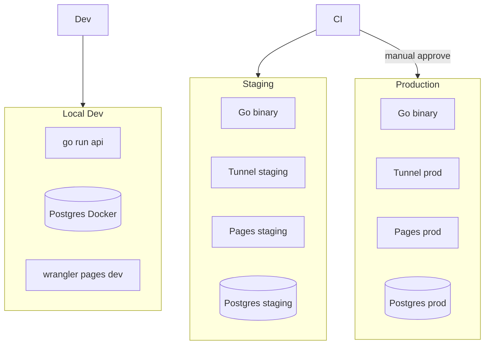

# 16 — Deploy & Lingkungan (Dev / Staging / Production)

> Menyatukan alur rilis **Backend (Go)**, **Frontend Admin**, **Frontend Publik**, **Tunnel**, dan **PostgreSQL** — selaras [02](./02-arsitektur-dan-infrastruktur.md), [15](./15-setup-cloudflare-integrasi.md), [13](./13-setup-backend-dan-sistem.md).

## 1. Tujuan

| Tujuan | Keterangan |
|--------|------------|
| Tiga lingkungan jelas | **Local**, **Staging**, **Production** — tidak campur data/secret |
| Deploy dapat diulang | Script / CI sama setiap rilis |
| Mini CPU aman | Rolling restart tanpa buka port publik |
| UI di edge | Pages deploy terpisah dari binary Go |
| Konfigurasi | Env server + `domain_env_config` + Setup admin per lingkungan |

---

## 2. Ringkasan Lingkungan

| | **Local** | **Staging** | **Production** |
|--|-----------|-------------|----------------|
| **Tujuan** | Dev pekerja | Uji sebelum prod | Live |
| **URL apex** | `localhost:8080` | `staging.seosementara.org` | `seosementara.org` |
| **Backend** | `go run` / binary lokal | Mini CPU (bisa mesin kedua) | Mini CPU utama |
| **PostgreSQL** | Docker / lokal | Instance staging | Instance prod |
| **Tunnel** | Opsional (`cloudflared` dev) | Tunnel `sse-staging` | Tunnel `sse-production` |
| **Pages** | `wrangler pages dev` | Project `*-staging` | Project `*-production` |
| **CF Zone** | — / tunnel only | Subdomain staging | Zone produksi |
| **Data** | Seed / sintetis | Anonim / subset | Real |



---

## 3. Artefak Deploy (Per Komponen)

| Komponen | Artefak | Target | Tool |
|----------|---------|--------|------|
| **Backend API** | `sse-api` binary Linux amd64/arm64 | Mini CPU `/opt/seosementara/bin/` | `go build`, rsync/scp, systemd |
| **Worker** | `sse-worker` atau flag `-mode worker` | Mini CPU systemd | sama |
| **Migrasi DB** | `migrations/*.sql` | PostgreSQL | `goose` / `migrate` |
| **cloudflared** | Config + tunnel token | Mini CPU systemd | Setup admin [15] + CLI |
| **Admin UI** | `Frontend-admin/` build | Cloudflare Pages | GitHub Actions + `wrangler` |
| **Publik UI** | `Frontend-Users/` build | Cloudflare Pages | GitHub Actions + `wrangler` |

**Bukan satu deploy monolith** — 4 pipeline terpisah yang dirilis berurutan (§6).

---

## 4. Variabel Lingkungan

### 4.1 Server mini CPU (file `/etc/seosementara/env` — tidak di Git)

| Variable | Local | Staging | Production |
|----------|-------|---------|------------|
| `APP_ENV` | `local` | `staging` | `production` |
| `HTTP_ADDR` | `127.0.0.1:8080` | `127.0.0.1:8080` | `127.0.0.1:8080` |
| `DATABASE_URL` | local DSN | staging DSN | prod DSN |
| `SESSION_SECRET` | dev-only | staging secret | prod secret (kuat) |
| `MASTER_ENCRYPTION_KEY` | dev-only | staging | prod |
| `LOG_LEVEL` | `debug` | `info` | `info` |

### 4.2 Domain utama (DB `domain_env_config` + sync Pages — [15])

| Key | Staging contoh | Production contoh |
|-----|----------------|-------------------|
| `PRIMARY_DOMAIN` | `staging.seosementara.org` | `seosementara.org` |
| `APEX_URL` | `https://staging.seosementara.org` | `https://seosementara.org` |
| `API_BASE_URL` | sama dengan APEX_URL | sama |
| `ENVIRONMENT` | `staging` | `production` |

Diset lewat **`/admin/setup/cloudflare/domain-utama`** per lingkungan (staging admin terpisah atau flag di DB).

### 4.3 Cloudflare (DB terenkripsi — [15])

| Resource | Staging | Production |
|----------|---------|------------|
| API Token | Token scoped staging (disarankan) | Token scoped prod |
| Tunnel name | `sse-staging` | `sse-production` |
| Pages project admin | `seosementara-admin-staging` | `seosementara-admin` |
| Pages project public | `seosementara-public-staging` | `seosementara-public` |

**Jangan** pakai tunnel/production token yang sama.

---

## 5. Struktur Repo & Branch

| Branch | Lingkungan | Deploy otomatis |
|--------|------------|-----------------|
| `main` | Production | Ya (dengan approval manual) |
| `staging` | Staging | Ya (setiap push) |
| `feature/*` | — | CI test saja |

```
.github/workflows/
├── ci.yml              → test + lint Go, validate SQL
├── deploy-staging.yml  → push staging branch
└── deploy-production.yml → workflow_dispatch / tag v*
```

---

## 6. Urutan Deploy (Runbook)

### 6.1 Production — urutan wajib

```text
1. Backup PostgreSQL (pg_dump)
2. Migrasi DB (goose up) — backward-compatible only
3. Deploy binary Go + restart sse-api, sse-worker
4. Cek /health & /health/ready
5. Deploy Pages (admin + public) — jika UI berubah
6. Sync env Pages dari admin (jika .env domain berubah)
7. Apply Tunnel routes (jika berubah) — biasanya jarang
8. Purge cache Cloudflare (opsional)
9. Smoke test: login admin, list domain, 1 API publik
```

| Langkah gagal | Rollback |
|---------------|----------|
| Migrasi | `goose down 1` + restore dump |
| Binary | systemd restart binary sebelumnya (simpan `.bak`) |
| Pages | Redeploy deployment sebelumnya di dashboard CF |

### 6.2 Staging

Sama seperti production, tanpa backup formal wajib — bisa reset DB dari seed.

### 6.3 Local

```bash
docker compose up -d postgres
cd Backend && go run ./cmd/api
cd Frontend-admin && npx wrangler pages dev
# atau Pages mock + API saja di :8080
```

---

## 7. Backend Go — Detail Deploy (Mini CPU)

### 7.1 Build (CI atau lokal)

```bash
cd Backend
CGO_ENABLED=0 GOOS=linux GOARCH=amd64 \
  go build -ldflags="-s -w -X main.version=${GIT_SHA}" \
  -o dist/sse-api ./cmd/api
CGO_ENABLED=0 GOOS=linux GOARCH=amd64 \
  go build -ldflags="-s -w" -o dist/sse-worker ./cmd/worker
```

| Target mini CPU | Rekomendasi |
|-----------------|-------------|
| `GOARCH` | `amd64` atau `arm64` sesuai hardware |
| Static binary | `CGO_ENABLED=0` — mudah deploy |

### 7.2 Layout di server

```text
/opt/seosementara/
├── bin/
│   ├── sse-api
│   ├── sse-worker
│   └── sse-api.bak          # rollback
├── migrations/
├── config/
│   └── env                  # chmod 600
└── data/
    └── media/               # jika storage local
```

### 7.3 systemd

```ini
# /etc/systemd/system/sse-api.service
[Service]
ExecStart=/opt/seosementara/bin/sse-api
EnvironmentFile=/etc/seosementara/env
Restart=on-failure
RestartSec=5
LimitNOFILE=65535
```

```ini
# sse-worker.service — terpisah agar job tidak mati saat API restart
```

| Dampak | |
|--------|--|
| Restart API < 2 detik | Session di DB tetap valid |
| Worker terpisah | Bulk job lanjut saat deploy API |

### 7.4 Migrasi database

| Aturan | Dampak |
|--------|--------|
| Migrasi **forward-only** di prod | Hindari down yang hapus kolom dipakai |
| Index baru | `CREATE INDEX CONCURRENTLY` di migrasi terpisah |
| Seed | Hanya local/staging |

```bash
goose -dir migrations postgres "$DATABASE_URL" up
```

### 7.5 cloudflared

| Langkah | |
|---------|--|
| Token dari Setup admin [15] | |
| `cloudflared service install <token>` | |
| Config routes dari DB → apply via admin | |

Service terpisah: `cloudflared.service` — restart tidak wajib saat deploy Go kecuali port berubah.

---

## 8. Cloudflare Pages — Detail Deploy

### 8.1 Dua proyek × dua lingkungan = 4 project (disarankan)

| Project | Branch CF Pages | Folder |
|---------|-----------------|--------|
| `seosementara-admin-staging` | `staging` | `Frontend-admin` |
| `seosementara-admin` | `main` | `Frontend-admin` |
| `seosementara-public-staging` | `staging` | `Frontend-Users` |
| `seosementara-public` | `main` | `Frontend-Users` |

### 8.2 GitHub Actions (contoh)

```yaml
# deploy-staging.yml — ringkas
jobs:
  pages-admin:
    steps:
      - uses: actions/checkout@v4
      - run: npx wrangler pages deploy Frontend-admin/public \
          --project-name=seosementara-admin-staging
    env:
      CLOUDFLARE_API_TOKEN: ${{ secrets.CF_TOKEN_STAGING }}
```

| Secret GitHub | Isi |
|---------------|-----|
| `CF_TOKEN_STAGING` | API token scoped Pages staging |
| `CF_TOKEN_PRODUCTION` | API token scoped Pages prod |
| `SSH_DEPLOY_KEY` | Opsional: rsync binary ke mini CPU |

### 8.3 Deploy dari admin panel (opsional fase 2)

Tombol di [15] §7.3: trigger `wrangler pages deploy` via job worker — token dari `cloudflare_credentials`.

| Pro | Kontra |
|-----|--------|
| Super Admin tidak perlu GitHub | Build di mini CPU lambat — **disarankan tetap CI utama** |

---

## 9. CI Pipeline (`ci.yml`)

| Job | Isi |
|-----|-----|
| `go-test` | `go test ./...`, race detector opsional |
| `go-lint` | `staticcheck` / `golangci-lint` |
| `sql-check` | Validasi migrasi goose |
| `build` | Artefak `sse-api`, `sse-worker` — upload artifact |

Tidak deploy ke prod dari PR — hanya dari `main` + approval.

---

## 10. Routing per Lingkungan

| Path | Local | Staging/Prod |
|------|-------|--------------|
| UI `/admin/*` | Pages dev atau Go | Pages + route |
| UI `/` | Pages dev | Pages |
| `/api/*` | Go :8080 | Tunnel → Go |
| `*.domain` | Hosts file / staging DNS | CF DNS |

**Staging** memakai subdomain `staging.` agar tidak bentrok cookie/session dengan prod.

---

## 11. Smoke Test Pasca-Deploy

| # | Cek | Harapan |
|---|-----|---------|
| 1 | `GET /health` | `200` `db: ok` |
| 2 | `GET /health/ready` | disk, tunnel ok |
| 3 | Login admin | Redirect `/admin/` |
| 4 | `GET /api/admin/dashboard` | 200 + HTML partial |
| 5 | Halaman publik apex | 200 |
| 6 | Satu subdomain contoh | 200 |
| 7 | Tunnel connector | healthy di Setup admin |
| 8 | Pages deployment | success di CF |

Otomatisasi: script `scripts/smoke.sh` dengan `curl` + exit code.

---

## 12. Rollback & Darurat

| Keadaan | Tindakan |
|---------|----------|
| Bug kritis API | Rollback binary `.bak` + restart |
| Migrasi rusak | Restore dump + fix forward migration |
| Pages rusak | Rollback deployment CF |
| Tunnel mati | Restart `cloudflared`; cek token |
| Maintenance | `app.maintenance=true` dari Setup backend [13] — tanpa deploy |

**RTO target (internal):** API rollback < 5 menit jika binary `.bak` siap.

---

## 13. Integrasi Setup Admin Panel

| Aksi deploy | Dari mana |
|-------------|-----------|
| Lihat versi terdeploy | `/admin/setup/backend/ringkasan` — `GIT_SHA`, `build_time` |
| Trigger Pages deploy | `/admin/setup/cloudflare/pages` (fase 2) |
| Env domain | `/admin/setup/cloudflare/domain-utama` |
| Maintenance mode | `/admin/setup/backend/operasional` |
| Health tunnel | `/admin/setup/cloudflare/tunnel` |

Backend expose:

```json
GET /api/admin/setup/backend/overview
{
  "version": "abc123",
  "env": "production",
  "uptime_sec": 86400,
  "tunnel_status": "healthy",
  "last_deploy_at": "..."
}
```

---

## 14. Matriks Skenario & Dampak

| # | Skenario | Dampak | Mitigasi |
|---|----------|--------|----------|
| D1 | Deploy API tanpa migrasi | 500 error | CI cek migrasi pending |
| D2 | Migrasi lock tabel lama | Timeout admin | CONCURRENTLY, maintenance window |
| D3 | Pages env salah | HTMX panggil API prod dari staging | Env terpisah per project |
| D4 | Binary salah arch | Cannot execute | CI build matrix match CPU |
| D5 | Dua worker aktif (blue/green salah) | Duplicate job | Satu worker enabled |
| D6 | Secret prod di staging | Kebocoran | Token CF terpisah |
| D7 | Rollback tanpa down migration | Schema mismatch | Hanya forward-compatible migration |
| D8 | cloudflared tidak restart | OK — tunnel independen | |
| D9 | Deploy Jumat sore | Incident weekend | Deploy staging Kamis, prod awal minggu |

---

## 15. Checklist Pertama Kali (Bootstrap Production)

1. [ ] Install PostgreSQL + PgBouncer di mini CPU  
2. [ ] Buat user DB + `DATABASE_URL` di `/etc/seosementara/env`  
3. [ ] Setup Cloudflare: token, tunnel, Pages, DNS [15]  
4. [ ] Install `cloudflared` + routes  
5. [ ] Deploy binary + systemd `sse-api`, `sse-worker`  
6. [ ] `goose up` migrasi awal  
7. [ ] Buat Super Admin pertama (CLI seed — bukan dari web)  
8. [ ] Deploy Pages admin + public  
9. [ ] Sync `domain_env_config` → Pages  
10. [ ] Smoke test §11  
11. [ ] Backup otomatis harian (cron `pg_dump`)  

---

## 16. Roadmap Implementasi Deploy

| Fase | Deliverable |
|------|-------------|
| MVP | Script manual `deploy.sh` + systemd + goose |
| Fase 2 | GitHub Actions staging auto, prod manual |
| Fase 3 | Smoke otomatis, overview versi di admin, Pages dari admin |

---

## 17. Dokumen Terkait

- [02-arsitektur-dan-infrastruktur.md](./02-arsitektur-dan-infrastruktur.md)
- [04-backend-golang.md](./04-backend-golang.md)
- [05-admin-panel-htmx.md](./05-admin-panel-htmx.md)
- [06-frontend-users-htmx.md](./06-frontend-users-htmx.md)
- [08-roadmap-implementasi.md](./08-roadmap-implementasi.md)
- [13-setup-backend-dan-sistem.md](./13-setup-backend-dan-sistem.md)
- [15-setup-cloudflare-integrasi.md](./15-setup-cloudflare-integrasi.md)
