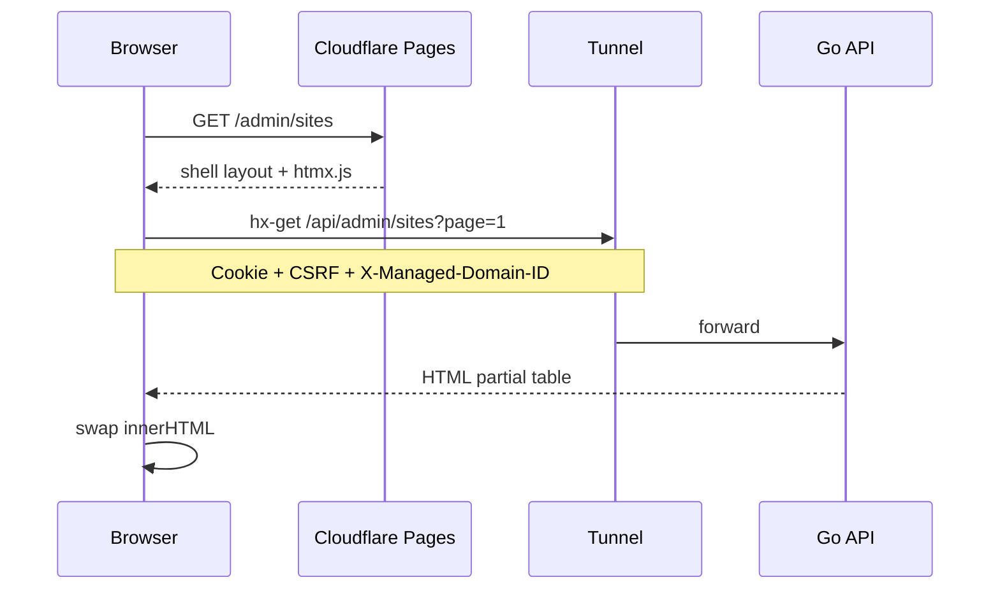

# 17 — Kontrak HTMX & Komponen UI

> Menyelaraskan **Admin Panel** [05](./05-admin-panel-htmx.md), **Frontend Publik** [06](./06-frontend-users-htmx.md), dan **API** [07](./07-api-dan-integrasi.md).  
> Deploy & origin: [16](./16-deploy-dan-lingkungan.md), [15](./15-setup-cloudflare-integrasi.md).

## 1. Prinsip Kontrak

| Prinsip | Aturan |
|---------|--------|
| **HTML-first** | Response HTMX = fragment HTML, bukan JSON kecuali download/export |
| **Satu origin (disarankan)** | `APEX_URL` = `API_BASE_URL` — Pages + Tunnel route `/api` |
| **Cookie session** | Admin: cookie HttpOnly; tidak pakai `Authorization: Bearer` di HTMX |
| **Scope domain** | Header `X-Managed-Domain-ID` pada request admin terkait konten |
| **CSRF** | Header `X-CSRF-Token` pada semua mutasi POST/PUT/PATCH/DELETE [12](./12-autentikasi-dan-login-aman.md) |
| **Id swap jelas** | Setiap region punya `id` stabil (`#main`, `#modal`, `#toast`) |

---

## 2. Arsitektur Request (Admin)



### 2.1 Layout shell (statis di Pages)

File: `Frontend-admin/templates/layouts/admin.html`

| Region | ID | Isi |
|--------|-----|-----|
| Layout penuh | `#layout-admin` | Sidebar + topbar |
| Konten utama | `#main` | **Default swap target** |
| Modal | `#modal` | `hx-swap outerHTML` |
| Toast | `#toast` | Notifikasi singkat |
| Notifikasi badge | `#notif-badge` | Poll ringan |

```html
<body hx-headers='js:{"X-CSRF-Token": document.querySelector("meta[name=csrf]").content}'>
  <meta name="csrf" content="{{.CSRFToken}}">
  <div id="toast"></div>
  <div id="modal"></div>
  <aside><!-- sidebar --></aside>
  <main id="main"
        hx-get="/api/admin/dashboard"
        hx-trigger="load"
        hx-swap="innerHTML">
  </main>
</body>
```

### 2.2 Konfigurasi global HTMX (admin)

```html
<script>
  document.body.addEventListener('htmx:configRequest', (e) => {
    const domainId = localStorage.getItem('active_managed_domain_id');
    if (domainId) e.detail.headers['X-Managed-Domain-ID'] = domainId;
  });
  document.body.addEventListener('htmx:responseError', (e) => {
    // fallback → partial error §4
  });
</script>
```

---

## 3. Header HTTP (Kontrak Wajib)

### 3.1 Request (browser → API)

| Header | Kapan | Nilai |
|--------|-------|-------|
| `HX-Request` | Semua hx-* | `true` (otomatis HTMX) |
| `Cookie` | Admin | `sse_session=...` |
| `X-CSRF-Token` | Mutasi | Dari meta tag |
| `X-Managed-Domain-ID` | Konten domain | ID aktif dari site switcher |
| `Accept` | Opsional | `text/html` |

### 3.2 Response (API → browser)

| Header | Kapan | Efek |
|--------|-------|------|
| `HX-Redirect` | Login OK, logout | Navigasi penuh |
| `HX-Location` | Redirect SPA-like | |
| `HX-Retarget` | Ganti target swap | Mis. error → `#toast` |
| `HX-Reswap` | Ganti strategi swap | |
| `HX-Trigger` | Event client | `showToast`, `closeModal` |
| `HX-Push-Url` | Update URL browser | `/admin/sites?page=2` |
| `Cache-Control` | Publik | `public, max-age=60` |
| `Set-Cookie` | Login | Session |

---

## 4. Format Response & Error

### 4.1 Sukses — partial HTML

```http
HTTP/1.1 200 OK
Content-Type: text/html; charset=utf-8

<div id="post-list">
  <table>...</table>
  <nav class="pagination">...</nav>
</div>
```

**Aturan:** fragment **tidak** include `<html><body>` — hanya potongan dalam target swap.

### 4.2 Error — HTML fragment (admin)

| HTTP | Kode | Fragment |
|------|------|----------|
| 400 | `validation_error` | `<div class="alert alert-error">...</div>` + field errors |
| 401 | `unauthorized` | `HX-Redirect: /admin/login` |
| 403 | `forbidden` | Alert + link bantuan |
| 404 | `not_found` | Alert "tidak ditemukan" |
| 409 | `conflict` | Alert versi konflik (optimistic lock) |
| 429 | `rate_limited` | Alert + `Retry-After` |
| 500 | `internal_error` | Alert generik — tanpa stack trace |

```html
<!-- partial: partials/alert-error.html -->
<div class="alert alert-error" role="alert">
  <p>{{.Message}}</p>
  {{if .Fields}}<ul>{{range .Fields}}<li>{{.}}</li>{{end}}</ul>{{end}}
</div>
```

### 4.3 Error — HTMX global handler

```javascript
document.body.addEventListener('htmx:responseError', (e) => {
  if (e.detail.xhr.status === 401) {
    window.location.href = '/admin/login';
    return;
  }
  const target = e.detail.target;
  if (target && target.id === 'main') {
    target.innerHTML = '<div class="alert">Gagal memuat. Coba lagi.</div>';
  }
});
```

---

## 5. Pola Swap & Trigger (Katalog)

| Pola | hx-get/post | hx-target | hx-swap | Use case |
|------|-------------|-----------|---------|----------|
| List load | `GET` | `#main` | `innerHTML` | `hx-trigger="load"` |
| Pagination | `GET` | `#main` | `innerHTML` | `HX-Push-Url: true` |
| Inline edit | `GET` | `#editor` | `outerHTML` | Klik baris |
| Form save | `POST` | `#editor` | `outerHTML` | Validasi server |
| Append rows | `GET` | `#list` | `beforeend` | Muat lebih |
| Delete confirm | `DELETE` | `#row-{id}` | `delete` | `hx-confirm` |
| Modal | `GET` | `#modal` | `innerHTML` | Setup wizard |
| Toast only | `POST` | `#toast` | `innerHTML` | Aksi kecil |
| Poll job | `GET` | `#job-status` | `innerHTML` | `every 2s` |
| Poll notif | `GET` | `#notif-badge` | `innerHTML` | `every 30s` |
| Site switch | `POST` | `none` | — | Simpan localStorage + reload `#main` |

### 5.1 Hentikan polling

```html
<div hx-get="/api/admin/jobs/45/status"
     hx-trigger="every 2s"
     hx-swap="innerHTML"
     hx-on::after-request="if (event.detail.xhr.responseText.includes('completed')) this.removeAttribute('hx-trigger')">
```

---

## 6. Komponen Admin (Design System Ringan)

Komponen = partial Go template + CSS class — **bukan** framework JS.

| Komponen | File partial | Props / isi |
|----------|--------------|-------------|
| **Alert** | `partials/alert.html` | type, message |
| **Button** | `partials/button.html` | variant, disabled |
| **Table** | `partials/data-table.html` | columns, rows, empty state |
| **Pagination** | `partials/pagination.html` | cursor, has_next |
| **Search box** | `partials/search.html` | hx-get, delay 300ms |
| **Site switcher** | `partials/site-switcher.html` | combobox + hx-get autocomplete |
| **Permission checklist** | `partials/permission-grid.html` | preset + checkboxes [11](./11-rbac-dan-permission-share.md) |
| **Job progress** | `partials/job-progress.html` | % + log ringkas |
| **Modal frame** | `partials/modal.html` | title + body slot |
| **Empty state** | `partials/empty.html` | CTA tambah domain |
| **Badge** | `partials/badge.html` | status domain/job |

### 6.1 Site switcher (ribuan domain)

**Jangan** `<select>` 1000 opsi.

```html
<input type="search"
       name="q"
       placeholder="Cari domain..."
       hx-get="/api/admin/managed-domains/autocomplete"
       hx-trigger="keyup changed delay:300ms"
       hx-target="#site-switcher-results"
       hx-swap="innerHTML">
<div id="site-switcher-results"></div>
```

Pilih item → `POST /api/admin/session/active-domain` → set `localStorage` → `htmx.ajax('GET', '/api/admin/dashboard', '#main')`.

---

## 7. Alur HTMX Kritis (Admin)

### 7.1 Login

```html
<form hx-post="/api/admin/auth/login"
      hx-target="#login-form"
      hx-swap="outerHTML">
```

Response sukses: header `HX-Redirect: /admin/`.

### 7.2 Share domain + checklist permission

- Form: preset radio → centang grid permission
- Owner submit → langsung aktif
- Co-admin → partial "Menunggu persetujuan owner"

### 7.3 Approve undangan (owner)

```html
<button hx-post="/api/admin/share-invitations/{{.ID}}/approve"
        hx-target="#invitation-{{.ID}}"
        hx-swap="outerHTML">
  Setujui
</button>
```

### 7.4 Bulk job

1. Form filter → `POST /api/admin/jobs` → return partial dengan `job_id`
2. Region `#job-progress` poll `GET /api/admin/jobs/{id}/status`

### 7.5 Setup Cloudflare wizard

Steps: koneksi → domain env → tunnel → pages → DNS — `hx-get` step berikutnya ke `#main`, progress bar di top.

---

## 8. Frontend Publik — Kontrak HTMX

### 8.1 Beda dengan admin

| Aspek | Admin | Publik |
|-------|-------|--------|
| Auth | Session wajib | Anonymous (kebanyakan) |
| CSRF | Wajib mutasi | Form publik + Turnstile |
| Cache | Bypass | `max-age` + CDN |
| API prefix | `/api/admin/` | `/api/public/` |

### 8.2 Layout shell (Pages)

```html
<main id="content"
      hx-get="/api/public/home"
      hx-trigger="load"
      hx-swap="innerHTML">
</main>
```

Subdomain `bola.*`:

```html
<main hx-get="/api/public/bola/home"
      hx-trigger="load"></main>
```

### 8.3 Meta `<head>`

**Opsi A (disarankan MVP):** full page reload untuk artikel (SEO) — server return HTML lengkap dari Go/Pages function.

**Opsi B:** HTMX swap hanya `#content` — `<title>` di-update via `HX-Trigger: updateTitle`.

### 8.4 Form publik

```html
<form hx-post="/api/public/forms/contact"
      hx-target="#form-result"
      hx-swap="innerHTML">
  <!-- Turnstile widget -->
</form>
```

---

## 9. Routing URL vs API (Pages + Tunnel)

| URL browser | Siapa render shell | Data HTMX |
|-------------|-------------------|-----------|
| `/admin/sites` | Pages static atau Go | `GET /api/admin/...` |
| `/blog/foo` | Pages / Go | `GET /api/public/...` atau full HTML |

**Kontrak path:** path di address bar boleh di-push (`HX-Push-Url`) hanya untuk admin list/detail — hindari push pada modal.

---

## 10. Versi API & Kompatibilitas

| Item | Nilai |
|------|-------|
| Prefix | `/api/` (v1 opsional) |
| Breaking change | Bump `HX-API-Version: 1` header opsional |
| Deprecation | Comment di template 2 bulan sebelum hapus endpoint |

---

## 11. Testing HTMX

| Jenis | Tool |
|-------|------|
| Handler Go | `httptest` + assert contains HTML |
| E2E ringan | Playwright: login → list domain → create post |
| htmx swap | Cek `HX-Request` header terkirim |

---

## 12. Skenario & Dampak

| # | Skenario | Dampak | Mitigasi |
|---|----------|--------|----------|
| H1 | Swap ke `#main` tanpa ID | Konten hilang | Layout wajib `#main` |
| H2 | Lupa `X-Managed-Domain-ID` | Salah domain edit | Middleware tolak / default none |
| H3 | Return JSON ke hx-get | HTMX tampil raw JSON | `Accept: text/html` + middleware |
| H4 | Poll job tidak berhenti | Beban server | Hapus `hx-trigger` saat done |
| H5 | CSRF missing | 403 semua form | Meta + htmx:configRequest |
| H6 | Cross-origin API | CORS error | Same-origin Tunnel [15] |
| H7 | Full HTML di swap | Layout rusak | Test partial only |
| H8 | Push-Url tanpa handler reload | 404 refresh | Server route `/admin/sites` shell |

---

## 13. Checklist Implementasi MVP

- [ ] Layout admin + `#main`, `#modal`, `#toast`
- [ ] CSRF global + session cookie
- [ ] Site switcher autocomplete
- [ ] Partial error alert
- [ ] `HX-Redirect` login/logout
- [ ] Job polling pattern
- [ ] Publik apex `hx-load` home
- [ ] Smoke: satu alur admin + satu publik

---

## 14. Dokumen Terkait

- [05-admin-panel-htmx.md](./05-admin-panel-htmx.md)
- [06-frontend-users-htmx.md](./06-frontend-users-htmx.md)
- [07-api-dan-integrasi.md](./07-api-dan-integrasi.md)
- [11-rbac-dan-permission-share.md](./11-rbac-dan-permission-share.md)
- [18-bisnis-subdomain-dan-modul.md](./18-bisnis-subdomain-dan-modul.md)
