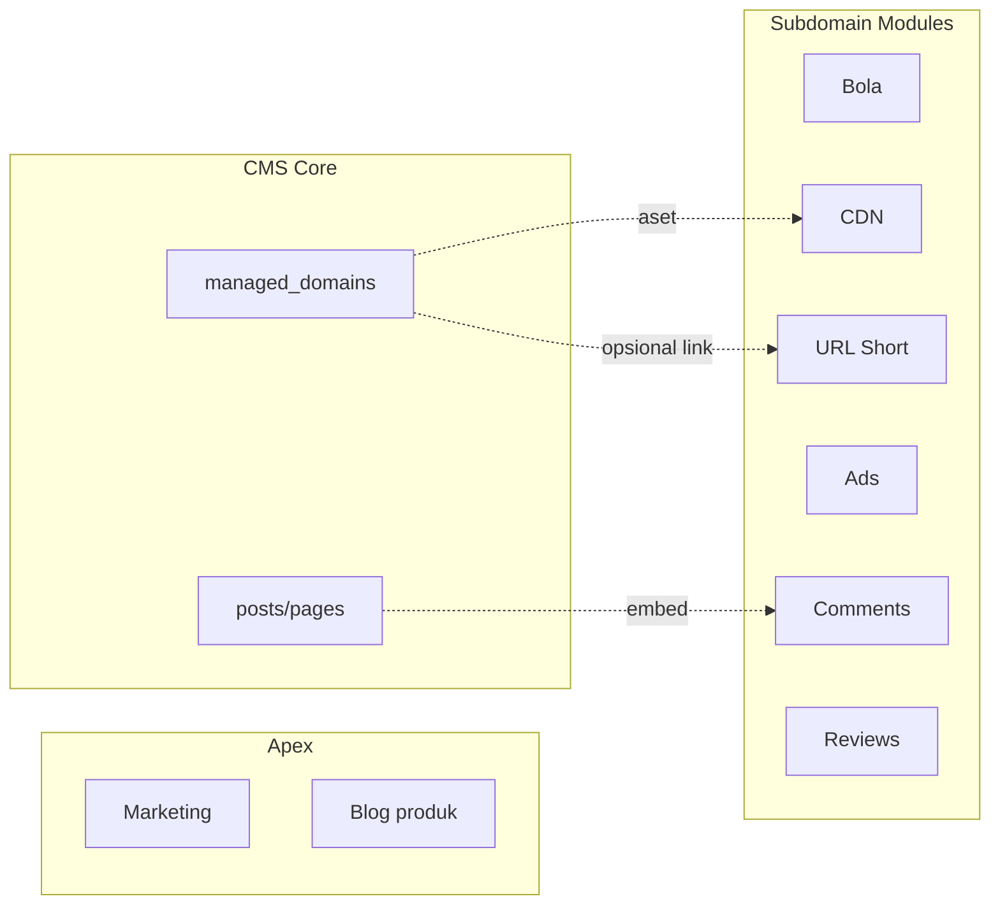

# 18 — Bisnis Subdomain & Modul Layanan

> Spesifikasi fungsi tiap **subdomain produk** (`bola.`, `cdn.`, `url.`, …) — melengkapi [06](./06-frontend-users-htmx.md) dan [09](./09-model-domain-host-dan-subdomain.md).  
> Host didaftarkan di `/admin/setup/host` — template_id menentukan modul.

## 1. Prinsip

| Prinsip | Keterangan |
|---------|------------|
| Subdomain = **layanan produk** | Bukan domain portfolio ribuan |
| Dinamis | Super Admin tambah/ubah host + template di admin |
| Data terpisah | Tabel/modul per layanan — namespace API `/api/public/{modul}/` |
| UI terpisah | Folder `Frontend-Users/subdomains/{modul}/` |
| Hubung ke CMS | Opsional link ke `managed_domain_id` (tracking, aset, short link target) |

---

## 2. Peta Modul (Ringkas)

| Host contoh | `template_id` | Modul | Pengunjung | Admin mengelola |
|-------------|---------------|-------|------------|-----------------|
| `seosementara.org` | `apex_default` | **Apex** | Marketing, blog produk | Super Admin (konten apex) |
| `bola.seosementara.org` | `subdomain_bola` | **Bola** | Jadwal, skor | Modul bola (role khusus / SA) |
| `cdn.seosementara.org` | `subdomain_cdn` | **CDN** | Aset publik / embed | Media global + SA |
| `url.seosementara.org` | `subdomain_url` | **URL** | Redirect short link | Pekerja + domain portfolio |
| `ads.seosementara.org` | `subdomain_ads` | **Ads** | Landing kampanye | Marketing / SA |
| `comments.seosementara.org` | `subdomain_comments` | **Comments** | Widget komentar | Moderator |
| `review.seosementara.org` | `subdomain_review` | **Reviews** | Ulasan produk/layanan | Moderator |



---

## 3. Modul: Apex (`seosementara.org`)

### 3.1 Fungsi

| Fitur | Deskripsi |
|-------|-----------|
| Beranda | Hero, fitur produk, CTA daftar |
| Blog produk | Artikel changelog, tutorial |
| Halaman statis | Tentang, kontak, kebijakan |
| Docs | Dokumentasi API (fase 2) |

### 3.2 Data

Pakai tabel `posts` / `pages` dengan `managed_domain_id = NULL` atau flag `scope = 'product'`.

### 3.3 API publik

| Method | Path |
|--------|------|
| GET | `/api/public/home` |
| GET | `/api/public/blog/{slug}` |

### 3.4 Admin

Konten apex di menu terpisah **Konten Produk** (Super Admin) — bukan site switcher domain portfolio.

---

## 4. Modul: Bola (`bola.`)

### 4.1 Fungsi bisnis (draft)

| Fitur | Pengunjung | Admin |
|-------|------------|-------|
| Daftar pertandingan | Hari ini, liga | CRUD match |
| Detail skor | Live / final | Update skor |
| Klasemen | Tabel liga | Generate klasemen |

### 4.2 Data (tabel baru)

```sql
CREATE TABLE bola_matches (
  id BIGSERIAL PRIMARY KEY,
  league      TEXT NOT NULL,
  home_team   TEXT NOT NULL,
  away_team   TEXT NOT NULL,
  kickoff_at  TIMESTAMPTZ NOT NULL,
  score_home  INT,
  score_away  INT,
  status      SMALLINT NOT NULL DEFAULT 0,
  created_at  TIMESTAMPTZ NOT NULL DEFAULT now()
);
CREATE INDEX idx_bola_matches_kickoff ON bola_matches (kickoff_at DESC);
```

### 4.3 API

| Prefix | Contoh |
|--------|--------|
| Publik | `GET /api/public/bola/matches`, `GET /api/public/bola/matches/{id}` |
| Admin | `GET/POST /api/admin/bola/matches` (permission modul atau SA) |

### 4.4 UI publik

`Frontend-Users/subdomains/bola/` — layout hijau, menu: Beranda, Liga, Jadwal.

---

## 5. Modul: CDN (`cdn.`)

### 5.1 Fungsi

| Fitur | Deskripsi |
|-------|-----------|
| Delivery aset | URL publik media dari CMS |
| Embed | Link gambar untuk domain portfolio |
| Purge | Invalidate cache saat media update |

### 5.2 Data

Terkait `media` table — `public_url`, `cdn_path`.

### 5.3 API

| Method | Path |
|--------|------|
| GET | `/api/public/cdn/asset/{id}` | Redirect / serve |
| POST | `/api/admin/cdn/purge` | Purge by domain atau global |

### 5.4 Keamanan

| Risiko | Mitigasi |
|--------|----------|
| Hotlink abuse | Signed URL TTL 1h |
| Directory listing | Tidak ada list publik |

---

## 6. Modul: URL Short (`url.`)

### 6.1 Fungsi

| Fitur | Deskripsi |
|-------|-----------|
| Buat short link | `url.seosementara.org/abc123` → target URL |
| Statistik klik | Count per link (aggregat cached) |
| Link per domain portfolio | `managed_domain_id` opsional |

### 6.2 Data

```sql
CREATE TABLE url_links (
  id BIGSERIAL PRIMARY KEY,
  code            TEXT NOT NULL UNIQUE,
  target_url      TEXT NOT NULL,
  managed_domain_id BIGINT REFERENCES managed_domains(id),
  owner_user_id   BIGINT NOT NULL REFERENCES users(id),
  click_count     BIGINT NOT NULL DEFAULT 0,
  is_active       BOOLEAN NOT NULL DEFAULT true,
  created_at      TIMESTAMPTZ NOT NULL DEFAULT now()
);
CREATE INDEX idx_url_links_code ON url_links (code);
```

### 6.3 Alur publik

```http
GET https://url.seosementara.org/{code}
→ 302 target_url
→ increment click_count async (job)
```

### 6.4 Admin

- Pekerja buat link untuk domain yang mereka miliki / share
- Menu: **Tools → Short URL** atau di detail domain portfolio

---

## 7. Modul: Ads (`ads.`)

### 7.1 Fungsi

| Fitur | Deskripsi |
|-------|-----------|
| Landing kampanye | Halaman promo |
| Banner registry | ID banner → embed di domain portfolio (fase 2) |
| Tracking imp/click | Job agregat |

### 7.2 Data

```sql
CREATE TABLE ads_campaigns (
  id BIGSERIAL PRIMARY KEY,
  name        TEXT NOT NULL,
  slug        TEXT NOT NULL UNIQUE,
  html_block  TEXT,
  is_active   BOOLEAN NOT NULL DEFAULT true,
  starts_at   TIMESTAMPTZ,
  ends_at     TIMESTAMPTZ
);
```

### 7.3 API publik

`GET /api/public/ads/campaign/{slug}` — HTML partial landing.

---

## 8. Modul: Comments (`comments.`)

### 8.1 Fungsi

| Fitur | Deskripsi |
|-------|-----------|
| Widget embed | Script/HTMX embed di halaman eksternal |
| Moderasi | Approve / spam |
| Rate limit ketat | CF + origin [13](./13-setup-backend-dan-sistem.md) |

### 8.2 Data

```sql
CREATE TABLE comments (
  id BIGSERIAL PRIMARY KEY,
  entity_type   TEXT NOT NULL,  -- post, page, external
  entity_id     TEXT NOT NULL,
  author_name   TEXT,
  body          TEXT NOT NULL,
  status        SMALLINT NOT NULL DEFAULT 0,  -- pending, approved, spam
  ip_hash       TEXT,
  created_at    TIMESTAMPTZ NOT NULL DEFAULT now()
);
CREATE INDEX idx_comments_entity ON comments (entity_type, entity_id, status);
```

### 8.3 API

| Method | Path |
|--------|------|
| GET | `/api/public/comments?entity_type=&entity_id=` |
| POST | `/api/public/comments` | Turnstile + rate limit |
| POST | `/api/admin/comments/{id}/approve` | Moderator |

---

## 9. Modul: Reviews (`review.`)

### 9.1 Fungsi

| Fitur | Deskripsi |
|-------|-----------|
| Ulasan bintang 1–5 | Terikat `managed_domain_id` atau produk |
| Agregat rating | `stats_domain` extension |
| Moderasi | Sama seperti comments |

### 9.2 Data

```sql
CREATE TABLE reviews (
  id BIGSERIAL PRIMARY KEY,
  managed_domain_id BIGINT REFERENCES managed_domains(id),
  rating          SMALLINT NOT NULL CHECK (rating BETWEEN 1 AND 5),
  title           TEXT,
  body            TEXT,
  status          SMALLINT NOT NULL DEFAULT 0,
  created_at      TIMESTAMPTZ NOT NULL DEFAULT now()
);
```

---

## 10. Registrasi Host di Admin

| Field `hosts` | Contoh |
|---------------|--------|
| `hostname` | `url.seosementara.org` |
| `template_id` | `subdomain_url` |
| `config` | `{"default_redirect": "https://seosementara.org"}` |

Tombol **Sync DNS** [15] — CNAME/wildcard.

Tombol **Preview** — buka host di tab baru (staging/prod).

---

## 11. Permission & RBAC Modul

| Modul | Permission sistem (admin) | Domain share |
|-------|-------------------------|--------------|
| Bola | `module.bola.manage` | — |
| CDN | `module.cdn.manage` | — |
| URL | — | `tools.url` pada domain |
| Ads | `module.ads.manage` | — |
| Comments | `module.comments.moderate` | — |
| Reviews | `module.reviews.moderate` | — |

Tambah key di [11](./11-rbac-dan-permission-share.md) §3.3 saat implementasi.

---

## 12. Prioritas Implementasi

| Fase | Modul | Alasan |
|------|-------|--------|
| MVP | Apex + **URL** | Nilai langsung untuk domain portfolio |
| Fase 2 | **CDN** + Comments | Media & engagement |
| Fase 3 | Bola, Ads, Reviews | Konten vertikal |

---

## 13. Domain Portfolio — Hubungan ke Publik

| Pertanyaan | Keputusan draft |
|------------|-----------------|
| Apakah `toko-abc.com` punya situs publik di CMS? | **Tidak di MVP** — hanya data admin |
| Preview domain | `GET /admin/sites/{id}/preview` — HTML privat (auth) |
| Short link | **Ya** — modul URL, link ke domain |
| Sitemap domain | Generate file / job — fase 2, bukan hostname terpisah |

---

## 14. Skenario & Dampak

| # | Skenario | Dampak |
|---|----------|--------|
| M1 | Tambah subdomain tanpa template | 404 — wajib `template_id` valid |
| M2 | URL code collision | UNIQUE constraint |
| M3 | Comment spam | Moderation queue + rate limit |
| M4 | CDN hotlink | Signed URL |
| M5 | Bola data stale | Cache pendek + HTMX poll opsional |
| M6 | Modul tanpa admin UI | Super Admin only — beban operasi |

---

## 15. Dokumen Terkait

- [06-frontend-users-htmx.md](./06-frontend-users-htmx.md)
- [09-model-domain-host-dan-subdomain.md](./09-model-domain-host-dan-subdomain.md)
- [14-setup-meta-dan-seo.md](./14-setup-meta-dan-seo.md)
- [17-kontrak-htmx-dan-komponen-ui.md](./17-kontrak-htmx-dan-komponen-ui.md)
- [10-database-postgresql.md](./10-database-postgresql.md)
