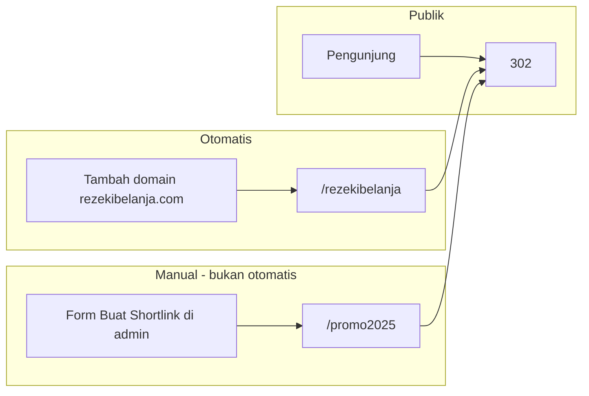

# 19 — Modul URL Shortlink (`url.seosementara.org`)

> Sistem shortlink **mandiri** dengan pembuatan **manual** dan **otomatis** (per domain portfolio), plus **tracking & analitik** terintegrasi data internal dan **Cloudflare**.  
> Host: `url.seosementara.org` — `template_id`: `subdomain_url` ([18](./18-bisnis-subdomain-dan-modul.md)).

## 1. Tujuan

| Tujuan | Keterangan |
|--------|------------|
| Shortlink branded | `url.seosementara.org/{kode}` — bukan bit.ly pihak ketiga |
| Otomatis massal | Tambah domain `rezekibelanja.com` → langsung ada `url.seosementara.org/rezekibelanja` |
| Manual fleksibel | Kode & target bebas lewat UI `/manual` |
| Tracking | Klik, referrer, geo, device — dashboard admin |
| Cloudflare | Analytics / logs / bot score dari edge selaras [15](./15-setup-cloudflare-integrasi.md) |

---

## 2. Dua Jenis Shortlink — Otomatis vs Manual

> **Manual** = **cara pembuatan** (user sengaja membuat link), **bukan** nama path URL seperti `/manual`.

| Jenis | `source` di DB | Contoh shortlink | Kapan dibuat |
|-------|----------------|------------------|--------------|
| **Otomatis** | `auto_domain` | `url.seosementara.org/rezekibelanja` | Sistem saat domain `rezekibelanja.com` ditambahkan |
| **Manual** | `manual` | `url.seosementara.org/promo2025` | User klik **Buat shortlink** di admin & isi form |

| | Otomatis | Manual |
|--|----------|--------|
| Pemicu | Tambah / import domain | Form di admin panel |
| Kode | Dari hostname domain | User tentukan (atau random) |
| Target | Default URL domain | URL tujuan bebas |
| Jumlah | 1 per domain (typical) | Banyak per user/domain |



---

## 3. Peta URL di `url.seosementara.org`

Hanya **redirect** dan halaman pendukung — **tidak** ada path `/manual`.

| Path | Fungsi | Auth |
|------|--------|------|
| `/` | Landing singkat modul shortlink (opsional) | Publik |
| `/{code}` | **Redirect** ke `target_url` (auto **atau** manual) | Publik |
| `/stats/{code}` | Lihat statistik satu link | Login |

### Reserved paths (bukan kode shortlink)

```
stats, api, admin, health, assets, favicon.ico
```

**`manual` bukan path khusus** — bisa dipakai sebagai **kode** shortlink jika user buat manual (mis. `url.seosementara.org/manual` → redirect ke suatu URL), sama seperti kode lain.

---

## 4. Pembuatan Otomatis (Ribuan Domain)

### 4.1 Aturan generate kode

| Input domain | Kode default | Target default |
|--------------|--------------|----------------|
| `rezekibelanja.com` | `rezekibelanja` | `https://rezekibelanja.com` (atau dari setting domain) |
| `www.toko.id` | `toko` (strip www) | `https://www.toko.id` |
| `shop.example.co.id` | `shop-example-co-id` atau slug configurable | URL tercatat di `managed_domains` |

Algoritma (urutan):

1. Ambil **hostname** dari `managed_domains.hostname`
2. Normalisasi: lowercase, buang `www.`
3. Ambil **label utama** sebelum TLD (`rezekibelanja` dari `rezekibelanja.com`)
4. Jika bentrok → suffix `-2`, `-3` atau hash pendek 4 char
5. Insert `url_links` dengan `source = auto_domain`

### 4.2 Hook backend

```text
POST /api/admin/managed-domains  (domain baru)
  → INSERT managed_domains
  → IF auto_shortlink_enabled (default true)
      → createUrlLinkAuto(domain)
  → RETURN domain + shortlink_url di response HTML
```

| Event lain | Aksi shortlink |
|------------|----------------|
| Ubah hostname domain | Opsional: update target_url, **jangan** ubah kode (stabilitas link) |
| Hapus / arsip domain | `url_links.is_active = false` — redirect ke halaman "nonaktif" |
| Transfer ownership | `owner_user_id` pada link mengikuti owner baru |

### 4.3 Skala ribuan

| Tantangan | Solusi |
|-----------|--------|
| 3000 domain = 3000 link auto | Insert satu row — ringan; index `code` UNIQUE |
| List di admin | Pagination — jangan load semua |
| Collision nama | Algoritma suffix + UI tampilkan kode final |

### 4.4 Field di `managed_domains`

```sql
ALTER TABLE managed_domains ADD COLUMN
  auto_shortlink_enabled BOOLEAN NOT NULL DEFAULT true,
  auto_shortlink_code    TEXT,  -- mirror kode aktif, denormalized
  default_target_url     TEXT;  -- override redirect target
```

---

## 5. Pembuatan Manual (`/manual`)

### 5.1 UI (HTMX di `url.seosementara.org/manual`)

| Elemen | Perilaku |
|--------|----------|
| Target URL | Input wajib, validasi http(s) |
| Kode custom | Opsional — kosong = generate random 6–8 char |
| Domain portfolio | Opsional — link ke `managed_domain_id` |
| Catatan | Label internal |
| Simpan | `POST /api/admin/url/links` atau `/api/public/url/links` dengan session |

Login: session cookie **sama** dengan admin apex (`seosementara.org`) — same-site atau shared cookie domain `.seosementara.org` [17](./17-kontrak-htmx-dan-komponen-ui.md).

### 5.2 Permission

| Role | Manual create |
|------|---------------|
| Super Admin | Semua |
| Owner domain | Ya + auto link domain milik |
| Share dengan permission | `tools.url` atau `module.url` [11](./11-rbac-dan-permission-share.md) |

---

## 6. Redirect & Edge (Publik)

### 6.1 Alur request

```http
GET https://url.seosementara.org/rezekibelanja
Host: url.seosementara.org
```

```text
1. Router: bukan reserved path → lookup url_links WHERE code = $1 AND is_active
2. Jika tidak ada → 404 branded
3. Validasi target (tidak redirect ke javascript:, dll.)
4. Enqueue job / async: insert url_clicks + headers CF
5. HTTP 302 Location: target_url
   (opsional 301 jika link permanen)
```

### 6.2 Header Cloudflare yang disimpan

Dari request di origin (via Tunnel):

| Header CF | Dipakai untuk |
|-----------|---------------|
| `CF-Connecting-IP` | IP hash (privasi) |
| `CF-IPCountry` | Negara |
| `CF-Ray` | Korelasi log CF |
| `CF-Device-Type` | desktop/mobile/tablet |
| `User-Agent` | Browser/OS (parsed ringkas) |
| `Referer` | Sumber klik |

| Dampak | Tanpa CF header |
|--------|-----------------|
| Geo tidak ada | Hanya IP hash |

---

## 7. Tracking & Analitik (Database)

### 7.1 Tabel `url_links` (revisi)

```sql
CREATE TABLE url_links (
  id                BIGSERIAL PRIMARY KEY,
  code              TEXT NOT NULL,
  target_url        TEXT NOT NULL,
  source            TEXT NOT NULL CHECK (source IN ('auto_domain','manual')),
  managed_domain_id BIGINT REFERENCES managed_domains(id) ON DELETE SET NULL,
  owner_user_id     BIGINT NOT NULL REFERENCES users(id),
  title             TEXT,
  is_active         BOOLEAN NOT NULL DEFAULT true,
  redirect_status   SMALLINT NOT NULL DEFAULT 302,
  click_count       BIGINT NOT NULL DEFAULT 0,  -- denorm untuk dashboard cepat
  last_clicked_at   TIMESTAMPTZ,
  created_at        TIMESTAMPTZ NOT NULL DEFAULT now(),
  updated_at        TIMESTAMPTZ NOT NULL DEFAULT now(),
  UNIQUE (code)
);

CREATE INDEX idx_url_links_domain ON url_links (managed_domain_id);
CREATE INDEX idx_url_links_owner ON url_links (owner_user_id, created_at DESC);
```

### 7.2 Tabel `url_clicks` (event)

```sql
CREATE TABLE url_clicks (
  id          BIGSERIAL,
  url_link_id BIGINT NOT NULL REFERENCES url_links(id) ON DELETE CASCADE,
  clicked_at  TIMESTAMPTZ NOT NULL DEFAULT now(),
  country     CHAR(2),
  device_type TEXT,
  referer     TEXT,
  ip_hash     TEXT,
  cf_ray      TEXT,
  PRIMARY KEY (id, clicked_at)
) PARTITION BY RANGE (clicked_at);

-- Partisi bulanan; retensi 12 bulan
```

| Dampak | |
|--------|--|
| Insert async | Redirect tidak tunggu INSERT |
| Partition | Drop bulan lama cepat |
| Agregat | Job harian roll-up ke `url_link_stats_daily` |

### 7.3 Agregat harian (dashboard cepat)

```sql
CREATE TABLE url_link_stats_daily (
  url_link_id   BIGINT NOT NULL,
  stat_date     DATE NOT NULL,
  clicks        INT NOT NULL DEFAULT 0,
  unique_ip     INT NOT NULL DEFAULT 0,
  top_country   CHAR(2),
  PRIMARY KEY (url_link_id, stat_date)
);
```

---

## 8. Integrasi Cloudflare Analytics

### 8.1 Dua sumber data

| Sumber | Data | Cara |
|--------|------|------|
| **Internal** | Klik per redirect (akurat) | `url_clicks` di origin |
| **Cloudflare** | Traffic edge, bot, cache | API Analytics / GraphQL |

### 8.2 Setup admin ([15](./15-setup-cloudflare-integrasi.md) + [13](./13-setup-backend-dan-sistem.md))

Path: `/admin/setup/backend/url-analytics/` atau tab di Setup Cloudflare

| Setting | Fungsi |
|---------|--------|
| Zone tag untuk `url.seosementara.org` | Query traffic |
| Sync interval | Job harian pull CF stats |
| Map `cf_ray` → klik | Korelasi debug |

### 8.3 Cloudflare API (contoh)

| API | Dipakai untuk |
|-----|---------------|
| Zone Analytics / GraphQL | Request count ke `url.seosementara.org/*` |
| Firewall Events | Blocked bot pada shortlink |
| Logpush (opsional) | Log mentah ke R2 — fase lanjutan |

Tabel cache:

```sql
CREATE TABLE url_cf_stats_daily (
  stat_date     DATE NOT NULL,
  requests      BIGINT,
  bandwidth     BIGINT,
  threats       INT,
  synced_at     TIMESTAMPTZ NOT NULL,
  PRIMARY KEY (stat_date)
);
```

### 8.4 Dashboard admin

| Halaman | Isi |
|---------|-----|
| `/admin/url` atau tab di domain detail | Shortlink domain: `url.../rezekibelanja` |
| `/admin/url/links/{id}/stats` | Grafik klik 30 hari, negara, referer top |
| `/url.seosementara.org/stats/{code}` | Versi untuk owner (HTMX) |
| Bandingkan | Internal clicks vs CF requests (selisih = cache/bot) |

---

## 9. Menu Admin & API

### 9.1 Menu

```
Tools (atau modul URL)
├── Daftar shortlink (paginated, filter auto/manual)
├── Buat manual → link ke url.../manual
└── Analitik global

Detail domain portfolio
└── Kartu: Shortlink otomatis
    ├── URL: url.seosementara.org/rezekibelanja
    ├── Target: https://rezekibelanja.com
    ├── Toggle auto_shortlink_enabled
    └── Lihat statistik
```

### 9.2 API

| Method | Path | Deskripsi |
|--------|------|-----------|
| GET | `/api/admin/url/links` | List (filter owner, domain, source) |
| POST | `/api/admin/url/links` | Buat manual |
| PATCH | `/api/admin/url/links/{id}` | Ubah target, active |
| GET | `/api/admin/url/links/{id}/stats` | Agregat + series |
| POST | `/api/admin/url/links/sync-cf-stats` | Pull CF (SA) |
| GET | `/api/public/url/r/{code}` | Redirect handler (bukan JSON) |

Semua create **manual** lewat **`/api/admin/url/links`** (session + permission `tools.url.create`).

---

## 10. Konfigurasi (Setup Backend)

| Key | Default | Keterangan |
|-----|---------|------------|
| `url.auto_enabled_global` | true | Default auto saat domain baru |
| `url.manual_code_min_len` | 4 | |
| `url.manual_code_max_len` | 32 | |
| `url.random_code_length` | 6 | Jika kode kosong |
| `url.retention_clicks_months` | 12 | Partition drop |
| `url.sync_cf_analytics` | true | Job harian |

---

## 11. Skenario & Dampak

| # | Skenario | Dampak | Mitigasi |
|---|----------|--------|----------|
| U1 | Domain `rezekibelanja.com` + `.id` sama slug | Collision | Suffix `-2` |
| U2 | 10k klik/hari satu link | Banyak insert | Async + partition |
| U3 | Target phishing | Reputasi rusak | Blocklist domain + moderasi SA |
| U4 | CF cache 302 | Under-count internal | Dokumentasi selisih analytics |
| U5 | User ubah kode auto | Link mati | Kode auto **immutable** |
| U6 | `/manual` sebagai kode | 404 salah | Reserved paths |
| U7 | Redirect loop | Browser error | Validasi target ≠ url host |
| U8 | Import 1000 domain bulk | 1000 insert | Job batch create shortlinks |

---

## 12. Prioritas Implementasi

| Fase | Deliverable |
|------|-------------|
| MVP | Auto on domain create + redirect 302 + click_count |
| Fase 2 | `/manual` UI + `url_clicks` + dashboard harian |
| Fase 3 | CF Analytics sync + partition + geo chart |

---

## 13. Contoh End-to-End

```text
1. Pekerja tambah domain "rezekibelanja.com" di /admin/sites
2. Backend create managed_domains id=501
3. Auto create url_links:
     code=rezekibelanja, target=https://rezekibelanja.com, source=auto_domain
4. Response HTML menampilkan:
     "Shortlink: https://url.seosementara.org/rezekibelanja"
5. Pengunjung buka shortlink → 302 → rezekibelanja.com
6. Job tulis url_clicks + increment click_count
7. Owner buka stats → grafik 7 hari + top country
```

---

## 14. Dokumen Terkait

- [18-bisnis-subdomain-dan-modul.md](./18-bisnis-subdomain-dan-modul.md)
- [09-model-domain-host-dan-subdomain.md](./09-model-domain-host-dan-subdomain.md)
- [10-database-postgresql.md](./10-database-postgresql.md)
- [15-setup-cloudflare-integrasi.md](./15-setup-cloudflare-integrasi.md)
- [17-kontrak-htmx-dan-komponen-ui.md](./17-kontrak-htmx-dan-komponen-ui.md)
- [11-rbac-dan-permission-share.md](./11-rbac-dan-permission-share.md)
