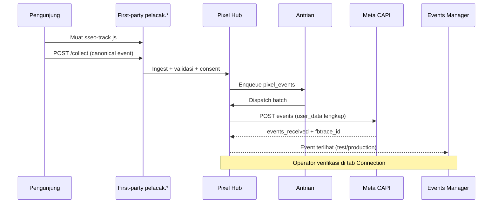

# 21 — Pixel Facebook Pro (Spesifikasi Profesional)

> **Dokumen perencanaan** — bukan panduan coding. Mendefinisikan fitur tingkat **Pro** untuk kolaborasi dengan **Meta** (Facebook Pixel + Conversions API).  
> Arsitektur hub: [20](./20-pixel-admin-facebook-tiktok-gads.md) · Protokol & data: [22](./22-pixel-protokol-komunikasi-dan-data.md) · **CAPI kedalaman: [23](./23-meta-conversions-api-kedalaman.md)**

---

## 1. Posisi Modul

| Level | Cakupan | Contoh |
|-------|---------|--------|
| **Basic** | Tempel Pixel ID, snippet manual di tema | Tidak ada CAPI, tidak ada first-party |
| **Pro** *(dokumen ini)* | Ruang kerja Meta + first-party + CAPI + dedup + EMQ + mass domain | Setara Stape/CAPIG untuk satu kanal |
| **Enterprise** *(fase berikut)* | Multi-BM, multi-pixel per domain, SLA, audit compliance | Agensi / ribuan domain dengan SLA berbeda |

**Tujuan Pro:** tim marketing dan operator CMS bisa **berkolaborasi penuh** dengan Events Manager Meta tanpa bolak-balik dashboard eksternal untuk rutinitas, sambil menjaga **kelengkapan data** dan **kekuatan sinyal** (Event Match Quality) untuk iklan lebih murah dan stabil.

---

## 2. Ruang Kerja Admin — Fitur per Tab

### 2.1 Overview (`/admin/pixel/facebook/`)

| Widget / data | Sumber | Refresh | Kegunaan kolaborasi |
|---------------|--------|---------|---------------------|
| Status koneksi Meta | Validasi token + health job | 5 menit | Langsung tahu apakah kolaborasi “hidup” |
| Event Match Quality (EMQ) ringkas | Meta API / estimasi internal | Harian | Indikator “pixel pintar” = data cocok dengan akun Meta |
| Events 24j: diterima / terkirim / gagal / pending | DB internal | Real-time | Transparansi pipeline |
| Recovery rate estimasi | Perbandingan pre/post first-party | Mingguan | Bukti solusi adblock |
| Peringatan aktif | Token expired, backlog > N, error rate > X% | Real-time | Proaktif sebelum budget iklan boros |
| Tautan cepat | Events Manager, Business Manager, dokumentasi Meta | - | Satu klik ke platform untuk verifikasi manual |

### 2.2 Setup (`.../setup`)

| Field | Wajib | Validasi | Disimpan sebagai |
|-------|-------|----------|------------------|
| Nama konfigurasi | Ya | Unik per scope | `pixel_configs.name` |
| Meta Pixel ID | Ya | Numeric, panjang valid | `external_ids.pixel_id` |
| Business Manager ID | Tidak | ID BM jika multi-akun | `external_ids.business_id` |
| Dataset ID (jika terpisah) | Tidak | Opsional CAPI v2 | `external_ids.dataset_id` |
| CAPI Access Token | Ya (Pro) | Test kirim event | `pixel_credentials` terenkripsi |
| Test Event Code | Disarankan | String dari Events Manager | `pixel_configs.test_event_code` |
| Mode pelacakan | Ya | `server_first` / `hybrid` / `legacy_client` | `mode_override` |
| Aktifkan CAPI | Ya | Boolean | `capi_enabled` |
| Aktifkan browser pixel | Hybrid saja | Boolean | `browser_pixel_enabled` |
| Agama data (retensi log) | Ya | 30 / 90 / 180 hari | `pixel_hub_settings` |

**Aksi profesional:**

| Tombol | Hasil yang diharapkan |
|--------|----------------------|
| Simpan & validasi struktur | Field invalid ditolak sebelum simpan |
| Uji koneksi CAPI | 1 event `PageView` ke Meta dengan `test_event_code` |
| Pratinjau payload | JSON yang **akan** dikirim (tanpa secret) |
| Rotasi token | Token baru; token lama grace 24j |
| Buka Events Manager | Deep link ke pixel yang sama |

### 2.3 Connection (`.../connection`)

Kolaborasi **status hidup** dengan Meta — bukan sekadar “connected / tidak”.

| Indikator | Data lengkap | Ambang hijau / kuning / merah |
|-----------|--------------|-------------------------------|
| Token health | `expires_at`, `scopes`, `last_validated_at` | Valid < 7 hari sebelum expiry |
| CAPI throughput | events/detik, rate limit headers | < 80% quota |
| Error taxonomy | `auth`, `invalid_payload`, `rate_limit`, `pixel_disabled` | > 5% gagal = kuning |
| EMQ per parameter | skor untuk `em`, `ph`, `fbp`, `fbc`, `ip`, `ua` | Meta guideline |
| Dedup rate | % event ditolak duplikat Meta | < 2% = normal |
| Last successful sync | timestamp | > 1 jam = investigasi |

**Integrasi dua arah (kolaborasi):**

| Arah | Mekanisme | Data yang kembali ke CMS |
|------|-----------|---------------------------|
| CMS → Meta | CAPI `POST /{pixel-id}/events` | `events_received`, `fbtrace_id`, `messages[]` |
| Meta → CMS *(fase Pro+)* | Webhook diagnostics / scheduled Insights | Ringkasan kualitas event (jika API mengizinkan) |
| Operator → Meta | Link + panduan langkah di UI | Checklist verifikasi domain |

### 2.4 Domains (`.../domains`)

Mass collaboration untuk **ribuan domain portfolio**.

| Fitur | Data | Perilaku |
|-------|------|----------|
| Pencarian domain | hostname, owner, tag, status | Pagination 50 |
| Assign pixel ke domain | `pixel_domain_assignments` | Satu domain bisa 1 pixel aktif default |
| Template grup | “Semua domain owner X” → pixel Y | Job batch, bukan loop manual |
| Kebijakan inherit | global → override per domain | Child domain menimpa parent |
| Status deploy | `pending` / `deployed` / `failed` | Snippet/meta terupdate via job |
| Simulasi event | pilih domain → fire test `PageView` | Muncul di Events Manager dengan label domain |
| Verifikasi domain Meta | checklist DNS / meta-tag | Status per domain |

### 2.5 Diagnostics (`.../diagnostics`)

| Metrik | Definisi | Tindakan disarankan |
|--------|----------|---------------------|
| Backlog pending | Event belum `pixel_dispatch` | Scale worker / cek token |
| P95 latency ingest→sent | Waktu antrian + API Meta | > 30 dtk = tuning batch |
| Failure rate per `event_name` | Gagal / total per tipe | Perbaiki mapping atau payload |
| Bot dropped | Ditolak di privacy gateway | Normal jika tinggi di redirect |
| Adblock recovery | `(sent_server) / (sent_server + estimated_lost)` | Bandingkan sebelum/sesudah first-party |
| Top 10 error messages | Agregat 24j | Link ke event log terfilter |

### 2.6 Events (`.../events`)

Log **lengkap** untuk audit kolaborasi dengan Meta.

| Kolom UI | Field DB / payload | Filter |
|----------|-------------------|--------|
| Waktu (UTC + lokal) | `created_at`, `sent_at` | Rentang tanggal |
| Event ID (dedup) | `event_id` | Exact |
| Nama event | `event_name` | Multi-select |
| Canonical | `canonical_event` | Dari katalog [22] |
| Domain / shortlink | `managed_domain_id`, `url_link_id` | |
| Status pipeline | `pending` → `sent` / `failed` / `dropped_bot` | |
| Meta response | `platform_event_id`, `fbtrace_id` | |
| Payload ringkas | `user_data` hash status ✓/✗ | Tanpa PII mentah |
| Retry count | `retry_attempts` | |
| Error | `error_message`, `error_code` | |

**Aksi:** replay event gagal (dengan `event_id` sama untuk dedup), export CSV (job, max 10k baris).

### 2.7 Analytics (`.../analytics`)

| Laporan | Dimensi | Catatan |
|---------|---------|---------|
| Funnel event | page_view → view_content → lead → purchase | Per domain / global |
| Konversi per domain | `managed_domain_id` | Untuk portfolio massal |
| EMQ trend | 7 / 30 hari | Disclaimer jika API terbatas |
| Perbandingan kanal | FB vs internal traffic CF | [15] Analytics |
| ROI proxy | event purchase / spend *(input manual/API Ads)* | Fase Enterprise |

---

## 3. Cara Berkomunikasi — Facebook (Alur Kuat & Jelas)

### 3.1 Tiga jalur komunikasi

| Jalur | Kapan | Kekuatan sinyal |
|-------|-------|-----------------|
| **A — First-party ingest** | Default Pro | Tidak diblokir adblock; URL & cookie first-party |
| **B — CAPI server** | Setelah antrian | EMQ tinggi: IP, UA, fbp, fbc, hash em/ph |
| **C — Browser hybrid** | Mode `hybrid` | Dedup wajib `event_id` sama A+B |

### 3.2 Tahap pipeline (setiap event)

| Tahap | Fungsi | Gagal → |
|-------|--------|---------|
| 1. Capture | Browser atau server CMS menghasilkan canonical event | Drop + log |
| 2. Ingest | Validasi schema [22], origin, rate limit | 400 |
| 3. Enrich | Tambah IP, UA, geo (CF header), kait `managed_domain_id` | Partial OK |
| 4. Consent gate | Cek marketing consent | `skipped` |
| 5. Privacy transform | Hash PII, buang field terlarang | Audit log |
| 6. Map | Canonical → `PageView`, `Lead`, … | `mapping_error` |
| 7. Dedup key | Generate / preserve `event_id` | - |
| 8. Queue | `pending` di DB | Backpressure |
| 9. Dispatch | HTTP ke Meta dengan retry exponential | `failed` + retry |
| 10. Ack | Simpan `fbtrace_id`, update stat harian | - |
| 11. Reconcile *(Pro+)* | Bandingkan count internal vs Meta | Alert mismatch |

### 3.3 Aturan deduplikasi (wajib agar “kuat”)

| Parameter | Sumber | Aturan |
|-----------|--------|--------|
| `event_id` | UUID v4 dari Hub | **Sama** di browser (hybrid) dan CAPI |
| `event_time` | Unix detik | ± 7 hari dari sekarang (Meta) |
| `fbc` | Cookie `_fbc` atau bangun dari `fbclid` | Format `fb.1.{time}.{click_id}` |
| `fbp` | Cookie `_fbp` | Format `fb.1.{time}.{random}` |
| `external_id` | Opsional: user CMS hash | Stabil per user login |

Duplikat tidak mengurangi kualitas kampanye — justru **menjaga** EMQ dan menghindari double counting.

### 3.4 Payload CAPI — data lengkap (standar Pro)

Lihat **[23 — CAPI kedalaman](./23-meta-conversions-api-kedalaman.md)** (user_data, EMQ, dedup, test events, troubleshooting) dan [22](./22-pixel-protokol-komunikasi-dan-data.md) §6.1.

**Minimal Pro (setiap PageView):**

| Field | Wajib Pro | Contoh |
|-------|-----------|--------|
| `event_name` | Ya | `PageView` |
| `event_time` | Ya | `1716300000` |
| `event_id` | Ya | `550e8400-e29b-41d4-a716-446655440000` |
| `action_source` | Ya | `website` |
| `event_source_url` | Ya | `https://rezekibelanja.com/artikel` |
| `user_data.client_ip_address` | Ya | IPv4/IPv6 |
| `user_data.client_user_agent` | Ya | UA lengkap |
| `user_data.fbp` | Sangat disarankan | dari cookie |
| `user_data.fbc` | Jika ada klik iklan | dari cookie / fbclid |
| `user_data.em` | Jika login/newsletter | SHA256 |
| `user_data.ph` | Jika ada telepon | SHA256 E.164 |
| `custom_data.content_ids` | E-commerce | SKU array |
| `custom_data.value` + `currency` | Purchase | `150000`, `IDR` |

**Test mode:** selalu kirim `test_event_code` saat debug — event muncul di tab Test Events Events Manager tanpa mengotori produksi.

---

## 4. Kolaborasi dengan Events Manager (Workflow Operator)

| Langkah | Di CMS | Di Meta |
|---------|--------|---------|
| 1. Buat pixel | Setup → Pixel ID | Events Manager → Connect data |
| 2. Generate token | Setup → CAPI token | Settings → Conversions API |
| 3. Test | Connection → Uji + Test Event Code | Test Events tab |
| 4. Verifikasi domain | Domains → checklist | Domains → Verify |
| 5. Produksi | Matikan test code / ganti token prod | Overview live events |
| 6. Monitor | Diagnostics + Analytics | Diagnostics (EMQ) |
| 7. Optimasi iklan | Export funnel per domain | Ads Manager audiences |

---

## 5. Event Bisnis CMS → Facebook (Mapping Default)

| Canonical (Hub) | Facebook `event_name` | Trigger |
|-----------------|----------------------|---------|
| `page_view` | `PageView` | Halaman dibuka |
| `view_content` | `ViewContent` | Artikel / produk |
| `click` | `ViewContent` atau custom | Shortlink [19] |
| `lead` | `Lead` | Form |
| `add_to_cart` | `AddToCart` | Fase e-commerce |
| `purchase` | `Purchase` | Checkout |
| `subscribe` | `Subscribe` | Newsletter |

Override per domain di Event Catalog [20] §6 — tidak perlu ubah kode.

---

## 6. Kebutuhan Data & Tabel (Ringkas)

| Entitas | Tujuan |
|---------|--------|
| `pixel_hub_settings` | Hostname first-party, mode default, consent |
| `pixel_configs` | Pixel ID, flags, scope |
| `pixel_credentials` | Token terenkripsi + status validasi |
| `pixel_domain_assignments` | Mass deploy per domain |
| `pixel_events` | Log pipeline + dedup |
| `pixel_facebook_stats_daily` | Agregat analytics |
| `pixel_event_definitions` + `pixel_platform_mappings` | Katalog [22] |
| `pixel_dispatch_dead_letter` *(Pro+)* | Event gagal permanen |

Schema SQL detail: [22](./22-pixel-protokol-komunikasi-dan-data.md) + [10](./10-database-postgresql.md).

---

## 7. Non-Fungsional (Pro)

| Aspek | Target |
|-------|--------|
| Ingest `/collect` | p95 < 100 ms (tanpa tunggu Meta) |
| Dispatch | Async; tidak blocking redirect shortlink |
| Retry | 3x exponential: 5s, 30s, 5m |
| Rate limit ingest | Per IP + per `site_key` |
| Skala | 10k event/menit burst singkat; batch dispatch 100 |
| Keamanan | Token tidak pernah di response API/UI |
| Compliance | Consent + hash PII + retention configurable |

---

## 8. Fase setelah Pro (Enterprise Facebook)

| Fitur | Manfaat |
|-------|---------|
| Multi-pixel per domain (A/B advertiser) | Agensi |
| Offline conversions upload | Toko fisik |
| Automatic Advanced Matching suggestions | EMQ maksimal |
| Integrasi Ads API (spend + ROAS di dashboard) | Satu panel |
| SAML / audit log siapa rotasi token | Enterprise |

---

## 9. Dokumen terkait

- [20](./20-pixel-admin-facebook-tiktok-gads.md) — Pixel Hub umum
- [22](./22-pixel-protokol-komunikasi-dan-data.md) — **Protokol & data lengkap**
- [08](./08-roadmap-implementasi.md) — Urutan implementasi *(setelah spec disetujui)*
