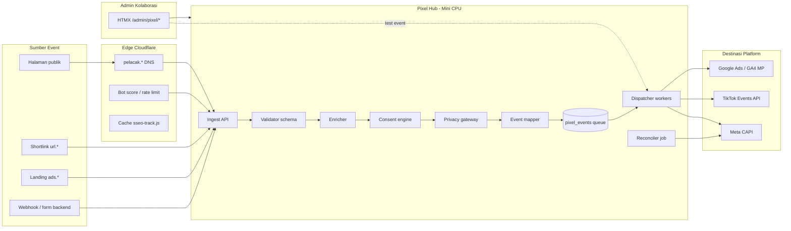
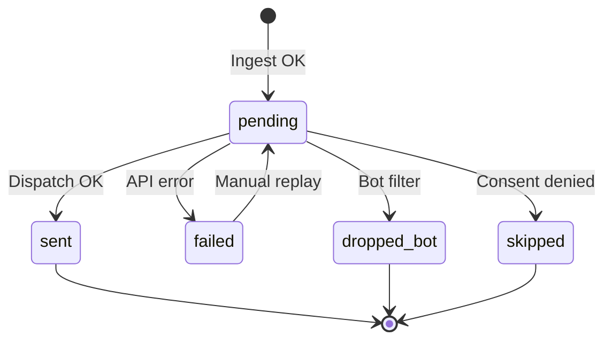

# 22 — Protokol Komunikasi Pixel & Data Lengkap

> Spesifikasi **kontrak data** dan **alur komunikasi** antar lapisan: browser → Hub → platform iklan.  
> Supaya kolaborasi pixel **pas** (konsisten), **kuat** (tahan adblock, dedup, retry), dan **lengkap** (EMQ).  
> Facebook Pro: [21](./21-pixel-facebook-pro.md) · **CAPI Meta: [23](./23-meta-conversions-api-kedalaman.md)** · Hub umum: [20](./20-pixel-admin-facebook-tiktok-gads.md)

---

## 1. Prinsip Komunikasi

| Prinsip | Arti operasional |
|---------|------------------|
| **Satu bahasa internal** | Semua sumber (web, shortlink, form, webhook) → **canonical event** dulu |
| **N-to-M keluar** | Satu canonical → banyak platform (FB, TikTok, GAds) via mapping |
| **Async ke platform** | Hub tidak menunggu Meta/TikTok/Google di path pengunjung |
| **Idempotent** | `event_id` + aturan dedup platform |
| **Observable** | Setiap event punya status pipeline + trace ID platform |
| **Privacy by design** | PII di-hash / di-drop sebelum keluar Hub |

---

## 2. Diagram Arsitektur Komunikasi (Lengkap)



---

## 3. Canonical Event (Bahasa Internal Hub)

Setiap event masuk Hub **wajib** conform ke schema ini sebelum mapping platform.

### 3.1 Struktur JSON `canonical_event`

```json
{
  "schema_version": "1.0",
  "event_id": "550e8400-e29b-41d4-a716-446655440000",
  "canonical_name": "page_view",
  "event_time": 1716300000,
  "action_source": "website",
  "source": {
    "type": "browser",
    "channel": "first_party_collect",
    "site_key": "global",
    "managed_domain_id": 1042,
    "url_link_id": null,
    "page_url": "https://rezekibelanja.com/",
    "referrer": "https://google.com/"
  },
  "identity": {
    "session_id": "sess_abc123",
    "anonymous_id": "anon_xyz",
    "external_id": null,
    "fbp": "fb.1.1716300000.123456789",
    "fbc": "fb.1.1716300000.IwAR0...",
    "ttclid": null,
    "gclid": null
  },
  "user": {
    "client_ip": "203.0.113.10",
    "user_agent": "Mozilla/5.0 ...",
    "email_plain": null,
    "phone_plain": null,
    "email_hash": "7b17fb0bd173f625b58625ad059fcbc2e2c25691cddad1961d840fcffd356b98",
    "phone_hash": null,
    "country": "id",
    "city": "jakarta"
  },
  "commerce": {
    "value": null,
    "currency": "IDR",
    "content_ids": [],
    "content_type": "product",
    "num_items": null,
    "order_id": null
  },
  "consent": {
    "marketing": true,
    "analytics": true,
    "source": "cookie_banner_v2",
    "timestamp": 1716299900
  },
  "meta": {
    "cf_bot_score": 12,
    "delivery_mode": "server_first",
    "retry_attempt": 0
  }
}
```

### 3.2 Tabel field canonical (lengkap)

| Field | Tipe | Wajib | Keterangan |
|-------|------|-------|------------|
| `schema_version` | string | Ya | Semver contract |
| `event_id` | UUID | Ya | Dedup lintas jalur |
| `canonical_name` | enum | Ya | Lihat §3.3 |
| `event_time` | unix sec | Ya | Waktu aksi pengunjung |
| `action_source` | enum | Ya | `website`, `email`, `app`, `phone_call`, `chat`, `physical_store`, `system_generated`, `other` |
| `source.type` | enum | Ya | `browser`, `server`, `webhook` |
| `source.channel` | string | Ya | `first_party_collect`, `cms_publish`, `shortlink_redirect`, … |
| `source.site_key` | string | Ya | Kunci situs / tenant |
| `source.managed_domain_id` | int64 | Tidak | Domain portfolio |
| `source.url_link_id` | int64 | Tidak | Shortlink [19] |
| `source.page_url` | string | Disarankan | URL lengkap |
| `source.referrer` | string | Tidak | |
| `identity.session_id` | string | Disarankan | Sesi first-party |
| `identity.anonymous_id` | string | Disarankan | Cookie Hub |
| `identity.external_id` | string | Tidak | User login hash |
| `identity.fbp` | string | Sangat disarankan | Meta |
| `identity.fbc` | string | Jika ada | Meta click |
| `identity.ttclid` | string | Jika TikTok ads | |
| `identity.gclid` | string | Jika Google ads | |
| `user.client_ip` | string | Ya (Pro) | Dari `X-Forwarded-For` |
| `user.user_agent` | string | Ya (Pro) | |
| `user.email_hash` | hex sha256 | Opsional | Setelah privacy gateway |
| `user.phone_hash` | hex sha256 | Opsional | E.164 normalized |
| `commerce.*` | object | Jika purchase | value, currency, ids |
| `consent.marketing` | bool | Ya jika GDPR mode | Gate dispatch |
| `meta.cf_bot_score` | int | Tidak | Filter bot |
| `meta.delivery_mode` | enum | Ya | `server_first`, `hybrid`, `legacy_client` |

### 3.3 Daftar `canonical_name` (standar)

| canonical_name | Deskripsi |
|----------------|-----------|
| `page_view` | Halaman dilihat |
| `view_content` | Konten/produk |
| `click` | Klik outbound / shortlink |
| `search` | Pencarian internal |
| `lead` | Form submitted |
| `add_to_cart` | Keranjang |
| `initiate_checkout` | Checkout started |
| `purchase` | Transaksi selesai |
| `subscribe` | Langganan |
| `complete_registration` | Registrasi |
| `custom` | Dengan `custom_label` di payload |

---

## 4. Protokol Ingest (Browser / Server → Hub)

### 4.1 First-party `POST /collect`

| Header | Wajib | Nilai |
|--------|-------|-------|
| `Content-Type` | Ya | `application/json` |
| `Origin` / `Referer` | Disarankan | Validasi CORS allowlist |
| `X-Site-Key` | Opsional | Override `site_key` body |

**Body (versi ringkas dari browser):**

```json
{
  "event": "page_view",
  "event_id": null,
  "url": "https://example.com/path",
  "site_key": "global",
  "managed_domain_id": 1042,
  "fbp": "...",
  "fbc": "...",
  "ttclid": null,
  "gclid": null,
  "props": {}
}
```

**Response sukses:**

```json
{
  "ok": true,
  "queued_id": 981234,
  "event_id": "550e8400-e29b-41d4-a716-446655440000"
}
```

| HTTP | Arti |
|------|------|
| 200 | Masuk antrian |
| 400 | Schema invalid |
| 403 | Origin tidak diizinkan |
| 429 | Rate limit |
| 503 | Backpressure (antrian penuh) |

### 4.2 Server-side ingest (CMS internal)

| Sumber | Channel | Contoh |
|--------|---------|--------|
| Shortlink redirect | `shortlink_redirect` | Klik `url.*` |
| Publish post | `cms_publish` | URL live |
| Form handler | `form_submit` | Lead |
| Webhook payment | `webhook` | Purchase |

Sama canonical schema — `source.type = server`.

---

## 5. Privacy Gateway (Transform Sebelum Keluar)

| Input | Transform | Output ke platform |
|-------|-----------|-------------------|
| `email_plain` | lowercase, trim, SHA256 | `em` (array 1 hash) |
| `phone_plain` | E.164, SHA256 | `ph` |
| Nama lengkap | **Tidak dikirim** ke Meta kecuali Enhanced Conversions Google (hash) | - |
| IP | Pass-through / anonimasi EU | `client_ip_address` |
| Bot `cf_bot_score` > 30 | `status = dropped_bot` | Tidak dispatch |

---

## 6. Mapping ke Platform (N-to-M)

### 6.1 Facebook (Meta CAPI)

> Detail lengkap parameter, hash, EMQ, dedup, test events: **[23-meta-conversions-api-kedalaman.md](./23-meta-conversions-api-kedalaman.md)**

| canonical_name | `event_name` Meta | `custom_data` tambahan |
|----------------|-------------------|------------------------|
| `page_view` | `PageView` | - |
| `view_content` | `ViewContent` | `content_ids`, `content_type` |
| `click` | `ViewContent` atau custom | `content_name` = shortlink slug |
| `lead` | `Lead` | - |
| `purchase` | `Purchase` | `value`, `currency`, `order_id` |
| `subscribe` | `Subscribe` | - |

**Payload keluar (contoh lengkap `Purchase`):**

```json
{
  "data": [{
    "event_name": "Purchase",
    "event_time": 1716300000,
    "event_id": "550e8400-e29b-41d4-a716-446655440000",
    "action_source": "website",
    "event_source_url": "https://rezekibelanja.com/checkout/done",
    "user_data": {
      "client_ip_address": "203.0.113.10",
      "client_user_agent": "Mozilla/5.0 ...",
      "fbp": "fb.1.1716300000.123456789",
      "fbc": "fb.1.1716300000.IwAR0...",
      "em": ["7b17fb0bd173f625b58625ad059fcbc2e2c25691cddad1961d840fcffd356b98"],
      "ph": null
    },
    "custom_data": {
      "value": 150000,
      "currency": "IDR",
      "content_ids": ["SKU-1", "SKU-2"],
      "order_id": "ORD-9988"
    }
  }],
  "test_event_code": "TEST12345"
}
```

| Response Meta | Field disimpan di Hub |
|---------------|----------------------|
| `events_received` | counter |
| `fbtrace_id` | `platform_event_id` / trace log |
| `messages[]` | `error_message` jika 0 received |

### 6.2 TikTok Events API 2.0 *(fase berikut)*

| canonical_name | TikTok `event` |
|----------------|----------------|
| `page_view` | `Pageview` |
| `view_content` | `ViewContent` |
| `click` | `Click` |
| `lead` | `SubmitForm` |
| `purchase` | `CompletePayment` |

Field identitas: `ttclid`, `email`/`phone` hashed, `ip`, `user_agent`.

### 6.3 Google Ads / GA4 *(fase berikut)*

| canonical_name | Google |
|----------------|--------|
| `page_view` | GA4 `page_view` |
| `purchase` | Ads conversion + `transaction_id` |
| `lead` | `generate_lead` |

Enhanced Conversions: hash email/phone sama seperti Meta.

---

## 7. Status Pipeline `pixel_events`



| Status | Arti | Tampil di admin |
|--------|------|-----------------|
| `pending` | Menunggu `pixel_dispatch` | Kuning |
| `sent` | Meta/TikTok/Google ack | Hijau |
| `failed` | Error API / network | Merah + retry |
| `dropped_bot` | Sengaja tidak kirim | Abu |
| `skipped` | Consent / mapping error | Abu |

| Field tambahan | Tipe | Keterangan |
|----------------|------|------------|
| `retry_attempts` | int | 0–3 |
| `next_retry_at` | timestamptz | Exponential backoff |
| `platform` | enum | `facebook`, `tiktok`, `gads` |
| `canonical_event` | string | Sebelum map |
| `payload` | jsonb | Canonical snapshot |
| `platform_payload` | jsonb | Yang dikirim (tanpa token) |
| `platform_event_id` | string | `fbtrace_id` dll. |

---

## 8. Dispatcher — Komunikasi Kuat ke Platform

### 8.1 Konfigurasi worker `pixel_dispatch`

| Parameter | Nilai Pro | Alasan |
|-----------|-----------|--------|
| Batch size | 50–100 event | Throughput |
| Poll interval | 5–10 detik | Latency vs CPU mini |
| Max retry | 3 | Meta intermittent |
| Backoff | 5s, 30s, 5m | Tidak hammer API |
| Timeout HTTP | 15s | Hindari hang |
| Dead letter | Setelah 3 gagal | Investigasi manual |
| Parallel platform | Goroutine per destinasi | FB tidak block TT |

### 8.2 Retry & idempotency

| Kondisi | Aksi |
|---------|------|
| HTTP 5xx / timeout | Retry dengan **same** `event_id` |
| HTTP 400 invalid payload | `failed` permanen + alert |
| HTTP 401 token | Pause dispatch + banner admin |
| HTTP 429 rate limit | Backoff global 60s |
| `events_received = 0` + messages | Parse error taxonomy |

### 8.3 Reconciler *(Pro+)*

Job harian membandingkan:

| Metrik internal | Metrik platform | Alert jika |
|-----------------|-----------------|------------|
| `sent` count | Events Manager overview | Selisih > 15% |
| `purchase` sum value | Ads conversions | Selisih > 20% |

---

## 9. Skema Database Lengkap (Superset)

### 9.1 `pixel_hub_settings`

| Kolom | Tipe | Default | Keterangan |
|-------|------|---------|------------|
| `id` | bigint | 1 | Singleton |
| `tracking_hostname` | text | `pelacak.seosementara.org` | First-party |
| `default_mode` | text | `server_first` | |
| `consent_required` | bool | false | GDPR |
| `collect_path` | text | `/collect` | |
| `script_version` | text | `1` | Cache bust |
| `ingest_rate_limit_per_min` | int | 600 | Per site_key |
| `event_retention_days` | int | 90 | |
| `updated_at` | timestamptz | now() | |

### 9.2 `pixel_configs`

| Kolom | Tipe | Keterangan |
|-------|------|------------|
| `id` | bigserial | |
| `platform` | text | `facebook` |
| `scope` | text | `global`, `managed_domain`, `shortlink` |
| `managed_domain_id` | bigint nullable | |
| `name` | text | Label admin |
| `is_active` | bool | |
| `mode_override` | text nullable | |
| `external_ids` | jsonb | Lihat §9.2.1 |
| `credentials_id` | bigint FK | |
| `capi_enabled` | bool | |
| `browser_pixel_enabled` | bool | |
| `test_event_code` | text nullable | |
| `dispatch_priority` | int | 1=tinggi |
| `created_at` / `updated_at` | timestamptz | |

**`external_ids` Facebook:**

```json
{
  "pixel_id": "123456789012345",
  "business_id": "987654321098765",
  "dataset_id": "optional_dataset",
  "ad_account_id": "act_123"
}
```

### 9.3 `pixel_credentials`

| Kolom | Tipe | Keterangan |
|-------|------|------------|
| `id` | bigserial | |
| `platform` | text | |
| `name` | text | Label |
| `secret_ciphertext` | bytea | AES-256-GCM |
| `secret_nonce` | bytea | |
| `token_expires_at` | timestamptz nullable | |
| `scopes` | text[] | CAPI scopes |
| `last_validated_at` | timestamptz | |
| `validation_status` | text | `connected`, `error`, `expired` |
| `last_error` | text | |

### 9.4 `pixel_events` (superset)

| Kolom | Tipe | Index |
|-------|------|-------|
| `id` | bigserial | PK |
| `canonical_event` | text | |
| `platform` | text | `(platform, created_at DESC)` |
| `pixel_config_id` | bigint FK | |
| `event_name` | text | Platform-mapped name |
| `event_id` | text UNIQUE | Dedup |
| `managed_domain_id` | bigint | |
| `url_link_id` | bigint | |
| `payload` | jsonb | Canonical snapshot |
| `platform_payload` | jsonb | Outbound redacted |
| `status` | text | partial index pending |
| `retry_attempts` | int | |
| `next_retry_at` | timestamptz | |
| `platform_event_id` | text | fbtrace_id |
| `error_code` | text | Taxonomy |
| `error_message` | text | |
| `sent_at` | timestamptz | |
| `created_at` | timestamptz | |

### 9.5 `pixel_dispatch_dead_letter` *(Pro+)*

| Kolom | Tipe |
|-------|------|
| `pixel_event_id` | bigint FK |
| `failed_at` | timestamptz |
| `reason` | text |
| `resolved_at` | timestamptz nullable |
| `resolved_by` | bigint user FK |

---

## 10. Komunikasi Hybrid (Browser + CAPI)

Agar **pas** antara dua jalur:

| Aturan | Detail |
|--------|--------|
| Satu `event_id` | Dibuat di ingest; dikirim ke `fbq('track', ..., {}, {eventID})` jika hybrid |
| Urutan waktu | Browser dan server `event_time` ± 2 detik |
| Prioritas | Jika CAPI `sent`, browser duplikat diabaikan Meta |
| Matikan hybrid | Jika EMQ sudah > 8/10 hanya server |

---

## 11. Checklist Kekuatan Sinyal (Facebook)

| # | Syarat | Dampak ke iklan |
|---|--------|-----------------|
| 1 | First-party hostname aktif | Recovery dari adblock |
| 2 | CAPI aktif + token valid | Server events counted |
| 3 | `fbp` + `fbc` pada > 70% event | EMQ naik |
| 4 | Hash `em`/`ph` pada lead/purchase | Matching akun Meta |
| 5 | `event_id` dedup hybrid | Tidak double count |
| 6 | `event_source_url` valid | Attribution halaman |
| 7 | Test event sebelum prod | Tidak korupsi data |
| 8 | Domain verified di Meta | Aggregated event stability |

---

## 12. API Admin (Kontrak Kolaborasi)

| Method | Path | Request | Response data |
|--------|------|---------|---------------|
| GET | `/api/admin/pixel/facebook/setup` | - | Config + masked token |
| PATCH | `/api/admin/pixel/facebook/setup` | §21 Setup fields | Updated config |
| POST | `/api/admin/pixel/facebook/test-connection` | - | `events_received`, `fbtrace_id` |
| POST | `/api/admin/pixel/facebook/test-event` | `event_name` | Ack Meta |
| GET | `/api/admin/pixel/facebook/diagnostics` | - | §21 Diagnostics |
| GET | `/api/admin/pixel/facebook/events` | `status`, `page`, `from`, `to` | Paginated log |
| POST | `/api/admin/pixel/facebook/events/{id}/replay` | - | Re-queue |
| GET | `/api/admin/pixel/facebook/analytics` | `range=7d` | Aggregates |
| POST | `/api/admin/pixel/facebook/domains/assign` | `managed_domain_id`, `hostname` | Assignment |
| POST | `/api/admin/pixel/facebook/domains/deploy` | `domain_ids[]` | Job id |

---

## 13. Dokumen terkait

- [20](./20-pixel-admin-facebook-tiktok-gads.md)
- [21](./21-pixel-facebook-pro.md)
- [10](./10-database-postgresql.md)
- [19](./19-modul-url-shortlink.md)
