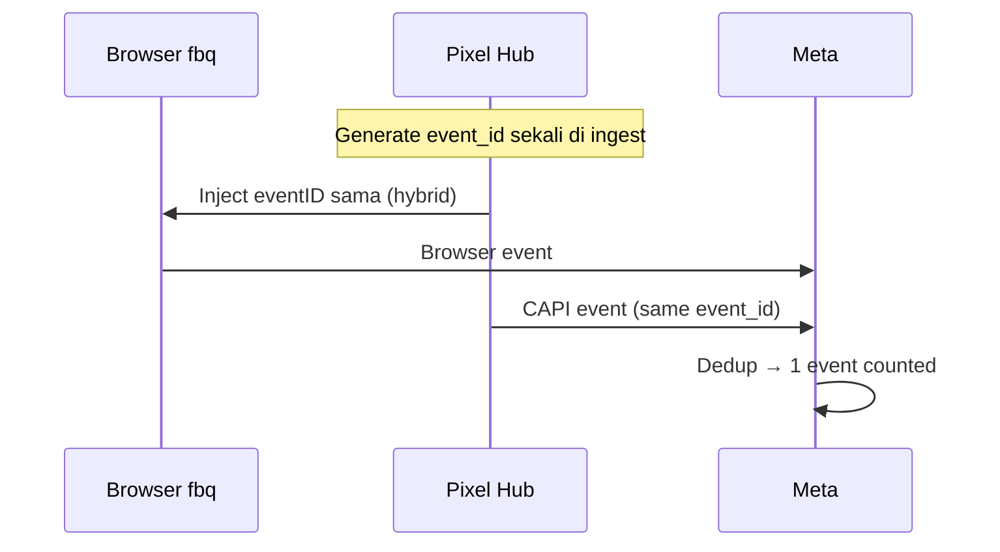

# 23 — Meta Conversions API (CAPI) — Kedalaman Lengkap

> Dokumen **fokus CAPI** untuk kolaborasi Pixel Facebook Pro.  
> Hub & admin: [21](./21-pixel-facebook-pro.md) · Protokol umum: [22](./22-pixel-protokol-komunikasi-dan-data.md) · Pixel Hub: [20](./20-pixel-admin-facebook-tiktok-gads.md)

---

## 1. Apa itu CAPI (Conversions API)

**Conversions API** adalah cara **server Anda** mengirim event langsung ke **server Meta** (Graph API), tanpa bergantung pada skrip `fbq` di browser pengunjung.

| Aspek | Browser Pixel (`fbq`) | Conversions API (CAPI) |
|-------|----------------------|-------------------------|
| Jalur | `connect.facebook.net` → Meta | Server Hub → `graph.facebook.com` → Meta |
| Blokir adblock / ITP | Sering gagal | Tidak terpengaruh |
| Data user | Terbatas cookie browser | IP, UA, hash email/telp, `fbp`/`fbc` dari ingest |
| Waktu kirim | Saat halaman load | Async dari antrian Hub |
| Dedup dengan browser | Perlu `eventID` sama | Perlu `event_id` sama di hybrid |
| Di Events Manager | Muncul sebagai **Browser** + **Server** | Muncul sebagai **Server** |

**Kesimpulan untuk Seosementara:** CAPI adalah **tulang punggung** komunikasi “kuat” dengan Meta. First-party `collect` hanya mengumpulkan; **CAPI** yang membuat Meta mengenali konversi untuk optimasi iklan.

---

## 2. Mengapa CAPI Wajib di Tahun 2026+

| Faktor | Dampak tanpa CAPI | Dengan CAPI |
|--------|-------------------|-------------|
| iOS ATT / Safari ITP | 30–70% event browser hilang | Server tetap kirim |
| Ad-blocker | `fbq` tidak jalan | Tidak relevan |
| EMQ rendah | CPA naik, learning phase lama | Matching akun Facebook lebih baik |
| Shortlink redirect | Hampir tidak ada JS | Server fire event saat klik |
| Ribuan domain | Snippet tidak konsisten | Satu pipeline dari Hub |

Meta tidak “menghukum” tanpa CAPI, tetapi **kampanye tidak belajar optimal** — inilah alasan layanan Stape/CAPIG dibayar.

---

## 3. Autentikasi & Credential (Lengkap)

### 3.1 Jenis token

| Jenis | Dipakai untuk | Cara dapat | Masa berlaku |
|-------|---------------|------------|--------------|
| **System User Access Token** | Produksi CAPI (disarankan) | Business Manager → System Users → Generate token | Bisa tidak kedaluwarsa (dengan refresh policy) |
| **User Access Token** | Setup awal / debug | Login developer | Pendek |
| **Dataset / Pixel token** | Terikat pixel tertentu | Events Manager → Settings → CAPI | Sesuai kebijakan Meta |

**Di CMS (`pixel_credentials`):**

| Field disimpan | Keterangan |
|--------------|------------|
| `secret_ciphertext` + `secret_nonce` | Token AES-256-GCM |
| `scopes` | Minimal: `ads_management`, event upload terkait pixel |
| `token_expires_at` | Alert 7 hari sebelum expiry |
| `validation_status` | `connected` / `expired` / `error` |
| `last_validated_at` | Dari uji koneksi di admin |

### 3.2 Permission minimum (checklist operator)

- [ ] Akses ke **Business Manager** yang memiliki pixel
- [ ] Pixel ID sudah dibuat di Events Manager
- [ ] Token punya izin kirim event ke pixel tersebut
- [ ] **Test Event Code** aktif untuk fase uji
- [ ] Domain / situs diverifikasi (lihat §12)

### 3.3 Rotasi token (Pro)

| Langkah | Sistem |
|---------|--------|
| 1 | Admin paste token baru di Setup |
| 2 | Hub simpan credential baru, tandai lama `grace` 24j |
| 3 | Dispatch pakai token baru; gagal 401 → pause + banner |
| 4 | Audit log: siapa rotasi (`updated_by`) |

---

## 4. Endpoint & Versi API

| Item | Nilai standar CMS |
|------|-------------------|
| Base URL | `https://graph.facebook.com` |
| Versi | `v21.0` (naikkan terencana per kuartal) |
| Upload event | `POST /{pixel-id}/events` |
| Query parameter | `access_token={token}` |
| Content-Type | `application/json` |

**Contoh URL lengkap:**

```
POST https://graph.facebook.com/v21.0/123456789012345/events?access_token=EAAxx...
```

### 4.1 Request body (struktur atas)

```json
{
  "data": [ /* array ServerEvent, max 1000 per request */ ],
  "test_event_code": "TEST12345",
  "partner_agent": "seosementara-pixelhub/1.0"
}
```

| Field root | Wajib | Keterangan |
|------------|-------|------------|
| `data` | Ya | Array event |
| `test_event_code` | Fase uji | Semua event masuk tab **Test Events** |
| `partner_agent` | Disarankan | Identifikasi integrator di Meta |

### 4.2 Response sukses

```json
{
  "events_received": 1,
  "messages": [],
  "fbtrace_id": "AbCdEf123456"
}
```

| Field | Simpan di Hub |
|-------|---------------|
| `events_received` | Harus = jumlah event dikirim; jika 0 → gagal parsial |
| `messages` | Warning/error per event |
| `fbtrace_id` | `platform_event_id` — untuk support Meta |

### 4.3 Response gagal (HTTP 4xx/5xx)

| HTTP | Arti | Aksi Hub |
|------|------|----------|
| 400 | Payload invalid | `failed` permanen, jangan retry buta |
| 401 | Token invalid/expired | Pause dispatch + alert admin |
| 403 | Permission | Cek BM / pixel ownership |
| 429 | Rate limit | Backoff global 60–300 detik |
| 5xx | Meta sementara | Retry exponential (§10) |

---

## 5. Objek `ServerEvent` — Field per Field

Setiap elemen di array `data` adalah satu **ServerEvent**.

### 5.1 Field level event

| Field | Tipe | Wajib | Aturan | Contoh |
|-------|------|-------|--------|--------|
| `event_name` | string | Ya | Standard atau custom (lihat §7) | `Purchase` |
| `event_time` | int unix sec | Ya | Waktu aksi user, bukan waktu dispatch | `1716300000` |
| `event_id` | string | Sangat disarankan | Dedup browser+server; max 128 char | UUID |
| `action_source` | enum | Ya | Lihat §8 | `website` |
| `event_source_url` | string | Ya untuk `website` | URL halaman konversi | `https://...` |
| `opt_out` | bool | Tidak | `true` = jangan pakai untuk targeting | `false` |
| `data_processing_options` | array | GDPR | `[]` atau `["LDU"]` + country/state | lihat §13 |
| `data_processing_options_country` | int | GDPR | `0` = US, `1` = EU | |
| `data_processing_options_state` | int | GDPR | Negara bagian jika perlu | |

### 5.2 `user_data` — inti EMQ

Meta memakai `user_data` untuk mencocokkan event dengan akun Facebook/Instagram.

| Key Meta | Format di CAPI | Normalisasi Hub (wajib) | Prioritas EMQ |
|----------|----------------|-------------------------|---------------|
| `client_ip_address` | string IPv4/IPv6 | Dari `X-Forwarded-For` / CF | Tinggi |
| `client_user_agent` | string | UA lengkap | Tinggi |
| `fbp` | string | Cookie `_fbp` | Tinggi |
| `fbc` | string | Cookie `_fbc` atau dari `fbclid` | Tinggi (jika ada klik iklan) |
| `em` | array string hash | Email: trim, lowercase, SHA256 | Sangat tinggi |
| `ph` | array string hash | Telepon E.164, SHA256 | Sangat tinggi |
| `fn` | array hash | Nama depan, lowercase, SHA256 | Sedang |
| `ln` | array hash | Nama belakang | Sedang |
| `ge` | array hash | `m` / `f` lowercase SHA256 | Sedang |
| `db` | array hash | DOB `YYYYMMDD` SHA256 | Sedang |
| `ct` | array hash | Kota, lowercase, no space | Sedang |
| `st` | array hash | Provinsi kode 2 huruf | Sedang |
| `zp` | array hash | Kode pos (US min 5 digit) | Sedang |
| `country` | array hash | ISO 3166-1 alpha-2 lowercase | Sedang |
| `external_id` | array string | ID user CMS (bisa hash) | Tinggi untuk login |
| `subscription_id` | string | ID langganan | Khusus subscribe |
| `lead_id` | string | ID lead CRM | Khusus lead |
| `fbc` build rule | — | `fb.1.{creationTime}.{fbclid}` | — |

**Aturan hash (sama untuk em, ph, fn, …):**

1. Trim spasi
2. Lowercase (kecuali field khusus)
3. SHA256
4. Hex string **tanpa** salt tambahan dari Hub

**Contoh `user_data` Pro (Purchase):**

```json
"user_data": {
  "client_ip_address": "203.0.113.44",
  "client_user_agent": "Mozilla/5.0 (Windows NT 10.0; Win64; x64) AppleWebKit/537.36...",
  "fbp": "fb.1.1716299000.1987654321",
  "fbc": "fb.1.1716298800.IwAR2xxxxx",
  "em": ["7b17fb0bd173f625b58625ad059fcbc2e2c25691cddad1961d840fcffd356b98"],
  "ph": ["c051715cc583c6386f63ae2e614361fd9a67efb3a9bafa64e36f97c9b4da82c9"],
  "external_id": ["a665a45920422f9d417e4867efdc4fb8a04a1f3fff1fa07e998e86f7f7a27ae3"]
}
```

### 5.3 `custom_data` — e-commerce & konten

| Key | Tipe | Event umum | Keterangan |
|-----|------|------------|------------|
| `value` | float | Purchase | Nilai total |
| `currency` | string ISO 4217 | Purchase | `IDR`, `USD` |
| `content_ids` | string[] | ViewContent, Purchase | SKU |
| `content_type` | string | ViewContent | `product`, `product_group` |
| `content_name` | string | ViewContent | Judul |
| `content_category` | string | ViewContent | Kategori |
| `num_items` | int | Purchase | Jumlah item |
| `order_id` | string | Purchase | ID unik order — dedup tambahan |
| `search_string` | string | Search | Query |
| `status` | bool/string | Lead | Status lead |

---

## 6. Event Match Quality (EMQ)

EMQ adalah skor kualitas matching Meta (bukan fitur CMS, tetapi **target** kolaborasi CAPI).

| Parameter | Cara Hub meningkatkan |
|-----------|----------------------|
| Browser ID (`fbp`) | First-party collect baca cookie |
| Click ID (`fbc`) | Pass `fbclid` dari URL iklan ke cookie |
| Email / phone | Form login/checkout → hash di privacy gateway |
| IP + UA | Selalu dari request asli, jangan proxy kosong |
| External ID | User ID CMS stabil |

**Target Pro:**

| Tier | EMQ kasar | Tindakan |
|------|-----------|----------|
| Rendah | < 4/10 | Tambah em/ph, perbaiki fbp |
| Pro | 6–8/10 | Hybrid + CAPI lengkap |
| Enterprise | 8+/10 | Advanced matching + CRM sync |

Di admin tab **Connection**: tampilkan checklist parameter ✓/✗ per event sample (bukan hanya angka agregat).

---

## 7. Standard Events vs Custom Events

### 7.1 Standard (disarankan — algoritma iklan paham)

| `event_name` | Kapan kirim | `custom_data` kunci |
|--------------|-------------|---------------------|
| `PageView` | Setiap halaman | - |
| `ViewContent` | Artikel/produk | `content_ids`, `content_type` |
| `Search` | Pencarian | `search_string` |
| `AddToCart` | Tambah keranjang | `content_ids`, `value`, `currency` |
| `InitiateCheckout` | Mulai checkout | `value`, `num_items` |
| `AddPaymentInfo` | Isi pembayaran | - |
| `Purchase` | Bayar sukses | `value`, `currency`, `order_id` |
| `Lead` | Form | - |
| `CompleteRegistration` | Daftar akun | - |
| `Subscribe` | Newsletter | - |
| `Contact` | Hubungi WA/email | - |

### 7.2 Custom events

| Aturan | Detail |
|--------|--------|
| Nama | String, konsisten, PascalCase disarankan |
| Mapping | Di Event Catalog: `canonical_name` → custom |
| Risiko | Optimasi iklan mungkin lebih lambat vs standard |

---

## 8. `action_source` — Kapan Pakai Apa

| Nilai | Situasi Seosementara |
|-------|---------------------|
| `website` | Default: web, shortlink landing, domain portfolio |
| `app` | Jika ada app mobile native |
| `email` | Klik dari email campaign (server tracked) |
| `phone_call` | Lead telepon manual upload |
| `chat` | WhatsApp/chat CRM |
| `physical_store` | Offline store (Enterprise) |
| `system_generated` | Event otomatis CMS tanpa user action langsung |
| `other` | Fallback — hindari jika bisa |

**Salah `action_source`** → event diterima tetapi attributions melemah.

---

## 9. Deduplikasi (Dedup) — Aturan Meta + Hub

Meta menggabungkan event **browser** dan **server** jika dianggap sama.

### 9.1 Parameter dedup utama

| Parameter | Harus sama antara browser & CAPI |
|-----------|----------------------------------|
| `event_name` | Ya |
| `event_id` | Ya (paling penting) |
| `event_time` | Dalam window ~48 jam (Meta dapat berubah) |
| `fbp` atau `fbc` | Salah satu membantu |

### 9.2 Alur Hub (hybrid mode)



### 9.3 Server-only (`server_first`)

| Situasi | Dedup |
|---------|-------|
| Hanya CAPI | Tidak ada pasangan browser — `event_id` tetap wajib untuk retry |
| Retry dispatch | **Same** `event_id` — Meta idempotent |
| Replay manual admin | Same `event_id` jika belum `sent` |

### 9.4 `order_id` (Purchase)

Gunakan `custom_data.order_id` unik — Meta tambahan dedup untuk transaksi ganda.

---

## 10. Test Events vs Produksi

### 10.1 Test Event Code

| Item | Detail |
|------|--------|
| Dapat dari | Events Manager → Test Events |
| Di payload | `"test_event_code": "TEST12345"` di root (bukan per event) |
| Tampilan | Hanya tab Test Events — tidak mengotori live |
| Produksi | **Hapus** field test_event_code |

### 10.2 Workflow uji di CMS

| Langkah | Admin | Meta |
|---------|-------|------|
| 1 | Setup → isi Test Event Code | - |
| 2 | Connection → **Kirim event uji** `PageView` | Test Events muncul < 1 menit |
| 3 | Cek `events_received` = 1 | - |
| 4 | Ubah ke `Purchase` uji dengan `custom_data` | Validasi parameter |
| 5 | Matikan test code, kirim 1 event prod | Overview live |

---

## 11. Transform Hub: Canonical → CAPI

| `canonical_name` | `event_name` | `user_data` minimum | `custom_data` |
|------------------|--------------|---------------------|---------------|
| `page_view` | `PageView` | ip, ua, fbp | - |
| `view_content` | `ViewContent` | + fbc jika ada | content_ids, content_type |
| `click` | `ViewContent` | ip, ua, fbp, fbc | content_name = slug |
| `lead` | `Lead` | + em hash | - |
| `purchase` | `Purchase` | + em/ph, external_id | value, currency, order_id |
| `subscribe` | `Subscribe` | em | - |

**Fungsi transform (konsep):**

```
canonical_event + privacy_gateway → ServerEvent → platform_payload (redacted log)
```

Field yang **tidak** boleh masuk CAPI: email plain, telepon plain, nama plain (kecuali sudah hash).

---

## 12. Domain, Pixel & Aggregated Event Measurement (AEM)

| Konsep | Keterangan untuk ribuan domain |
|--------|--------------------------------|
| **Pixel terikat BM** | Satu BM bisa banyak pixel — pilih per klien/domain |
| **Verifikasi domain** | Meta DNS/HTML — status per `managed_domain` di admin |
| **Event di subdomain** | `event_source_url` harus URL nyata pengunjung |
| **Multiple domains → satu pixel** | Umum untuk agensi; bedakan `custom_data` / `external_id` |
| **Satu domain → satu pixel** | Ideal EMQ terpisah per advertiser |

**CAPI tidak menggantikan verifikasi domain** — keduanya dibutuhkan untuk iklan stabil.

---

## 13. GDPR & Data Processing Options

| Mode | Payload |
|------|---------|
| Default (non-EU) | Tanpa `data_processing_options` |
| Limited Data Use (LDU) | `"data_processing_options": ["LDU"]` + country/state |
| Consent ditolak | Hub: `status = skipped` — **jangan** panggil CAPI |

| Negara pengunjung | Hub behavior |
|-------------------|--------------|
| EU + consent false | Skip dispatch |
| EU + consent true | CAPI + LDU jika diperlukan |

---

## 14. Batasan Teknis API (Batch & Rate)

| Batas | Nilai | Implikasi Hub |
|-------|-------|---------------|
| Event per request | ≤ 1000 | Batch `pixel_dispatch` max 100 disarankan |
| Ukuran body | ~ beberapa MB | Jangan lampirkan blob |
| Rate limit | Dinamis per token | Tangani 429 global |
| `event_time` | Tidak > 7 hari lalu / terlalu maju | Validasi di ingest |

---

## 15. Monitoring CAPI di Admin (Data Lengkap)

### 15.1 Tab Connection — panel CAPI

| Metrik | Formula / sumber |
|--------|------------------|
| Events received rate | `sent / attempted` 24j |
| API latency p50/p95 | Timestamp dispatch - created_at |
| Error breakdown | Group by `error_code` |
| Token expiry countdown | `token_expires_at - now()` |
| Test vs prod | Count dengan/ tanpa test_event_code |

### 15.2 Alert otomatis

| Kondisi | Severity |
|---------|----------|
| `events_received = 0` > 10x berturut | Critical |
| 401 dalam 5 menit | Critical |
| Failure rate > 10% 1 jam | Warning |
| Pending > 10.000 | Warning (backlog) |
| EMQ parameter `em` < 20% events | Info |

---

## 16. Troubleshooting (CAPI)

| Gejala | Penyebab umum | Solusi |
|--------|---------------|--------|
| Test event tidak muncul | `test_event_code` salah / typo | Copy ulang dari Events Manager |
| `events_received: 0` + messages | Payload invalid | Lihat `messages[]`, perbaiki field |
| EMQ rendah | Tanpa fbp/em | Aktifkan first-party + form hash |
| Duplikat di reporting | event_id beda browser/server | Samakan event_id hybrid |
| Purchase double | order_id beda | Stabilkan order_id |
| 401 | Token expired | Rotasi token |
| 403 | Pixel tidak di BM token | Assign permission |
| Event telat | `event_time` salah timezone | Unix UTC waktu aksi user |
| Domain portfolio tidak kehitung | URL bukan `event_source_url` benar | Pass URL final setelah redirect |

---

## 17. CAPI vs Layanan Pihak Ketiga (Posisi Hub)

| Kemampuan | Stape / CAPIG | Pixel Hub Seosementara |
|-----------|---------------|------------------------|
| Hosting CAPI | Ya | Ya (mini CPU + Tunnel) |
| First-party subdomain | Ya | `pelacak.*` [20] |
| Dedup | Ya | `event_id` + aturan §9 |
| EMQ tuning | Dashboard | Tab Connection checklist |
| Mass 3000 domain | Ya | Job deploy + assign [21] |
| Biaya per event | Berlangganan | Infrastruktur sendiri |

---

## 18. Checklist CAPI Sebelum Live

- [ ] Pixel ID & token System User valid
- [ ] Test Event Code — semua event uji lulus
- [ ] `PageView` + `Purchase` (jika ada) sample ke EMQ
- [ ] Dedup hybrid tested (`event_id` sama)
- [ ] Produksi: test_event_code **dihapus**
- [ ] Privacy: hash em/ph, consent EU
- [ ] Monitoring alert aktif
- [ ] Dokumentasi operator: link Events Manager + tab Connection

---

## 19. Dokumen terkait

- [21-pixel-facebook-pro.md](./21-pixel-facebook-pro.md)
- [22-pixel-protokol-komunikasi-dan-data.md](./22-pixel-protokol-komunikasi-dan-data.md)
- Meta Developers: [Conversions API](https://developers.facebook.com/docs/marketing-api/conversions-api)
- Meta: [Parameters](https://developers.facebook.com/docs/marketing-api/conversions-api/parameters)
- Meta: [Dedup](https://developers.facebook.com/docs/marketing-api/conversions-api/deduplicate-pixel-and-server-events)
