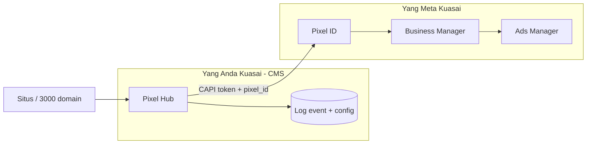

# 24 — Akun Meta, BM, Pixel & Optimasi Iklan (Realita Operasional)

> Jawaban atas situasi nyata: **akun personal / Fanpage / BM sering putus**, pixel tidak bisa “dipindah” sembarangan, dan **fitur apa** yang benar-benar membuat iklan FB lebih tertarget & efisien.  
> CAPI teknis: [23](./23-meta-conversions-api-kedalaman.md) · Hub: [20](./20-pixel-admin-facebook-tiktok-gads.md) · Multi-pixel: [23 §20](./23-meta-conversions-api-kedalaman.md#20-multi-pixel--banyak-advertiser-di-ribuan-domain)

---

## 1. Jadi Bagaimana? (Gambaran Satu Halaman)

**Pixel Facebook tidak hidup di website Anda** — pixel “milik” struktur **Business Manager (BM)** di Meta.  
**Pixel Hub di CMS** adalah **rumah data & pipa CAPI di server Anda**. Saat BM/akun Meta putus, **pipa CMS tetap jalan**, tetapi **tujuan** (Pixel ID + token) harus diganti ke BM/pixel baru yang sehat.

| Jika… | Yang mati | Yang tetap |
|-------|-----------|------------|
| BM kena suspend | Akses pixel lama, iklan, token CAPI | Data event di DB Hub, skrip first-party, domain |
| Personal admin logout | Setup UI Meta | CAPI jika pakai **System User** |
| Fanpage di-unpublish | Beberapa creative / identitas | Pixel tetap jika pixel di BM terpisah |

**Kesimpulan operasional:** Bangun proses **“BM putus → ganti Pixel ID + token di Hub → lanjut kirim CAPI”**, jangan bergantung pada satu akun personal.

---

## 2. Hierarki Akun Meta (Personal, Fanpage, BM)

| Lapisan | Fungsi | Risiko “putus” |
|---------|--------|----------------|
| **Akun Facebook personal** | Login manusia, admin awal | Ban, checkpoint, logout |
| **Fanpage** | Identitas publik, iklan dari page | Hilang role admin, page restricted |
| **Business Manager (BM)** | **Pemilik pixel**, ad account, orang & aset | **Suspend BM** = pixel ikut tidak terpakai |
| **Ad Account** | Budget iklan, kampanye | Disable payment, policy |
| **Pixel / Dataset** | Terima event, feed optimasi | Terikat BM yang membuatnya |

### Yang sering disalahpahami

| Mitos | Realita |
|-------|---------|
| “Pixel bisa dishare seperti file ke BM lain” | Pixel **dikelola** lewat BM; pindah BM butuh **share asset** di Meta atau buat pixel baru |
| “Fanpage = pixel” | Fanpage ≠ pixel; pixel di **BM** (page hanya salah satu identitas iklan) |
| “Kalau pixel pernah jalan, tinggal tempel ID di BM baru” | **Tidak otomatis** — pixel ID lama tetap di BM lama; BM baru butuh **pixel baru** atau **proses transfer resmi** Meta |
| “CAPI menggantikan BM” | CAPI hanya **mengirim data ke pixel ID**; tetap butuh BM + token valid |

---

## 3. Kenapa Akun / BM “Putus” & Pixel Lama Tidak Bisa Dipakai

| Penyebab umum | Dampak ke pixel |
|---------------|-----------------|
| Pelanggaran kebijakan iklan / konten | BM atau ad account restrict |
| Akun personal admin terkena | Kehilangan akses ke BM |
| Pembayaran / verifikasi bisnis gagal | Ad account mati, learning reset |
| Terlalu banyak domain “grey” di satu pixel | Risiko agregat policy |
| Token CAPI dari user personal expire | CAPI stop — **bukan** pixel mati |

**Pixel ID lama** tetap ada di Meta, tetapi jika **Anda tidak punya akses BM-nya**, Hub tidak bisa mengirim CAPI ke sana (token 401/403).

---

## 4. Strategi CMS untuk Ketahanan (BM Sering Putus)

### 4.1 Pisahkan “data Anda” vs “akun Meta”

| Di Pixel Hub | Tidak ikut mati saat BM putus |
|--------------|------------------------------|
| Log `pixel_events` (canonical + payload) | Ya |
| `managed_domain_id`, URL, funnel | Ya |
| Konfigurasi mode `server_first` / routing | Ya |
| **Pixel ID + token** | **Harus diganti** |

### 4.2 Pola multi-pixel yang disarankan (ribuan domain)

| Pola | Ketahanan | Target iklan |
|------|-----------|--------------|
| **Satu pixel per owner / klien besar** (Pol B) | BM klien A putus → domain klien B tetap | EMQ per advertiser |
| **Grup domain per BM** (Pol D) | Satu BM mati = satu segmen terdampak, bukan semua | Segmentasi risiko |
| **Hindari satu pixel untuk 3000 domain grey** | Satu ban = semua mati | - |

### 4.3 System User + token BM (bukan personal)

| Token dari | Stabilitas |
|------------|------------|
| Login personal developer | Rendah — expire, ikut ban personal |
| **System User** di BM | **Tinggi** — untuk CAPI produksi |

Di admin Setup: credential = System User token, dokumentasi `business_id` + siapa admin cadangan.

### 4.4 Prosedur darurat “BM putus”

| Langkah | Pelaku | CMS |
|---------|--------|-----|
| 1 | Buat / pulihkan BM baru (atau BM cadangan) | - |
| 2 | Buat **pixel baru** atau share pixel dari BM partner (jika Meta izinkan) | `pixel_configs` baru |
| 3 | Generate token CAPI baru | `pixel_credentials` baru |
| 4 | Update assignment domain | `pixel_domain_assignments` |
| 5 | Test Events + 24j monitoring | Tab Connection |
| 6 | *(Opsional)* Replay event penting ke pixel baru | Job terbatas — hanya dengan konfirmasi legal/policy |

**Replay:** Meta tidak selalu menerima event lama; gunakan hanya untuk gap kecil, bukan bulanan.

### 4.5 BM cadangan & dokumentasi di admin

| Field di CMS (usulan) | Isi |
|-----------------------|-----|
| `meta_bm_label` | “BM Utama – Klien X” |
| `meta_bm_status` | `active` / `restricted` / `retired` |
| `backup_pixel_config_id` | Pixel siap failover |
| `last_incident_at` | Tanggal putus |
| `runbook_url` | Link SOP internal |

---

## 5. Fitur Pixel / CAPI yang Benar-benar Membantu Iklan (Tertarget & Lebih Murah)

Pixel **tidak** mengganti strategi kreatif atau audience manual — pixel **memberi makan** algoritma Meta dengan **sinyal konversi lengkap & akurat**. Itu yang sering menurunkan CPA.

### 5.1 Yang langsung berdampak ke optimasi biaya

| Fitur / praktik | Mekanisme | Dampak ke iklan |
|-----------------|-----------|-----------------|
| **Conversions API (CAPI)** | Server kirim event yang browser kehilangan | Lebih banyak konversi terhitung → learning cepat → CPA turun |
| **Event Match Quality (EMQ) tinggi** | `fbp`, `fbc`, hash email/phone | Meta cocokkan ke akun FB → bid lebih tepat |
| **Standard events** (`Purchase`, `Lead`) | Algoritma paham | Optimasi **Purchase** / **Lead** vs custom |
| **Nilai pembelian** (`value` + `currency`) | ROAS bidding | Iklan ke orang yang mirip pembeli bernilai tinggi |
| **`event_id` dedup** | Tidak double count | Budget tidak “bocor” ke duplikat |
| **First-party collect** | Kurangi kehilangan adblock | Sinyal lebih penuh = audience lookalike lebih bagus |

### 5.2 Yang membangun penargetan (di Ads Manager, didukung pixel bagus)

| Fitur Ads Manager | Butuh pixel bagus? |
|-------------------|-------------------|
| **Custom Audience** (pengunjung 30 hari) | Ya — event masuk pixel |
| **Lookalike** dari pembeli | Ya — butuh cukup `Purchase` |
| **Retargeting** view content / cart | Ya — `ViewContent`, `AddToCart` |
| **Advantage+ shopping / catalog** | Ya + katalog produk |
| **Excluded audiences** | Ya — kurangi waste |

Pixel Hub **tidak mengganti** Ads Manager — tetapi **menjaga kualitas data** masuk pixel sehingga fitur di atas **berisi orang yang benar**.

### 5.3 Yang sering diklaim “pixel pintar” (jujur)

| Klaim pihak ketiga | Faktanya |
|--------------------|----------|
| “Pixel pintar = algoritma ajaib” | = **data lebih lengkap** (CAPI + EMQ) + kampanye terstruktur |
| “Pasti lebih murah 50%” | Tidak dijamin — tergantung offer, landing, kreatif, BM sehat |
| “Bisa tanpa BM” | **Tidak** — tetap butuh struktur iklan Meta |
| “Share pixel yang sudah jalan ke BM baru” | Hanya lewat **share asset** resmi atau pixel baru |

---

## 6. Rekomendasi untuk Model Anda (Banyak Domain, BM Tidak Stabil)

| Prioritas | Kebijakan |
|-----------|-----------|
| 1 | **Jangan** satu pixel untuk semua domain grey — segment per owner/BM |
| 2 | Produksi CAPI pakai **System User**, bukan token personal |
| 3 | Default **`server_first`** + first-party `pelacak.*` |
| 4 | Simpan **semua event di Hub** — saat ganti pixel, histori internal tetap untuk laporan |
| 5 | Tab Connection: monitor EMQ + failure rate — fix sebelum scale budget |
| 6 | Dokumen **BM cadangan** per segmen di admin |
| 7 | `Purchase` + `value` + `order_id` untuk toko; `Lead` + hash email untuk form |

---

## 7. Apa yang Dikerjakan Admin CMS vs Meta

| Tugas | Di CMS Pixel Hub | Di Meta (BM / Ads) |
|-------|------------------|---------------------|
| Ganti pixel saat BM putus | Setup pixel + token baru | Buat pixel / share asset |
| Kirim event | CAPI dispatch | Terima di Events Manager |
| Uji event | Test connection | Test Events tab |
| Lihat funnel per domain | Analytics internal | Ads reporting |
| Buat lookalike / retargeting | - | Ads Manager audiences |
| Budget & kreatif | - | Ads Manager |

---

## 8. Ringkasan Jawaban “Jadi Bagaimana?”

1. **Personal & Fanpage** rapuh — jangankan **BM + System User** sebagai fondasi pixel.  
2. **BM putus** → pixel lama tidak bisa dipakai tanpa akses BM itu — siapkan **pixel baru + token baru** di Hub, domain & skrip first-party **tetap**.  
3. **“Lebih tertarget & murah”** datang dari **CAPI + EMQ + event standar + value** — bukan dari menempel Pixel ID saja.  
4. **Pixel Hub** = aset jangka panjang Anda; **BM Meta** = penyedia tujuan yang bisa diganti dengan SOP.  
5. Untuk ribuan domain: **isolasi per owner/BM**, jangan satu pixel global kecuali brand resmi satu BM kuat.

---

## 9. Dokumen terkait

- [23-meta-conversions-api-kedalaman.md](./23-meta-conversions-api-kedalaman.md)
- [21-pixel-facebook-pro.md](./21-pixel-facebook-pro.md)
- [11-rbac-dan-permission-share.md](./11-rbac-dan-permission-share.md) — owner per domain
