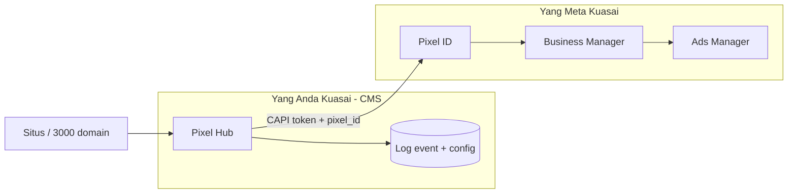
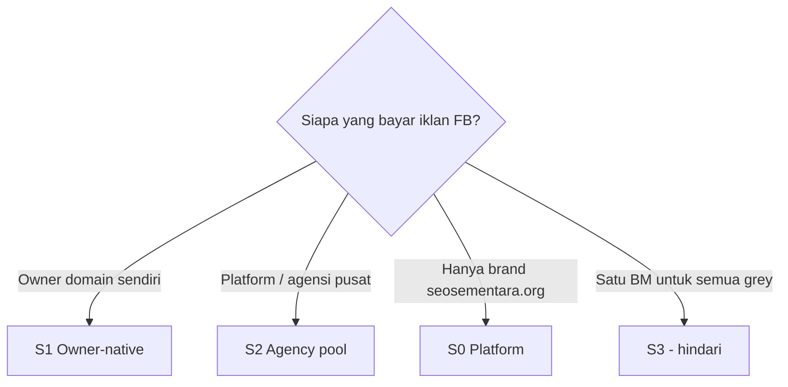

# 24 — Akun Meta, BM, Pixel & Optimasi Iklan (Realita Operasional)

> Jawaban atas situasi nyata: **akun personal / Fanpage / BM sering putus**, pixel tidak bisa “dipindah” sembarangan, dan **fitur apa** yang benar-benar membuat iklan FB lebih tertarget & efisien.  
> CAPI teknis: [23](./23-meta-conversions-api-kedalaman.md) · Hub: [20](./20-pixel-admin-facebook-tiktok-gads.md) · Multi-pixel: [23 §20](./23-meta-conversions-api-kedalaman.md#20-multi-pixel--banyak-advertiser-di-ribuan-domain)

---

## 1. Jadi Bagaimana? (Gambaran Satu Halaman)

**Pixel Facebook tidak hidup di website Anda** — pixel “milik” struktur **Business Manager (BM)** di Meta.  
**Pixel Hub di CMS** adalah **rumah data & pipa CAPI di server Anda**. Saat BM/akun Meta putus, **pipa CMS tetap jalan**, tetapi **tujuan** (Pixel ID + token) harus diganti ke BM/pixel baru yang sehat.



| Jika… | Yang mati | Yang tetap |
|-------|-----------|------------|
| BM kena suspend | Akses pixel lama, iklan, token CAPI | Data event di DB Hub, skrip first-party, domain |
| Personal admin logout | Setup UI Meta | CAPI jika pakai **System User** |
| Fanpage di-unpublish | Beberapa creative / identitas | Pixel tetap jika pixel di BM terpisah |

**Kesimpulan operasional:** Bangun proses **“BM putus → ganti Pixel ID + token di Hub → lanjut kirim CAPI”**, jangan bergantung pada satu akun personal.

---

## 2. Hierarki Akun Meta (Personal, Fanpage, BM)

| Lapisan | Fungsi | Risiko “putus” |
|---------|--------|----------------|
| **Akun Facebook personal** | Login manusia, admin awal | Ban, checkpoint, logout |
| **Fanpage** | Identitas publik, iklan dari page | Hilang role admin, page restricted |
| **Business Manager (BM)** | **Pemilik pixel**, ad account, orang & aset | **Suspend BM** = pixel ikut tidak terpakai |
| **Ad Account** | Budget iklan, kampanye | Disable payment, policy |
| **Pixel / Dataset** | Terima event, feed optimasi | Terikat BM yang membuatnya |

### Yang sering disalahpahami

| Mitos | Realita |
|-------|---------|
| “Pixel bisa dishare seperti file ke BM lain” | Pixel **dikelola** lewat BM; pindah BM butuh **share asset** di Meta atau buat pixel baru |
| “Fanpage = pixel” | Fanpage ≠ pixel; pixel di **BM** (page hanya salah satu identitas iklan) |
| “Kalau pixel pernah jalan, tinggal tempel ID di BM baru” | **Tidak otomatis** — pixel ID lama tetap di BM lama; BM baru butuh **pixel baru** atau **proses transfer resmi** Meta |
| “CAPI menggantikan BM” | CAPI hanya **mengirim data ke pixel ID**; tetap butuh BM + token valid |

---

## 3. Kenapa Akun / BM “Putus” & Pixel Lama Tidak Bisa Dipakai

| Penyebab umum | Dampak ke pixel |
|---------------|-----------------|
| Pelanggaran kebijakan iklan / konten | BM atau ad account restrict |
| Akun personal admin terkena | Kehilangan akses ke BM |
| Pembayaran / verifikasi bisnis gagal | Ad account mati, learning reset |
| Terlalu banyak domain “grey” di satu pixel | Risiko agregat policy |
| Token CAPI dari user personal expire | CAPI stop — **bukan** pixel mati |

**Pixel ID lama** tetap ada di Meta, tetapi jika **Anda tidak punya akses BM-nya**, Hub tidak bisa mengirim CAPI ke sana (token 401/403).

---

## 4. Strategi CMS untuk Ketahanan (BM Sering Putus)

### 4.1 Pisahkan “data Anda” vs “akun Meta”

| Di Pixel Hub | Tidak ikut mati saat BM putus |
|--------------|------------------------------|
| Log `pixel_events` (canonical + payload) | Ya |
| `managed_domain_id`, URL, funnel | Ya |
| Konfigurasi mode `server_first` / routing | Ya |
| **Pixel ID + token** | **Harus diganti** |

### 4.2 Pola multi-pixel yang disarankan (ribuan domain)

| Pola | Ketahanan | Target iklan |
|------|-----------|--------------|
| **Satu pixel per owner / klien besar** (Pol B) | BM klien A putus → domain klien B tetap | EMQ per advertiser |
| **Grup domain per BM** (Pol D) | Satu BM mati = satu segmen terdampak, bukan semua | Segmentasi risiko |
| **Hindari satu pixel untuk 3000 domain grey** | Satu ban = semua mati | - |

### 4.3 System User + token BM (bukan personal)

| Token dari | Stabilitas |
|------------|------------|
| Login personal developer | Rendah — expire, ikut ban personal |
| **System User** di BM | **Tinggi** — untuk CAPI produksi |

Di admin Setup: credential = System User token, dokumentasi `business_id` + siapa admin cadangan.

### 4.4 Prosedur darurat “BM putus”

| Langkah | Pelaku | CMS |
|---------|--------|-----|
| 1 | Buat / pulihkan BM baru (atau BM cadangan) | - |
| 2 | Buat **pixel baru** atau share pixel dari BM partner (jika Meta izinkan) | `pixel_configs` baru |
| 3 | Generate token CAPI baru | `pixel_credentials` baru |
| 4 | Update assignment domain | `pixel_domain_assignments` |
| 5 | Test Events + 24j monitoring | Tab Connection |
| 6 | *(Opsional)* Replay event penting ke pixel baru | Job terbatas — hanya dengan konfirmasi legal/policy |

**Replay:** Meta tidak selalu menerima event lama; gunakan hanya untuk gap kecil, bukan bulanan.

### 4.5 BM cadangan & dokumentasi di admin

| Field di CMS (usulan) | Isi |
|-----------------------|-----|
| `meta_bm_label` | “BM Utama – Klien X” |
| `meta_bm_status` | `active` / `restricted` / `retired` |
| `backup_pixel_config_id` | Pixel siap failover |
| `last_incident_at` | Tanggal putus |
| `runbook_url` | Link SOP internal |

---

## 5. Fitur Pixel / CAPI yang Benar-benar Membantu Iklan (Tertarget & Lebih Murah)

Pixel **tidak** mengganti strategi kreatif atau audience manual — pixel **memberi makan** algoritma Meta dengan **sinyal konversi lengkap & akurat**. Itu yang sering menurunkan CPA.

### 5.1 Yang langsung berdampak ke optimasi biaya

| Fitur / praktik | Mekanisme | Dampak ke iklan |
|-----------------|-----------|-----------------|
| **Conversions API (CAPI)** | Server kirim event yang browser kehilangan | Lebih banyak konversi terhitung → learning cepat → CPA turun |
| **Event Match Quality (EMQ) tinggi** | `fbp`, `fbc`, hash email/phone | Meta cocokkan ke akun FB → bid lebih tepat |
| **Standard events** (`Purchase`, `Lead`) | Algoritma paham | Optimasi **Purchase** / **Lead** vs custom |
| **Nilai pembelian** (`value` + `currency`) | ROAS bidding | Iklan ke orang yang mirip pembeli bernilai tinggi |
| **`event_id` dedup** | Tidak double count | Budget tidak “bocor” ke duplikat |
| **First-party collect** | Kurangi kehilangan adblock | Sinyal lebih penuh = audience lookalike lebih bagus |

### 5.2 Yang membangun penargetan (di Ads Manager, didukung pixel bagus)

| Fitur Ads Manager | Butuh pixel bagus? |
|-------------------|-------------------|
| **Custom Audience** (pengunjung 30 hari) | Ya — event masuk pixel |
| **Lookalike** dari pembeli | Ya — butuh cukup `Purchase` |
| **Retargeting** view content / cart | Ya — `ViewContent`, `AddToCart` |
| **Advantage+ shopping / catalog** | Ya + katalog produk |
| **Excluded audiences** | Ya — kurangi waste |

Pixel Hub **tidak mengganti** Ads Manager — tetapi **menjaga kualitas data** masuk pixel sehingga fitur di atas **berisi orang yang benar**.

### 5.3 Yang sering diklaim “pixel pintar” (jujur)

| Klaim pihak ketiga | Faktanya |
|--------------------|----------|
| “Pixel pintar = algoritma ajaib” | = **data lebih lengkap** (CAPI + EMQ) + kampanye terstruktur |
| “Pasti lebih murah 50%” | Tidak dijamin — tergantung offer, landing, kreatif, BM sehat |
| “Bisa tanpa BM” | **Tidak** — tetap butuh struktur iklan Meta |
| “Share pixel yang sudah jalan ke BM baru” | Hanya lewat **share asset** resmi atau pixel baru |

---

## 6. Rekomendasi untuk Model Anda (Banyak Domain, BM Tidak Stabil)

| Prioritas | Kebijakan |
|-----------|-----------|
| 1 | **Jangan** satu pixel untuk semua domain grey — segment per owner/BM |
| 2 | Produksi CAPI pakai **System User**, bukan token personal |
| 3 | Default **`server_first`** + first-party `pelacak.*` |
| 4 | Simpan **semua event di Hub** — saat ganti pixel, histori internal tetap untuk laporan |
| 5 | Tab Connection: monitor EMQ + failure rate — fix sebelum scale budget |
| 6 | Dokumen **BM cadangan** per segmen di admin |
| 7 | `Purchase` + `value` + `order_id` untuk toko; `Lead` + hash email untuk form |

---

## 7. Apa yang Dikerjakan Admin CMS vs Meta

| Tugas | Di CMS Pixel Hub | Di Meta (BM / Ads) |
|-------|------------------|---------------------|
| Ganti pixel saat BM putus | Setup pixel + token baru | Buat pixel / share asset |
| Kirim event | CAPI dispatch | Terima di Events Manager |
| Uji event | Test connection | Test Events tab |
| Lihat funnel per domain | Analytics internal | Ads reporting |
| Buat lookalike / retargeting | - | Ads Manager audiences |
| Budget & kreatif | - | Ads Manager |

---

## 8. Ringkasan Jawaban “Jadi Bagaimana?”

1. **Personal & Fanpage** rapuh — jangankan **BM + System User** sebagai fondasi pixel.  
2. **BM putus** → pixel lama tidak bisa dipakai tanpa akses BM itu — siapkan **pixel baru + token baru** di Hub, domain & skrip first-party **tetap**.  
3. **“Lebih tertarget & murah”** datang dari **CAPI + EMQ + event standar + value** — bukan dari menempel Pixel ID saja.  
4. **Pixel Hub** = aset jangka panjang Anda; **BM Meta** = penyedia tujuan yang bisa diganti dengan SOP.  
5. Untuk ribuan domain: **isolasi per owner/BM**, jangan satu pixel global kecuali brand resmi satu BM kuat.

---

## 9. Pola Bisnis di Seosementara (Empat Model)

Platform ini mengelola **domain produk** (`seosementara.org` + subdomain) dan **ribuan `managed_domains`** (portfolio milik pekerja). Pixel Meta **tidak satu untuk semua**.

| Kode | Nama | Siapa punya BM | Siapa punya Pixel | Cocok untuk |
|------|------|---------------|-------------------|-------------|
| **S0** | Platform only | BM **Seosementara** | Pixel produk (1) | Iklan untuk `seosementara.org`, `url.*`, `ads.*` saja |
| **S1** | **Owner-native** *(disarankan)* | **Owner domain** (pekerja/klien) | 1 pixel per owner (atau per domain) | Ribuan domain portfolio, BM sering beda-beda |
| **S2** | Agency pool | BM **Seosementara** + sub-segment | 1 pixel per **grup** (10–50 domain) | Anda yang bayar iklan untuk banyak domain grey |
| **S3** | Single mega pixel | Satu BM pusat | Satu pixel untuk semua domain | **Tidak disarankan** — risiko suspend massal |



**Keputusan default produk:** **S0** untuk trafik produk + **S1** untuk setiap `managed_domain` yang beriklan. **S2** hanya jika kontrak bisnis menyatakan platform yang mengelola BM.

---

## 10. Tabel — Siapa Punya Pixel Siapa

### 10.1 Matriks kepemilikan

| Entitas CMS / Meta | Owner BM | Owner Pixel ID | Token CAPI | Fanpage untuk iklan | Catatan |
|--------------------|----------|----------------|------------|---------------------|---------|
| `seosementara.org` (apex) | BM Platform | `pixel_platform` | System User BM Platform | Fanpage produk | Model **S0** |
| Subdomain `ads.*`, `url.*` | BM Platform | Sama atau pixel `ads` terpisah | System User BM Platform | Fanpage kampanye | Event shortlink → CAPI [19] |
| `managed_domain` #1 … #N | **Owner domain** *(S1)* atau BM Pool *(S2)* | `pixel_configs` terikat assignment | Token BM yang punya pixel | Fanpage **milik owner** — bukan BM platform | Lihat baris domain |
| Grup domain “Fashion ID” | BM Pool segmen | `pixel_group_fashion` | System User segmen | Bisa banyak fanpage | Model **S2** |

### 10.2 Per record `managed_domains` (wajib diisi di admin)

| Field CMS (usulan) | Contoh | Siapa mengisi |
|--------------------|--------|---------------|
| `meta_ownership_model` | `S1` / `S2` | Super Admin / owner |
| `meta_bm_id` | `987654321` | Owner (BM miliknya) |
| `meta_bm_label` | “BM Toko Andi” | Owner |
| `meta_pixel_config_id` | FK → `pixel_configs` | Owner + approve platform |
| `meta_fanpage_id` | ID fanpage iklan | Owner |
| `meta_ad_account_id` | `act_123` | Owner |
| `meta_incident_status` | `ok` / `bm_restricted` | Otomatis + manual |

### 10.3 Tabel contoh (fiktif, 5 domain)

| managed_domain | Owner pekerja | Model | BM | Pixel ID | Fanpage | Yang kirim CAPI |
|----------------|---------------|-------|-----|----------|---------|-----------------|
| rezekibelanja.com | Andi | S1 | BM Andi | `111222333` | FP Toko Andi | Hub → BM Andi |
| fashionmurah.id | Budi | S1 | BM Budi | `444555666` | FP Budi Shop | Hub → BM Budi |
| promo2025.net | CMS Pool | S2 | BM Seosementara | `777888999` | FP Agensi Promo | Hub → BM Platform |
| seosementara.org | Platform | S0 | BM Platform | `000111222` | FP Seosementara | Hub → BM Platform |
| *(domain baru)* | Citra | S1 | *(belum ada)* | — | — | Event antri di Hub sampai setup |

**Aturan emas:** Jangan isi Pixel ID BM Andi ke domain milik Budi — EMQ dan policy kacau, risiko suspend naik.

### 10.4 Hubungan dengan RBAC [11]

| Role | Lihat pixel | Ubah Pixel ID / token |
|------|-------------|------------------------|
| Super Admin | Semua | Semua |
| Owner domain | Hanya `meta_pixel_config_id` domain sendiri | Hanya domain sendiri *(jika `pixel.facebook.manage`)* |
| Pekerja share | Read-only atau tidak | Tidak |
| Platform Manager | Pool S2 + S0 | Pool + platform |

---

## 11. SOP — Model S1 (Owner-native) *(disarankan)*

### 11.1 Onboarding domain baru + pixel

| # | Langkah | Di Meta (owner) | Di CMS `/admin/pixel/facebook/` |
|---|---------|-----------------|----------------------------------|
| 1 | Owner buat / punya BM sendiri | Business Manager | - |
| 2 | Buat Pixel di Events Manager | Pixel ID dicatat | - |
| 3 | Buat System User + token CAPI | Generate token | - |
| 4 | Owner buka tab Setup (domain scope) | - | Paste Pixel ID + token |
| 5 | Uji Test Event Code | Test Events | Tombol **Uji koneksi** |
| 6 | Assign domain | - | Domains → assign `managed_domain_id` |
| 7 | Verifikasi domain di Meta | DNS / meta tag | Centang di CMS |
| 8 | Aktifkan `server_first` | - | Mode default [23 §19] |
| 9 | Monitor 48 jam | Events Manager live | Diagnostics |

**SLA internal:** setup selesai ≤ 24 jam setelah domain aktif beriklan.

### 11.2 Owner sudah punya pixel lama di BM yang masih sehat

| # | Langkah |
|---|---------|
| 1 | Jangan buat pixel baru — pakai Pixel ID existing |
| 2 | Buat token CAPI baru (token lama mungkin expire) |
| 3 | Hub assignment ke domain; `event_source_url` = hostname domain |
| 4 | Matikan snippet `fbq` tema lama → ganti first-party Hub |

### 11.3 Owner hanya punya akun personal + fanpage (belum ada BM)

| # | Langkah |
|---|---------|
| 1 | **Wajib** buat BM — pixel tidak stabil di personal |
| 2 | Klaim fanpage ke BM |
| 3 | Baru buat pixel + System User |
| 4 | Fanpage untuk identitas iklan; **jangan** simpan token dari login personal di CMS |

---

## 12. SOP — Model S2 (Agency pool / platform bayar iklan)

Untuk segmen domain grey yang **Anda** yang kelola budget iklan.

### 12.1 Struktur pool

| Segmen | Max domain / pixel | BM |
|--------|-------------------|-----|
| Pool A — tier rendah | ≤ 30 domain | BM Platform A |
| Pool B — tier mid | ≤ 30 domain | BM Platform B |
| … | Rotate jika satu BM kena | BM cadangan |

**Jangan** > 50–80 domain grey aktif per satu pixel (kebijakan risiko internal — sesuaikan dengan pengalaman policy).

### 12.2 Onboarding domain ke pool

| # | Langkah | CMS |
|---|---------|-----|
| 1 | Super Admin pilih grup `pixel_config_groups` | Buat / pilih grup |
| 2 | Assign domain ke grup | `pixel_group_members` |
| 3 | Pastikan `event_source_url` hostname domain benar | Routing [23 §20] |
| 4 | `external_id` prefix per domain | `custom_data`: `site_key` = slug domain |
| 5 | Dokumentasi fanpage mana yang dipakai iklan domain itu | Field `meta_fanpage_id` |

### 12.3 Jika satu pool BM kena suspend

| # | Langkah |
|---|---------|
| 1 | Tandai `meta_incident_status = bm_restricted` untuk semua domain di grup |
| 2 | Pindah domain ke **grup BM cadangan** (pixel ID baru) |
| 3 | Update `pixel_configs` + token — job mass deploy [21] |
| 4 | Komunikasi ke owner: iklan pause sampai BM cadangan aktif |
| 5 | **Jangan** replay bulanan event ke pixel baru tanpa review policy |

---

## 13. SOP Darurat — BM / Pixel Putus (Semua Model)

### 13.1 Deteksi (otomatis + manual)

| Sinyal | Deteksi |
|--------|---------|
| CAPI 401/403 | Worker + banner Connection merah |
| `events_received: 0` berulang | Alert [23 §15] |
| Owner lapor “iklan mati” | Tiket + cek `meta_incident_status` |
| Events Manager kosong 24j | Manual check |

### 13.2 Respons 0–4 jam

| # | Aksi | PIC |
|---|------|-----|
| 1 | Pause scale budget iklan domain terdampak | Owner / media buyer |
| 2 | Catat insiden di CMS: BM ID, pixel ID lama, waktu | Super Admin |
| 3 | Cek apakah BM **restricted** sementara atau permanen | Owner login Meta |
| 4 | Jika sementara: tunggu appeal Meta | - |
| 5 | Jika permanen / tidak ada akses: **pixel baru** | Owner atau Platform |

### 13.3 Respons 4–24 jam — pemulihan CAPI di Hub

| # | Aksi | CMS |
|---|------|-----|
| 1 | Buat `pixel_configs` baru (jangan hapus config lama — arsip) | `is_active=false` pada lama |
| 2 | Token System User **baru** | `pixel_credentials` baru |
| 3 | Assign ke domain yang terdampak | Bulk assign job |
| 4 | Test Event Code → uji `PageView` + `Purchase` | Connection tab |
| 5 | Hapus `test_event_code` untuk produksi | Setup |
| 6 | Monitor EMQ 7 hari | Analytics |

### 13.4 Yang tidak bisa dipulihkan

| Harapan | Realita |
|---------|---------|
| Pakai Pixel ID lama tanpa BM lama | Tidak bisa |
| Lookalike audience di BM mati | Buat ulang di BM baru |
| Learning phase kampanye | Reset — normal |
| Histori Events Manager lama | Tidak pindah otomatis |

**Yang tetap ada di Anda:** log `pixel_events` di Hub untuk laporan internal per `managed_domain_id`.

### 13.5 Checklist tiket insiden

```markdown
- [ ] Domain / grup terdampak didata
- [ ] BM ID lama & baru tercatat
- [ ] Pixel ID baru terpasang di Hub
- [ ] Token CAPI baru valid (test connection OK)
- [ ] Domain assignments diperbarui
- [ ] Test Events OK
- [ ] Produksi tanpa test_event_code
- [ ] Owner diinformasi
- [ ] Post-mortem: penyebab policy (jika diketahui)
```

---

## 14. Fanpage vs BM vs Pixel — SOP Singkat

| Situasi | Yang dilakukan |
|---------|----------------|
| Iklan dari fanpage A, pixel di BM owner | Normal — fanpage hanya identitas; CAPI ke pixel BM |
| Fanpage hilang admin, BM masih OK | Pulihkan role fanpage; pixel **tetap** |
| BM mati, fanpage masih ada | BM baru + pixel baru; fanpage diklaim ke BM baru |
| Hanya personal admin, tanpa BM | **Stop** — wajib buat BM dulu sebelum scale spend |

---

## 15. Fitur “Lebih murah & tertarget” — Checklist per Domain

Setelah pixel & BM sehat, pastikan ini aktif di Hub (bukan hanya di Ads Manager).  
**Data lengkap (bukan IP saja):** [25](./25-pixel-data-lengkap-emq.md).

| # | Item | Model S1 | Model S2 |
|---|------|----------|----------|
| 1 | CAPI aktif + System User token | ✓ | ✓ |
| 2 | `server_first` atau hybrid dengan dedup | ✓ | ✓ |
| 3 | `event_source_url` = hostname domain benar | ✓ | ✓ |
| 4 | `Purchase` / `Lead` + value jika ada | ✓ | ✓ |
| 5 | **`fbp` + `fbc`** (bukan hanya IP) | ✓ | ✓ |
| 6 | **Hash `em` / `ph`** pada Lead & Purchase | ✓ | ✓ |
| 7 | `external_id` jika ada login | ✓ | opsional |
| 8 | Diagnostics: **&lt; 10% event tier D** (IP+UA saja) | ✓ | ✓ |
| 6 | Di Ads: retargeting 7–30 hari | Owner | Platform |
| 7 | Di Ads: lookalike 1–3% pembeli | Owner | Platform |
| 8 | Exclude pembeli 180 hari pada prospecting | Owner | Platform |

---

## 16. Keputusan Resmi untuk Seosementara

| Aspek | Keputusan |
|-------|-----------|
| Default portfolio | **S1** — owner bawa BM + pixel sendiri |
| Platform marketing | **S0** — pixel terpisah untuk `seosementara.org` |
| Grey mass iklan pusat | **S2** — max ~30 domain / pixel / BM, BM cadangan wajib |
| Dilarang default | **S3** — satu pixel semua domain |
| Token produksi | System User only |
| Saat BM putus | SOP §13 — ganti pixel di Hub, data internal tetap |
| Dokumentasi wajib per domain | §10.2 `meta_*` fields |

---

## 17. Dokumen terkait

- [23-meta-conversions-api-kedalaman.md](./23-meta-conversions-api-kedalaman.md)
- [21-pixel-facebook-pro.md](./21-pixel-facebook-pro.md)
- [09-model-domain-host-dan-subdomain.md](./09-model-domain-host-dan-subdomain.md)
- [11-rbac-dan-permission-share.md](./11-rbac-dan-permission-share.md) — owner per domain
