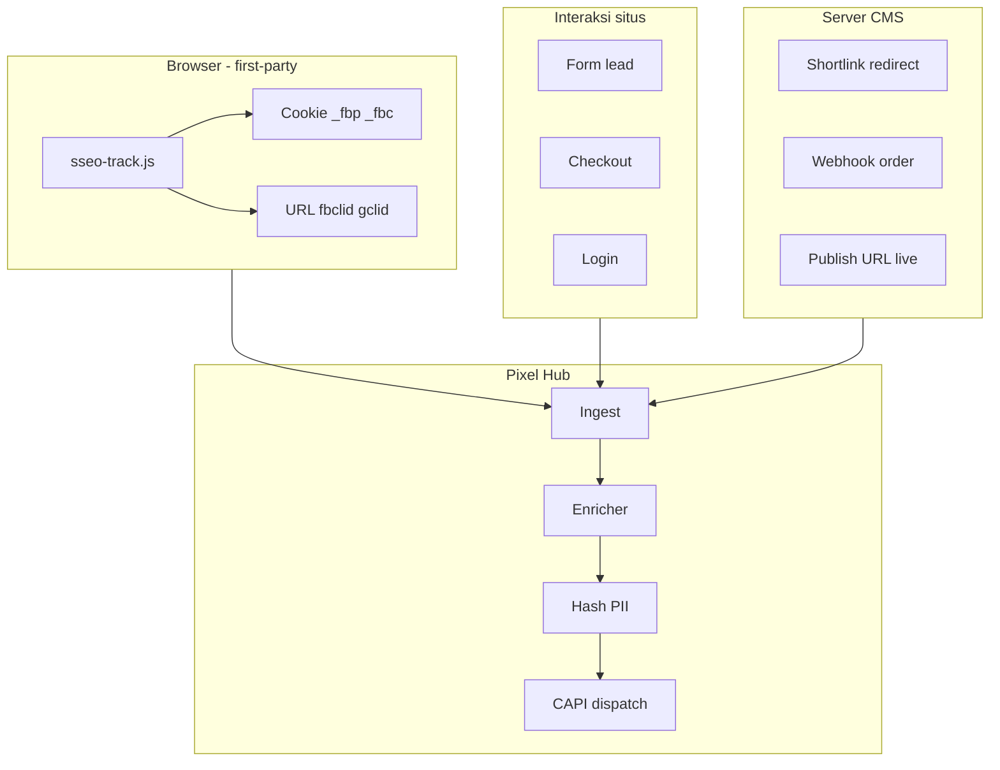

# 25 — Data Pixel Lengkap (Bukan Hanya IP & Device)

> Meta / CAPI **tidak optimal** jika Hub hanya mengirim `client_ip_address` + `client_user_agent`.  
> Dokumen ini mendefinisikan **data minimum berguna**, **data Pro wajib**, dan **dari mana CMS mengumpulkannya**.  
> CAPI: [23](./23-meta-conversions-api-kedalaman.md) · Facebook Pro: [21](./21-pixel-facebook-pro.md) · BM: [24](./24-meta-akun-bm-pixel-dan-optimasi-iklan.md)

---

## 1. Masalah: Hanya IP + Device = Hampir Tidak Berguna

| Yang sering diimplementasi awal | Nilai untuk Meta |
|--------------------------------|------------------|
| IP address | Rendah–sedang (banyak orang share IP/NAT) |
| User-Agent (device/browser) | Rendah–sedang |

| Yang Meta butuhkan untuk EMQ tinggi | Tanpa ini |
|-------------------------------------|-----------|
| `fbp` (browser ID Meta) | Matching lemah |
| `fbc` (click ID iklan) | Attribution iklan buruk |
| Hash **email** / **telepon** | Tidak bisa cocok ke akun FB |
| `external_id` (user login) | Retargeting/login chain lemah |
| `event_source_url` benar | Sinyal halaman salah |
| `value` + `currency` (purchase) | Tidak bisa optimasi ROAS |

**Kesimpulan:** Pixel Hub harus dirancang sebagai **pengumpul & pelengkap data**, bukan “forwarder IP saja”. Kalau hanya IP+UA, hasilnya mirip traffic analytics biasa — **bukan** pixel Pro untuk iklan murah/tertarget.

---

## 2. Tier Kualitas Data (Target Produk)

| Tier | Field CAPI `user_data` | EMQ estimasi | Layak untuk scale iklan? |
|------|------------------------|--------------|---------------------------|
| **D — Tidak berguna** | Hanya IP + UA | 2–4 / 10 | **Tidak** |
| **C — Dasar** | + `event_source_url`, `fbp` | 4–5 / 10 | Hanya testing |
| **B — Pro** | + `fbc`, hash `em` atau `ph`, `external_id` | 6–8 / 10 | **Ya** |
| **A — Lengkap** | + `fn`/`ln`/`ct`/`country`, `value` purchase, dedup hybrid | 8+ / 10 | Scale budget |

**Target Seosementara:** setiap event konversi (**Lead**, **Purchase**) minimal **Tier B**; **PageView** minimal **Tier C**.

---

## 3. Data Lengkap — Tabel Wajib per Jenis Event

### 3.1 Semua event (baseline Tier C)

| Field | Sumber di CMS | Cara kumpul |
|-------|---------------|-------------|
| `event_id` | Hub generate UUID | Ingest |
| `event_time` | Waktu aksi user | Ingest |
| `event_source_url` | URL halaman / redirect akhir | Browser `location.href` / server redirect |
| `client_ip_address` | Request | Header CF / `X-Forwarded-For` |
| `client_user_agent` | Request | Header |
| `fbp` | Cookie `_fbp` | `sseo-track.js` baca cookie |
| `action_source` | `website` | Default |

### 3.2 Event dari klik iklan (tambah Tier B)

| Field | Sumber | Cara kumpul |
|-------|--------|-------------|
| `fbc` | Cookie `_fbc` atau `fbclid` di URL | JS: parse `?fbclid=` → set cookie format Meta |

**Format `fbc`:** `fb.1.{unix}.{fbclid}`

### 3.3 Lead / form (Tier B wajib)

| Field | Sumber | Cara kumpul |
|-------|--------|-------------|
| `em` | Email form | Hash SHA256 di **privacy gateway** |
| `ph` | Telepon form (opsional) | Normalisasi E.164 → hash |
| `external_id` | User ID CMS | Hash stabil `user_id` |

**Tanpa email/telepon pada Lead** → Meta sulit mengait ke akun FB → iklan “tidak tertarget”.

### 3.4 Purchase / checkout (Tier A)

| Field | Lokasi | Keterangan |
|-------|--------|------------|
| `em`, `ph` | Checkout | Sama Lead |
| `external_id` | Akun pembeli | |
| `custom_data.value` | Total order | Float |
| `custom_data.currency` | `IDR` | |
| `custom_data.order_id` | Unik | Dedup transaksi |
| `custom_data.content_ids` | SKU | Dynamic ads |

### 3.5 Login / member (retargeting)

| Field | Sumber |
|-------|--------|
| `external_id` | Session user CMS |
| `em` | Profil (jika consent) |

---

## 4. Dari Mana Data Masuk — Peta Sumber (Pixel Hub)



| Sumber | Event contoh | Data tambahan |
|--------|--------------|---------------|
| `sseo-track.js` | PageView, ViewContent | fbp, fbc, url, session_id |
| Form HTMX/API | Lead | email, phone → hash |
| Checkout webhook | Purchase | value, order_id, em, ph |
| Shortlink [19] | Click → ViewContent | url, fbc dari query, domain_id |
| Login session | PageView berikutnya | external_id |

**IP + UA hanya** = satu input dari baris “Request” — **bukan** cukup.

---

## 5. Enricher — Lapisan Wajib di Hub (Spesifikasi)

Setelah `POST /collect`, sebelum CAPI, worker **enrich** melengkapi canonical event:

| Langkah enrich | Input | Output |
|----------------|-------|--------|
| Cookie resolve | `session_id` | `fbp`, `fbc` dari sesi sebelumnya jika cookie kosong di hit ini |
| Click param | `fbclid` di URL pertama sesi | Bangun `fbc`, simpan di session store |
| User profile | `user_id` login | `external_id`, `em` hash dari profil |
| Domain meta | `managed_domain_id` | `event_source_url` default, `site_key` |
| Geo (opsional) | CF `CF-IPCountry` | `country` hash |
| Last touch | Shortlink / referrer | `referrer` di custom_data |

**Penyimpanan sesi (usulan DB):**

```sql
CREATE TABLE pixel_sessions (
  session_id          TEXT PRIMARY KEY,
  managed_domain_id   BIGINT,
  fbp                 TEXT,
  fbc                 TEXT,
  anonymous_id        TEXT,
  first_url           TEXT,
  last_url            TEXT,
  created_at          TIMESTAMPTZ NOT NULL DEFAULT now(),
  updated_at          TIMESTAMPTZ NOT NULL DEFAULT now()
);
```

TTL sesi: 7–90 hari (config) — untuk mengisi `fbp`/`fbc` pada kunjungan berikutnya.

---

## 6. UI Admin — Indikator “Data Lengkap atau Tidak”

Tab **Connection** / **Diagnostics** wajib menampilkan **bukan** hanya jumlah event, tetapi **coverage parameter**:

| Parameter | Target Pro | Tampilan |
|-----------|------------|----------|
| % event dengan `fbp` | ≥ 70% | Hijau / merah |
| % event dengan `fbc` (traffic ads) | ≥ 40% dari ads landing | |
| % Lead dengan `em` | ≥ 80% | |
| % Purchase dengan `em` + `value` | ≥ 90% | |
| % hanya IP+UA (tier D) | **< 10%** | Alert critical |

**Label di event log:**

| Badge | Arti |
|-------|------|
| `tier_a` | Lengkap |
| `tier_b` | Pro |
| `tier_c` | Dasar |
| `tier_d` | **IP+UA saja — perbaiki** |

---

## 7. Integrasi Bisnis — Kapan Data Tersedia

| Skenario domain portfolio | Data yang realistis | Rekomendasi |
|---------------------------|---------------------|-------------|
| Landing + form lead | em, ph, fbp | Tier B — **layak iklan Lead** |
| Hanya blog tanpa form | fbp, url | Tier C — optimasi traffic/ViewContent saja |
| Shortlink ke offer | fbc jika dari FB ads, url | Pasang `fbclid` di URL iklan |
| Checkout e-commerce | Full Tier A | Wajib webhook purchase |
| Domain tanpa form & tanpa login | Hanya IP+UA | **Jangan** expect CPA murah — jujur di admin |

---

## 8. Form & Consent — Mengumpulkan Email Tanpa Melanggar

| Aturan | Implementasi |
|--------|--------------|
| Consent marketing | Checkbox → baru kirim `em` ke CAPI |
| Bukan semua field ke Meta | Hanya hash em/ph — tidak kirim nama plain |
| Pre-fill login | `external_id` dari user ID |

**Pesan ke owner domain (S1):** “Tanpa form email/telepon, pixel hanya setengah berguna untuk iklan lead.”

---

## 9. Perbandingan: Forwarder IP vs Pixel Hub Pro

| | Forwarder IP+UA | Pixel Hub Pro (dokumen ini) |
|--|-----------------|-----------------------------|
| CAPI | Ya, kosong | Ya, **user_data lengkap** |
| EMQ | Rendah | Target 6–8+ |
| Lookalike pembeli | Buruk | Memungkinkan |
| Attribution klik iklan | Buruk | `fbc` |
| ROAS bidding | Tidak | `value` + `currency` |
| Saat BM putus | Sama | Sama — tapi data historis lengkap di Hub |

---

## 10. Checklist Implementasi (Supaya Bukan IP Saja)

- [ ] `sseo-track.js` baca `_fbp`, `_fbc`, `fbclid` dari URL
- [ ] Simpan/update `pixel_sessions`
- [ ] Enricher pipeline sebelum `pixel_dispatch`
- [ ] Form lead → endpoint collect dengan `email` (hash di server)
- [ ] Purchase webhook → `value`, `order_id`, em
- [ ] Diagnostics: % tier D < 10%
- [ ] Admin warning jika domain hanya tier D 7 hari berturut
- [ ] Dokumentasi owner: wajib form/login untuk iklan konversi

---

## 11. Dokumen terkait

- [23-meta-conversions-api-kedalaman.md](./23-meta-conversions-api-kedalaman.md) §5 `user_data`
- [21-pixel-facebook-pro.md](./21-pixel-facebook-pro.md)
- [24-meta-akun-bm-pixel-dan-optimasi-iklan.md](./24-meta-akun-bm-pixel-dan-optimasi-iklan.md) §15
