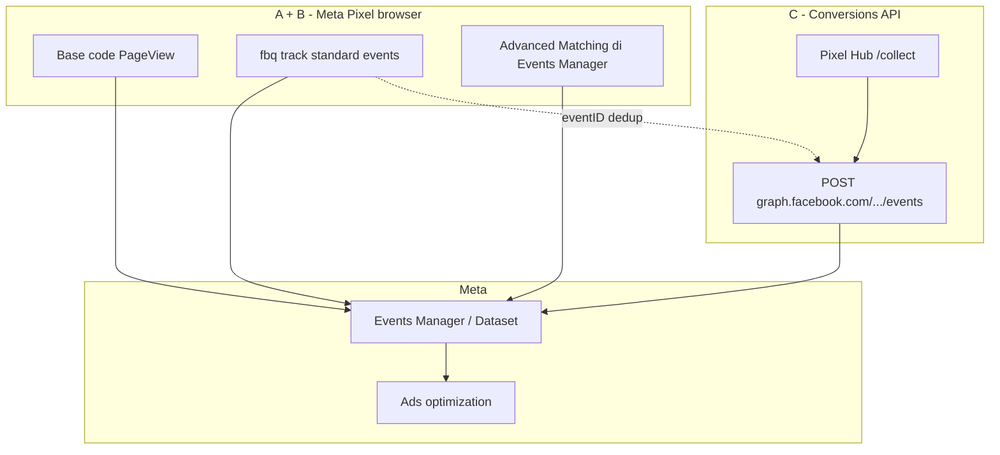

# 26 — Peta Sumber Resmi Meta (Pixel + CAPI) → Pixel Hub

> Dokumen ini mengikat **tiga URL resmi** yang Anda berikan ke spesifikasi Seosementara.  
> Implementasi data: [25](./25-pixel-data-lengkap-emq.md) · CAPI: [23](./23-meta-conversions-api-kedalaman.md)

---

## 1. Tiga Sumber yang Anda Kirim

| # | URL | Peran | Untuk siapa |
|---|-----|-------|-------------|
| A | [Specifications for Meta Pixel standard events](https://www.facebook.com/business/help/402791146561655?id=1205376682832142) | **Event standar** + contoh `fbq('track', ...)` | Operator / marketing |
| B | [Meta Pixel — Developers](https://developers.facebook.com/docs/meta-pixel) | **Implementasi teknis** pixel browser + hubungan CAPI | Developer |
| C | [Conversions API — Business Tools](https://www.facebook.com/business/tools/conversions-api) | **Produk CAPI** (mengapa server-side) | Keputusan bisnis / onboarding |

**Catatan URL:** `web.facebook.com` dan `www.facebook.com` mengarah ke konten yang sama (Business Help / marketing). Dokumentasi teknis CAPI tetap di `developers.facebook.com/docs/marketing-api/conversions-api/`.

---

## 2. Hubungan Ketiga Sumber (Satu Gambar)

| Lapisan | Sumber | Fungsi |
|---------|--------|--------|
| **Pixel browser** | B (+ A untuk nama event) | `fbq`, cookie, PageView otomatis |
| **Advanced Matching** | B → [Help: Advanced matching](https://www.facebook.com/business/help/611774685654668) | Email/telp/nama di pixel **atau** CAPI |
| **Conversions API** | C + [CAPI Parameters](https://developers.facebook.com/docs/marketing-api/conversions-api/parameters) | Server kirim event + `user_data` lengkap |
| **Dedup** | [Help: Deduplication](https://www.facebook.com/business/help/823677331451951) | `eventID` di `fbq` = `event_id` di CAPI |

**Pixel Hub Seosementara** menggantikan “hanya pixel A” atau “hanya CAPI C” dengan **keduanya selaras** (mode `server_first` atau `hybrid` [23 §19]).

---

## 3. Sumber A — Standard Events (Business Help)

Dari [Specifications for Meta Pixel standard events](https://www.facebook.com/business/help/402791146561655?id=1205376682832142):

| Aksi website | Standard event (`event_name` CAPI = sama) | Contoh `fbq` |
|--------------|-------------------------------------------|---------------|
| Tambah info pembayaran | `AddPaymentInfo` | `fbq('track', 'AddPaymentInfo')` |
| Tambah keranjang | `AddToCart` | `fbq('track', 'AddToCart')` |
| Wishlist | `AddToWishlist` | `fbq('track', 'AddToWishlist')` |
| Registrasi selesai | `CompleteRegistration` | `fbq('track', 'CompleteRegistration')` |
| Kontak (telp/SMS/email/chat) | `Contact` | `fbq('track', 'Contact')` |
| Kustomisasi produk | `CustomizeProduct` | `fbq('track', 'CustomizeProduct')` |
| Donasi | `Donate` | `fbq('track', 'Donate')` |
| Cari lokasi toko | `FindLocation` | `fbq('track', 'FindLocation')` |
| Mulai checkout | `InitiateCheckout` | `fbq('track', 'InitiateCheckout')` |
| **Lead** (form / trial) | `Lead` | `fbq('track', 'Lead')` |
| **Purchase** | `Purchase` | `fbq('track', 'Purchase', {value, currency})` |
| Booking janji | `Schedule` | `fbq('track', 'Schedule')` |
| Pencarian | `Search` | `fbq('track', 'Search')` |
| Mulai trial gratis | `StartTrial` | `fbq('track', 'StartTrial', {...})` |
| Lamar / apply | `SubmitApplication` | `fbq('track', 'SubmitApplication')` |
| Langganan berbayar | `Subscribe` | `fbq('track', 'Subscribe', {...})` |
| Lihat halaman penting | `ViewContent` | `fbq('track', 'ViewContent')` |
| Kunjungan halaman (umum) | `PageView` | Otomatis di **base code** pixel |

Referensi parameter objek lengkap: [Meta Pixel Reference](https://developers.facebook.com/docs/facebook-pixel/reference).

### Parameter objek standar (→ `custom_data` di CAPI)

| Property | Tipe | Dipakai untuk |
|----------|------|---------------|
| `value` | number | Nilai event — **wajib** untuk `Purchase` |
| `currency` | string ISO | **wajib** untuk `Purchase` |
| `content_ids` | array | SKU / ID produk |
| `contents` | array `{id, quantity}` | Advantage+ catalog ads |
| `content_type` | `product` / `product_group` | Katalog |
| `content_name` | string | Nama halaman/produk |
| `content_category` | string | Kategori |
| `num_items` | int | `InitiateCheckout` |
| `search_string` | string | `Search` |
| `predicted_ltv` | number | `StartTrial`, `Subscribe` |
| `status` | boolean | `CompleteRegistration` |

**Di Pixel Hub:** canonical event → `event_name` Meta + `custom_data` sesuai tabel [25](./25-pixel-data-lengkap-emq.md) §5.

---

## 4. Sumber B — Meta Pixel (Developers)

Dari [docs/meta-pixel](https://developers.facebook.com/docs/meta-pixel) dan [reference](https://developers.facebook.com/docs/facebook-pixel/reference):

| Topik resmi | Implikasi Hub |
|-------------|---------------|
| Base code di `<head>` | PageView otomatis — di mode `server_first` kita kirim `PageView` via CAPI + optional tipis `fbq` |
| `fbq('track', 'Event', params, {eventID})` | Parameter ke-4 **`eventID`** wajib jika hybrid + CAPI ([dedup doc](https://developers.facebook.com/docs/marketing-api/conversions-api/deduplicate-pixel-and-server-events)) |
| Standard + custom events | Prioritaskan **standard** untuk optimasi iklan |
| Advanced Matching | [About advanced matching](https://www.facebook.com/business/help/611774685654668) — sama dengan hash `em`/`ph` di CAPI [25] |
| Partner integrations | Opsional (Zaraz, GTM) — kita native Hub |

### Advanced Matching (Help Center — terkait B)

| Artikel | URL |
|---------|-----|
| About advanced matching for web | https://www.facebook.com/business/help/611774685654668 |
| Set up automatic advanced matching | https://www.facebook.com/business/help/1993001664341800 |
| Best practices advanced matching | https://www.facebook.com/business/help/930861050579797 |

**Kesimpulan:** Data yang Meta Pixel kumpulkan lewat Advanced Matching = **sama** yang harus dikirim CAPI di `user_data` (hash untuk contact fields).

---

## 5. Sumber C — Conversions API (Business)

Landing [Conversions API](https://www.facebook.com/business/tools/conversions-api) menjelaskan **mengapa** server-side (iOS, adblock, kontrol data). Untuk implementasi teknis gunakan:

| Kebutuhan | URL teknis |
|-----------|------------|
| Setup & parameters | https://developers.facebook.com/docs/marketing-api/conversions-api |
| Best practices | https://developers.facebook.com/docs/marketing-api/conversions-api/best-practices |
| Customer information | https://developers.facebook.com/docs/marketing-api/conversions-api/parameters/customer-information-parameters |
| Dedup dengan Pixel | https://www.facebook.com/business/help/823677331451951 |

| Pesan bisnis C | Jawaban operasi Seosementara |
|----------------|------------------------------|
| Kurangi kehilangan event | First-party collect + CAPI [20] |
| Kontrol data | Privacy gateway hash di Hub |
| Bukan ganti Pixel | **CAPI melengkapi** Pixel (dedup) |

---

## 6. Peta Lengkap: Browser Pixel ↔ CAPI ↔ Hub

| Aspek | Meta Pixel (A/B) | Conversions API (C + dev) | Pixel Hub |
|-------|------------------|---------------------------|-----------|
| Event name | `fbq('track', 'Purchase')` | `"event_name": "Purchase"` | Mapping canonical → PascalCase |
| Parameter nilai | `{value, currency}` di JS | `custom_data` JSON | Dari order webhook |
| User matching | Advanced Matching form | `user_data.em`, `ph`, … | Enricher [25] |
| Click attribution | `_fbc` cookie | `user_data.fbc` plain | Dari `fbclid` |
| Browser ID | `_fbp` cookie | `user_data.fbp` plain | Cookie + refresh |
| Dedup | `eventID` di fbq | `event_id` di payload | Satu UUID di ingest |
| Page view | Base code | `PageView` + `event_source_url` | `sseo-track.js` |

---

## 7. Yang Direkam Pixel — Aktivitas, Halaman Sukses, Pesan Sukses

Pemahaman umum **benar**: Pixel tidak hanya “ID + IP”. Ia merekam **jejak kunjungan** dan, jika disetel, **momen penting** (form kirim, checkout, halaman terima kasih).

### 7.1 Dua lapisan perekaman

| Lapisan | Apa yang terekam | Cara kerja | Untuk optimasi iklan |
|---------|------------------|------------|----------------------|
| **Aktivitas browsing** | Setiap halaman dibuka | **Otomatis** — `PageView` dari base code pixel | Retargeting “pengunjung 7 hari”, traffic, funnel kasar |
| **Konversi / aksi bernilai** | Lead, beli, daftar, kontak, dll. | **Harus dipicu** — kode, Event Setup Tool, atau server (CAPI) | Kampanye konversi, lookalike pembeli, CPA |

Pixel **tidak membaca teks** “Pesan sukses!” di layar secara ajaib. Yang Meta terima adalah **event bernama** (`Lead`, `Purchase`, …) dikirim saat aksi itu **benar-benar terjadi** (halaman sukses dimuat, form sukses, webhook order paid).

### 7.2 “Pesan sukses” di website → event Meta apa?

| Yang user lihat di situs | Standard event Meta | Contoh pemicu |
|--------------------------|---------------------|---------------|
| “Terima kasih, pesanan #123 berhasil” | `Purchase` | URL `/thank-you`, webhook order `paid` |
| “Form terkirim / kami hubungi Anda” | `Lead` | Submit form + redirect sukses, atau AJAX sukses → `fbq('track','Lead')` |
| “Registrasi berhasil” | `CompleteRegistration` | Halaman setelah signup |
| “Pembayaran dikonfirmasi” (tanpa detail order) | `Purchase` atau custom | Pastikan `value` + `currency` jika `Purchase` |
| “Pesan terkirim” (kontak umum) | `Contact` | Tombol kirim kontak |
| Pencarian produk | `Search` | Halaman hasil + `search_string` |
| Klik WhatsApp / telepon | `Contact` | Event pada klik (manual) |
| Halaman artikel/produk dilihat | `ViewContent` | Template produk/artikel |
| Situasi tidak cocok tabel standar | **Custom event** | `fbq('trackCustom', 'FormSuccess', {...})` — kurang optimal untuk Ads daripada standard |

**Di Pixel Hub** ([22](./22-pixel-protokol-komunikasi-dan-data.md) §4): trigger `form_submit`, `webhook`, `shortlink_click`, atau `manual` pada **momen sukses** → canonical `lead` / `purchase` → CAPI + optional `fbq` dengan `eventID` sama.

### 7.3 Tanpa kode: Event Setup Tool (Events Manager)

Di [Events Manager](https://business.facebook.com/events_manager), Meta menyediakan **Event Setup Tool** — klik tombol / kunjungan URL tertentu bisa dijadikan event tanpa developer. Cocok untuk situs sederhana; untuk **ribuan domain** CMS, Hub tetap mengandalkan **`sseo-track.js` + definisi event catalog** agar seragam.

### 7.4 Mode `server_first` vs browser

| Mode | PageView / aktivitas | Lead / Purchase / “sukses” |
|------|----------------------|----------------------------|
| `server_first` | CAPI `PageView` tiap collect | CAPI saat backend tahu sukses (webhook, form API) |
| `hybrid` | Pixel browser + CAPI (dedup `eventID`) | `fbq` di halaman sukses **dan** CAPI dengan `event_id` identik |

Ringkas: **browsing = otomatis**; **pesan sukses = konversi = harus dihubungkan ke event** (standard lebih baik dari custom).

---

## 8. Event Prioritas untuk Domain Portfolio CMS

Berdasarkan standar Meta (A + reference), untuk situs umum owner:

| Prioritas | Event | Parameter wajib/disarankan |
|-----------|-------|---------------------------|
| P0 | `PageView` | URL, UA, fbp |
| P0 | `ViewContent` | `content_ids` jika artikel/produk |
| P1 | `Lead` | `em` hash + optional `value` |
| P1 | `Purchase` | `value`, `currency`, `order_id`, `content_ids` |
| P2 | `InitiateCheckout`, `AddToCart` | `contents`, `value` |
| P2 | `CompleteRegistration` | `status`, `value` |
| P3 | `Search`, `Contact` | `search_string` / - |

Tanpa **Lead** / **Purchase** dengan `user_data` lengkap, optimasi konversi di Ads tetap lemah meskipun PageView banyak.

---

## 9. Checklist Keselarasan dengan Ketiga URL

- [ ] Semua standard event di §3 bisa di-fire dari Hub (mapping + `custom_data`)
- [ ] `Purchase` selalu punya `value` + `currency` (Help + Reference)
- [ ] Hybrid: `eventID` browser = `event_id` CAPI ([Help dedup](https://www.facebook.com/business/help/823677331451951))
- [ ] Advanced Matching ≈ field di [25](./25-pixel-data-lengkap-emq.md) §3
- [ ] Website CAPI: `event_source_url` + `client_user_agent` ([Parameters](https://developers.facebook.com/docs/marketing-api/conversions-api/parameters))
- [ ] Dokumentasi operator link ke Events Manager Test Events

---

## 10. Dokumen internal terkait

| Plan | Isi |
|------|-----|
| [25](./25-pixel-data-lengkap-emq.md) | Data `user_data` resmi 2026 |
| [23](./23-meta-conversions-api-kedalaman.md) | CAPI teknis |
| [21](./21-pixel-facebook-pro.md) | Admin Pro |
| [24](./24-meta-akun-bm-pixel-dan-optimasi-iklan.md) | BM & SOP |

**Versi:** 1.1 — + §7 aktivitas vs halaman/pesan sukses (Mei 2026)
