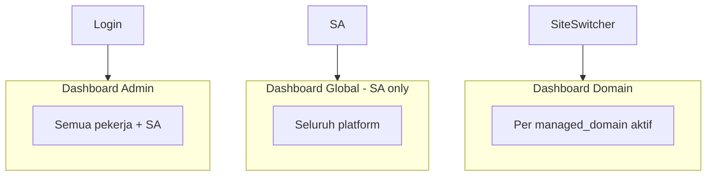
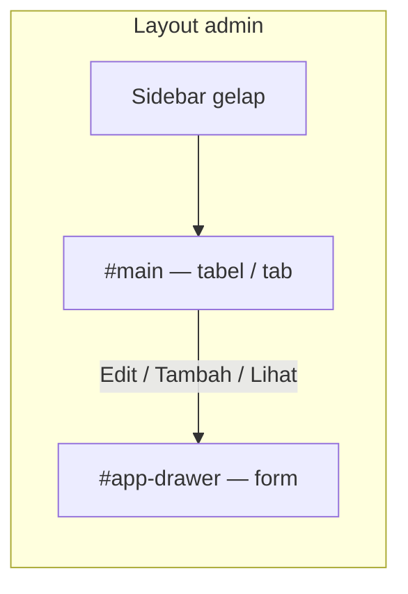

# 27 — Desain Admin Panel: UI, Navigasi, Tiga Dashboard, Responsif

> **Bukan** toko online — CMS untuk mengelola **ribuan domain portfolio** (`managed_domain`), konten, SEO per domain, plugin (shortlink, Pixel), dan **Settings** sistem.  
> Stack: [05](./05-admin-panel-htmx.md) · HTMX: [17](./17-kontrak-htmx-dan-komponen-ui.md) · RBAC: [11](./11-rbac-dan-permission-share.md) · Model domain: [09](./09-model-domain-host-dan-subdomain.md) · Pages: [15](./15-setup-cloudflare-integrasi.md)

---

## 1. Koreksi: Bukan Toko, Bukan Jobs (belum dibahas)

| Item | Status di navigasi |
|------|-------------------|
| Toko / Cart / Produk / Pesanan | **Tidak ada** — bukan model CMS ini |
| **Operasi massal** | **Belum** — tidak tampil di menu sampai ada Plan modulnya |
| **Jobs / antrian** | **Belum** — tidak tampil di menu sampai ada Plan modulnya |

**Pixel `AddToCart`** = event iklan untuk situs owner; bukan menu admin.

---

## 2. Dua “Dunia” Data (penting untuk SEO vs Settings)

| Dunia | Contoh | Dikelola di admin |
|-------|--------|-------------------|
| **Domain portfolio** (`managed_domain`) | `toko-abc.com`, ribuan domain pekerja | **Domain Panel** — drawer domain, Konten, **SEO grup §4** |
| **Domain produk / host** | `seosementara.org`, `bola.`, `url.` | **Settings** — Host, Cloudflare, meta apex ([09](./09-model-domain-host-dan-subdomain.md)) |

**SEO & pertumbuhan** di sidebar (§4) = **hanya** untuk **Domain Panel** (satu `managed_domain` aktif).  
**Bukan** untuk subdomain produk (`bola.seosementara.org`) dan **bukan** pengganti Settings meta host.

---

## 3. Tiga Jenis Dashboard (Wajib Dipisah)



### 3.1 Dashboard Global

| Aspek | Nilai |
|-------|--------|
| **URL** | `/admin/dashboard/global` |
| **Siapa** | **Hanya Super Admin** |
| **Scope** | Seluruh platform (agregat cache) |
| **Isi contoh** | Total domain, pekerja, health API/Tunnel/Pages, error rate |

Worker → **403** atau redirect ke Dashboard Admin.

### 3.2 Dashboard Admin (per akun)

| Aspek | Nilai |
|-------|--------|
| **URL** | `/admin/dashboard` (default login) |
| **Siapa** | Worker + Super Admin |
| **Scope** | Domain milik + dibagikan ke saya |
| **Isi contoh** | Jumlah domain, undangan pending, notifikasi, aktivitas terbaru akun |

### 3.3 Dashboard Domain (per `managed_domain`)

| Aspek | Nilai |
|-------|--------|
| **URL** | `/admin/dashboard/domain` |
| **Siapa** | Owner, share, atau SA |
| **Scope** | Satu domain portfolio aktif |
| **Isi contoh** | Ringkasan post, shortlink, pixel status domain, SEO ringkas |

**Alur:** Login → Dashboard Admin → site switcher → Dashboard Domain / Konten / SEO.

### 3.4 Ringkasan akses

| Dashboard | Super Admin | Worker |
|-----------|-------------|--------|
| Global | ✅ | ❌ |
| Admin | ✅ | ✅ |
| Domain | ✅ | ✅ (yang berhak) |

---

## 4. Navigasi — Bersih & Berkelompok (revisi v1.1)

Sidebar **6 grup** (+ user footer). Tanpa Operasi massal, Jobs, Toko, Tools.

### 4.1 Struktur grup (final)

```
[Logo]  Site switcher (managed_domain)
─────────────────────────────────────────

▼ Ringkasan
    Dashboard Admin
    Dashboard Domain          (butuh domain aktif)
    Dashboard Global          (SA only)

▼ Domain
    Domain saya
    Dibagikan ke saya
    Tambah domain
    Semua domain              (SA only)
    ── baris → drawer §4.2 (domain)

▼ Konten                      (Domain Panel — domain aktif)
    (list di #main · edit → drawer §4)
    Post
    Halaman
    Kategori & tag
    Media

▼ SEO & pertumbuhan           (Domain Panel SAJA — §2)
    Meta & schema per domain
    Sitemap & robots
    Redirect manager
    (konten per-post → di editor Konten)

▼ Plugins                     (list #main · edit → drawer §4)
    Shortlink                 → [19]
    Pixel Hub                 → [20]

▼ Laporan                     (opsional fase berikutnya)

▼ Settings                    (list #main · edit → drawer §4)
    → submenu §5 (nav kiri Settings + drawer untuk tiap record/form)

─────────────────────────────────────────
Notifikasi · User · Keluar
```

### 4.2 Pola drawer universal (referensi UI yang disetujui)

Satu komponen **`#app-drawer`** di layout admin ([17](./17-kontrak-htmx-dan-komponen-ui.md) §2.1) dipakai di **semua modul** — Domain, Konten, SEO, Plugins, Settings, RBAC, Host, dll. Pola mengikuti panel kanan pada referensi: **tabel/list di `#main`**, **form edit di drawer**, backdrop gelap, footer **Simpan / Batal**.



#### 4.2.1 Anatomi drawer (wajib sama di semua modul)

```
┌──────────────────────────────────────────────┐
│ [×]  Judul record          Mode: Edit        │  ← header
├──────────────────────────────────────────────┤
│ Status: Active · ID: 123 · Diperbarui: …     │  ← read strip (opsional)
├──────────────────────────────────────────────┤
│  Label (i)          [ dropdown / input    ]  │
│  Label              [ input               ]  │  ← body: grid 2 kolom
│  Label              [ textarea            ]  │     (1 kolom di mobile)
│  … tab dalam drawer jika banyak section …    │
├──────────────────────────────────────────────┤
│ [🗑][📄][🔑][⚙] …          [Batal] [Simpan] │  ← footer
└──────────────────────────────────────────────┘
```

| Bagian | Perilaku |
|--------|----------|
| **Header** | Judul entitas + tombol tutup; badge mode Read / Edit / Create |
| **Read strip** | Field hanya baca: status, tanggal dibuat/ubah, hostname, pemilik |
| **Body** | Form 2 kolom desktop; label + `(i)` hint tooltip; `<select>` untuk enum |
| **Tab dalam drawer** | Domain: Domain · Tema · Kepemilikan · Pembagian · SEO — jangan pindah halaman |
| **Footer kiri** | **Icon actions** kontekstual (hapus, salin, docs, kunci API, dll.) — permission-gated |
| **Footer kanan** | **Batal** (tutup tanpa simpan) · **Simpan** (primary, `hx-post` / `hx-put`) |
| **Backdrop** | `#drawer-backdrop` semi-transparan; klik = tutup |
| **Mobile** | Drawer **100% lebar**; footer sticky bawah |

#### 4.2.2 Kontrak HTMX (satu untuk semua)

| Aksi | Request | Target |
|------|---------|--------|
| Buka Edit | `GET /api/admin/{modul}/{id}/drawer?mode=edit` | `#app-drawer` |
| Buka Create | `GET /api/admin/{modul}/drawer/new` | `#app-drawer` |
| Buka Read | `GET /api/admin/{modul}/{id}/drawer?mode=read` | `#app-drawer` |
| Simpan | `POST/PUT` form `hx-target="#app-drawer"` atau `#main` + `HX-Trigger: closeDrawer` | |
| Tutup | `hx-get` kosong atau JS `closeDrawer()` + hapus backdrop | |

```html
<!-- trigger standar di setiap baris tabel -->
<button class="btn-icon"
        hx-get="/api/admin/domains/{{.ID}}/drawer?mode=edit"
        hx-target="#app-drawer"
        hx-swap="innerHTML"
        hx-on::after-request="openDrawer()">
  Edit
</button>
```

Response drawer = **HTML lengkap** `partials/app-drawer-shell.html` + isi modul.

#### 4.2.3 Pemetaan modul → drawer

| Modul | List di `#main` | Isi drawer (contoh) |
|-------|-----------------|---------------------|
| **Domain** | Tabel domain | Tab: Edit domain, Tema, Kepemilikan, Pembagian, SEO per domain |
| **Konten — Post** | Tabel post | Metadata + SEO singkat; **body artikel panjang** → drawer **lebar** (`drawer--wide`) atau tab “Editor” full-height |
| **Konten — Halaman / Taxonomy** | Tabel | Drawer form standar |
| **SEO** | Tabel redirect / rules | Edit rule di drawer |
| **Plugins — Shortlink** | Tabel link | Create/Edit shortlink |
| **Plugins — Pixel** | Tab overview | Edit assignment domain, test event (bukan ganti 7-tab Pro — tab tetap di `#main`, detail row di drawer) |
| **Settings — RBAC** | Tabel user/role | Edit user, edit permission role |
| **Settings — Cloudflare** | Ringkasan + tabel | Edit token, edit route tunnel, edit env var |
| **Settings — Host** | Tabel host produk | Edit host, template subdomain |
| **Settings — Auth / Rate limit** | Form section list | Edit blok setting (drawer per section atau inline — prefer drawer jika >6 field) |

**Bukan drawer:** Dashboard kartu; konfirmasi hapus kecil → `#modal`; login page.

#### 4.2.4 Domain — contoh pertama (sama shell universal)

`GET /api/admin/domains/{id}/drawer` — body pakai **tab horizontal** di dalam drawer:

| Tab | Isi |
|-----|-----|
| Domain | Hostname, status, catatan |
| Tema | Template, logo, preset |
| Kepemilikan | Owner; transfer (SA) |
| Pembagian | Share + checklist [11](./11-rbac-dan-permission-share.md) |
| SEO | Default meta domain portfolio |

Permission per tab sama seperti §4.2.3 Domain di v1.0.

#### 4.2.5 Visual & tema (selaras referensi, identitas Seosementara)

| Elemen | Gaya |
|--------|------|
| Sidebar + topbar | Gelap (bisa maroon/brand `--color-sidebar`) |
| Area `#main` | Terang, tabel zebra ringan |
| `#app-drawer` | Putih, shadow kiri, lebar **min(480px, 100vw)** |
| `drawer--wide` | **min(720px, 100vw)** — editor post |
| Tombol Simpan | Primary solid (biru/brand) |
| Tombol Batal | Outline / ghost |
| Icon footer | Kotak 40×40; destructive merah terpisah |
| Badge menu sidebar | Merah untuk hitung pending (notif, withdraw, dll. — jika modul ada) |

Warna exact = token di `admin.css`, tidak hardcode per halaman.

### 4.3 SEO & pertumbuhan — scope ketat

| Termasuk | Tidak termasuk |
|----------|----------------|
| SEO default **managed_domain** aktif | Meta **host** `seosementara.org` → **Settings → Meta** |
| Sitemap/robots **domain portfolio** | SEO subdomain `bola.` / `url.` → **Settings → Host** |
| Redirect **domain portfolio** | SEO halaman produk apex |

Grup sidebar **SEO** disabled jika site switcher kosong (sama seperti Konten).

### 4.4 Plugins (bukan Tools)

| Plugin | Path admin | Catatan |
|--------|------------|---------|
| Shortlink | `/admin/plugins/shortlink` | [19](./19-modul-url-shortlink.md) |
| Pixel Hub | `/admin/plugins/pixel` | [20](./20-pixel-admin-facebook-tiktok-gads.md) |

Plugin lain nanti (komentar, review, …) masuk grup **Plugins** setelah ada Plan modul — **tanpa** mengubah nama grup.

### 4.5 Settings (bukan Setup / Platform)

**Settings** = satu tempat **Read · Edit · Write** konfigurasi backend & infrastruktur produk. Istilah UI konsisten: form = Write, detail = Read, daftar = Read.

**Base URL:** `/admin/settings/` (ganti path lama `/admin/setup/` di implementasi).

| Hak | Siapa |
|-----|-------|
| Lihat Settings | Super Admin atau role dengan `settings.*` / `setup.*` (alias migrasi) |
| Ubah | `settings.edit` / Super Admin |

### 4.6 Aturan UX navigasi

| Aturan | Implementasi |
|--------|----------------|
| Maks. 2 level sidebar | Grup → item |
| **Drawer universal** | Semua Edit/Create/Read record → `#app-drawer` |
| Domain Panel | Konten + SEO butuh `managed_domain_id` aktif |
| SA only | Semua domain, Dashboard Global, transfer kepemilikan |
| Mobile | Sidebar drawer + `#app-drawer` full width |
| Active state | Path + grup terbuka |

### 4.7 Topbar

| Elemen | Fungsi |
|--------|--------|
| Hamburger | Sidebar |
| Site switcher | Cari & pilih **managed_domain** |
| Notifikasi | Undangan share, dll. |
| User | Profil, keluar |

---

## 5. Settings — Submenu Lengkap (Read / Edit / Write)

### 5.1 Peta submenu

| Submenu | Path | Operasi | Isi |
|---------|------|---------|-----|
| **Ringkasan sistem** | `/admin/settings/backend` | Read | Health, versi, GIT_SHA → [13](./13-setup-backend-dan-sistem.md) |
| **RBAC** | `/admin/settings/backend/rbac` | R/W | Peran, pengguna admin |
| **Autentikasi** | `/admin/settings/backend/auth` | R/W | Session, password → [12](./12-autentikasi-dan-login-aman.md) |
| **Rate limit** | `/admin/settings/backend/ratelimit` | R/W | App + selaras CF |
| **Operasional** | `/admin/settings/backend/ops` | R/W | DB, cache, maintenance |
| **Media & storage** | `/admin/settings/backend/media` | R/W | Limit upload, path |
| **API & webhook** | `/admin/settings/backend/api` | R/W | Keys, Turnstile |
| **Cloudflare — Koneksi** | `/admin/settings/cloudflare/koneksi` | R/W | Token, test → [15](./15-setup-cloudflare-integrasi.md) |
| **Cloudflare — Domain & env** | `/admin/settings/cloudflare/domain` | R/W | Env vars apex |
| **Cloudflare — Tunnel** | `/admin/settings/cloudflare/tunnel` | R/W | Route `/api/*` |
| **Cloudflare — Pages** | `/admin/settings/cloudflare/pages` | R/W | Deploy UI (free plan) |
| **Cloudflare — DNS** | `/admin/settings/cloudflare/dns` | R/W | Record zone produk |
| **Host & subdomain produk** | `/admin/settings/host` | R/W | **SA** — `bola.`, `url.` (bukan portfolio) |
| **Meta global produk** | `/admin/settings/meta` | R/W | SEO apex `seosementara.org` |
| **Notifikasi platform** | `/admin/settings/notifications` | R/W | Channel internal |

**Redirect migrasi:** `/admin/setup/*` → `/admin/settings/*` (301 atau HTMX alias).

### 5.2 Layout Settings (list + drawer)

```
┌─────────────────────────────────────────┐
│ Settings > Cloudflare                   │
├──────────────┬──────────────────────────┤
│ Subnav       │ #main — tabel / ringkasan │
│ Settings     │          ┌──────────────┐ │
│              │          │ #app-drawer  │ │
│              │          │ edit record  │ │
└──────────────┴──────────┴──────────────┘
```

- **Subnav kiri:** kategori Settings (Backend, Cloudflare, Host, …).
- **`#main`:** daftar record (tunnel routes, users, env vars) atau ringkasan read-only.
- **Edit / Tambah:** buka **`#app-drawer`** — bukan halaman form terpisah.

Partial: `nav-settings-sub.html` + `app-drawer-shell.html`.

---

## 6. Framework & Hosting UI

| Komponen | Pilihan |
|----------|---------|
| Interaktivitas | **HTMX 2.x** |
| Partial | **Go templates** → `/api/admin/*` |
| Shell | **Cloudflare Pages (free)** — CSS, htmx, layout |
| API | **Tunnel** → Go · same origin |

---

## 7. Desain Responsif (Android · Tablet · Desktop)

| Breakpoint | Perilaku |
|------------|----------|
| &lt; 640px | Sidebar drawer; **`#app-drawer`** full screen; tabel → kartu |
| 640–1024px | Sidebar collapse opsional; drawer ~90% lebar |
| ≥ 1024px | Sidebar 240px; **`#app-drawer`** ~480px kanan (wide 720px untuk editor) |

Touch target min. **44px**. Form drawer 1 kolom di mobile; footer Simpan/Batal sticky.

---

## 8. Partial & komponen baru

| Partial | Fungsi |
|---------|--------|
| `app-drawer-shell.html` | Header + footer Simpan/Batal + slot body |
| `drawer-domain.html` | Tab domain/tema/share/SEO |
| `drawer-{modul}.html` | Satu per entitas (shortlink, user, host, …) |
| `nav-sidebar.html` | 6 grup §4.1 |
| `nav-settings-sub.html` | Subnav Settings |
| `dashboard-*.html` | Tiga dashboard |

---

## 9. Kontrak API (ringkas)

| Endpoint | Partial |
|----------|---------|
| `GET /api/admin/dashboard` | `dashboard-admin.html` |
| `GET /api/admin/dashboard/domain` | `dashboard-domain.html` |
| `GET /api/admin/dashboard/global` | `dashboard-global.html` |
| `GET /api/admin/{modul}/{id}/drawer` | `app-drawer-shell` + body modul |
| `GET /api/admin/{modul}/drawer/new` | Mode create |
| `POST/PUT` via drawer form | Simpan + trigger refresh `#main` |

---

## 10. Perbedaan dengan revisi sebelumnya

| Sebelum (v1.0) | Sekarang (v1.1) |
|----------------|-----------------|
| Tools + operasi massal + jobs | **Plugins** — shortlink + Pixel saja |
| Setup / Platform | **Settings** — `/admin/settings/` |
| SEO ambigu | **Hanya Domain Panel** (`managed_domain`) |
| Drawer hanya domain | **`#app-drawer` universal** semua modul §4.2 |
| Operasi massal di menu | **Dihapus** sampai ada Plan |

---

## 11. Checklist implementasi

- [ ] Nav 6 grup §4.1 — tanpa jobs/operasi massal
- [ ] `#app-drawer` + `app-drawer-shell` + `openDrawer()` §4.2
- [ ] Domain drawer 5 tab (contoh pertama)
- [ ] Settings / Plugins / Konten pakai shell yang sama
- [ ] SEO grup gate `managed_domain_id`
- [ ] Path `/admin/settings/*` + redirect dari `/admin/setup/*`
- [ ] Plugins: `/admin/plugins/shortlink`, `/admin/plugins/pixel`
- [ ] Pisah copy UI: “domain portfolio” vs “host produk”
- [ ] Responsif + uji Android

---

## 12. Dokumen terkait

| Plan | Isi |
|------|-----|
| [03](./03-menu-dan-modul-cms.md) | Menu modul (selaraskan) |
| [05](./05-admin-panel-htmx.md) | HTMX admin |
| [09](./09-model-domain-host-dan-subdomain.md) | Portfolio vs host produk |
| [11](./11-rbac-dan-permission-share.md) | Drawer pembagian |
| [13](./13-setup-backend-dan-sistem.md) | Isi Settings backend |
| [14](./14-setup-meta-dan-seo.md) | Meta: domain vs host vs halaman |
| [15](./15-setup-cloudflare-integrasi.md) | CF di Settings |

**Versi:** 1.2 — Drawer universal (referensi UI) untuk semua modul; Settings list+drawer (Mei 2026)
