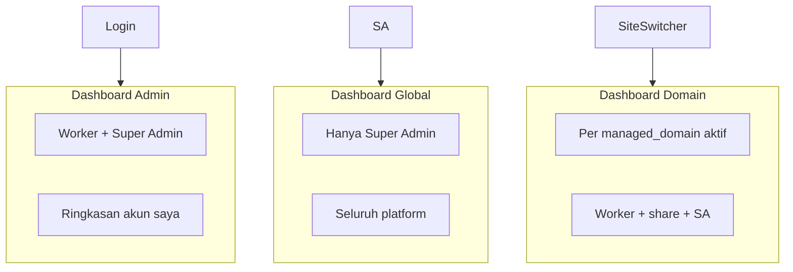

# 27 — Desain Admin Panel: UI, Navigasi, Tiga Dashboard, Responsif

> **Bukan** toko online — CMS untuk mengelola **ribuan domain portfolio**, konten, SEO, shortlink, Pixel Hub, dan infrastruktur produk.  
> Stack: [05](./05-admin-panel-htmx.md) · HTMX: [17](./17-kontrak-htmx-dan-komponen-ui.md) · RBAC: [11](./11-rbac-dan-permission-share.md) · Menu: [03](./03-menu-dan-modul-cms.md) · Pages: [15](./15-setup-cloudflare-integrasi.md)

---

## 1. Koreksi: Mengapa Sebelumnya Ada “Cart / Toko”?

| Kesalahan asumsi | Kebenaran produk |
|------------------|------------------|
| “Cart” = keranjang belanja / e-commerce | **Tidak ada** — CMS ini **bukan** untuk penjualan toko online ([01](./01-visi-dan-gambaran-sistem-cms.md) §2: e-commerce di luar fase awal) |
| Menu **Toko** (Produk, Pesanan) | **Dihapus** dari desain navigasi admin |
| “Cart” operasi bulk | Bukan istilah UI — gunakan **Operasi massal** + **Jobs** (sudah di [03](./03-menu-dan-modul-cms.md)) |

**Pixel `AddToCart`** di dokumen Meta = event iklan untuk situs **milik owner** yang memang punya toko; **bukan** modul admin Seosementara.

---

## 2. Tiga Jenis Dashboard (Wajib Dipisah)

Satu halaman “Dashboard” campur membingungkan. UI memakai **tiga konteks** berbeda:



### 2.1 Dashboard Global

| Aspek | Nilai |
|-------|--------|
| **URL** | `/admin/dashboard/global` |
| **Siapa** | **Hanya Super Admin** (`users.role = super_admin`) |
| **Scope data** | Seluruh platform — agregat semua domain, semua pekerja |
| **Isi contoh** | Total domain aktif, pekerja online, job gagal 24j, health API/Tunnel/Pages, error rate, top domain by traffic (cache) |
| **Bukan** | Konten satu domain; bukan “domain saya” saja |

Worker yang membuka URL ini → **403** + partial “Tidak berhak” (HTMX), atau redirect ke Dashboard Admin.

### 2.2 Dashboard Admin (per akun pekerja)

| Aspek | Nilai |
|-------|--------|
| **URL** | `/admin/dashboard` (default setelah login) |
| **Siapa** | **Semua admin** (worker); **Super Admin juga** melihat ini sebagai “sudut pandang akun” |
| **Scope data** | `owner_user_id = saya` OR `domain_shares` — **bukan** seluruh sistem |
| **Isi contoh** | Jumlah domain milik saya, domain dibagikan, undangan pending, post draft terbaru (lintas domain saya), job saya, notifikasi |
| **Bukan** | Statistik global seluruh pekerja (itu Dashboard Global) |

Super Admin **tidak** mengganti Dashboard Admin dengan Global secara otomatis — ada **link/tab** “Buka Dashboard Global” di sidebar grup **Platform**.

### 2.3 Dashboard Domain (per domain portfolio aktif)

| Aspek | Nilai |
|-------|--------|
| **URL** | `/admin/dashboard/domain` (wajib `X-Managed-Domain-ID` / site switcher terisi) |
| **Siapa** | User yang punya akses ke domain tersebut (owner, share, atau Super Admin) |
| **Scope data** | Satu `managed_domain_id` |
| **Isi contoh** | Post published/draft domain ini, SEO score ringkas, shortlink aktif, status Pixel domain, job terakhir domain ini, peringatan DNS |
| **Tanpa domain aktif** | Partial empty state: “Pilih domain di atas” + combobox search |

**Alur:** Login → Dashboard Admin → pilih domain di **site switcher** → opsional buka Dashboard Domain atau langsung ke Konten.

### 2.4 Ringkasan akses

| Dashboard | Super Admin | Worker (owner/share) |
|-----------|-------------|---------------------|
| Global | ✅ | ❌ |
| Admin (akun) | ✅ | ✅ |
| Domain | ✅ (semua domain) | ✅ (hanya yang berhak) |

---

## 3. Framework & Hosting UI

| Komponen | Pilihan | Catatan |
|----------|---------|---------|
| Markup dinamis | **Go `html/template`** → partial HTML | API `/api/admin/*` |
| Interaktivitas | **HTMX 2.x** | Tanpa React/Vue SPA |
| Shell statis | **Cloudflare Pages (free)** | `Frontend-admin/public/` — CSS, htmx.min.js, layout |
| API | **Tunnel** → mini CPU | Same origin `seosementara.org` |
| CSS | **Design token** + `admin.css` (~20KB) | Responsif mobile-first |
| JS opsional | Minimal (toggle sidebar) | Bukan framework UI |

**Batas Pages free:** UI = aset statis; tidak menjalankan logika bisnis di edge. Build jarang; partial dari Go.

---

## 4. Navigasi — Bersih & Berkelompok

Sidebar **maksimal 7 grup** (bukan puluhan link datar). Submenu **hanya** expand di grup yang aktif atau klik grup.

### 4.1 Struktur grup (final)

```
[Logo]  Site switcher (jika konteks domain)
─────────────────────────────────────────

▼ Ringkasan
    Dashboard Admin          → /admin/dashboard
    Dashboard Domain         → /admin/dashboard/domain  (butuh domain aktif)
    Dashboard Global         → /admin/dashboard/global  (badge SA only)

▼ Domain
    Domain saya
    Dibagikan ke saya
    Tambah domain
    Semua domain               (SA only)

▼ Konten                       (butuh domain aktif kecuali list lintas domain di Admin)
    Post
    Halaman
    Kategori & tag
    Media

▼ SEO & pertumbuhan            (domain aktif)
    Meta & schema
    Sitemap & robots
    Redirect

▼ Tools
    Shortlink                  → [19]
    Pixel Hub                  → [20] overview
    Operasi massal
    Jobs / antrian

▼ Laporan
    Statistik domain
    Aktivitas

▼ Platform                     (SA atau permission setup.*)
    Setup                      → submenu §5
    Bantuan

─────────────────────────────────────────
User · Notifikasi · Keluar
```

**Tidak ada:** Toko, Cart, Produk, Pesanan, Checkout.

### 4.2 Aturan UX navigasi

| Aturan | Implementasi |
|--------|----------------|
| Maks. 2 level | Grup → item; detail halaman = breadcrumb di `#main` |
| Domain wajib | Grup Konten/SEO disabled + tooltip jika site switcher kosong |
| SA only | Item dengan `data-require="super_admin"` — disembunyikan di template untuk worker |
| Permission domain | Item disembunyikan jika share tidak punya permission (server-side render) |
| Active state | Class `is-active` pada grup + item dari path URL |
| Mobile | Sidebar → **drawer**; overlay tap tutup |

### 4.3 Topbar (semua halaman)

| Elemen | Fungsi |
|--------|--------|
| Hamburger | Buka/tutup sidebar (mobile/tablet) |
| Site switcher | Combobox search domain — [17](./17-kontrak-htmx-dan-komponen-ui.md) §6.1 |
| Notifikasi | Badge undangan share, job selesai |
| User | Profil, sesi, keluar |

**Tidak ada** ikon keranjang belanja.

---

## 5. Setup — Submenu Lengkap (grup Platform)

Setup adalah **pusat konfigurasi sistem**, bukan satu halaman panjang. Setiap sub halaman = satu concern + HTMX partial.

**Base URL:** `/admin/setup/`

### 5.1 Peta submenu

| Submenu | Path | Siapa | Isi |
|---------|------|-------|-----|
| **Ringkasan** | `/admin/setup/backend` | SA / `setup.backend.view` | Health, versi binary, GIT_SHA, worker status |
| **RBAC** | `/admin/setup/backend/rbac` | SA | Peran, pengguna, permission sistem → [13](./13-setup-backend-dan-sistem.md) |
| **Autentikasi** | `/admin/setup/backend/auth` | SA | Session, password policy, 2FA fase 2 → [12](./12-autentikasi-dan-login-aman.md) |
| **Rate limit** | `/admin/setup/backend/ratelimit` | SA | Limit app + selaras Cloudflare |
| **Operasional** | `/admin/setup/backend/ops` | SA | DB, cache, maintenance mode |
| **Media & storage** | `/admin/setup/backend/media` | SA | Upload limit, path, R2 fase 2 |
| **API & webhook** | `/admin/setup/backend/api` | SA | Keys, Turnstile, webhook |
| **Cloudflare — Koneksi** | `/admin/setup/cloudflare/koneksi` | SA | Token, test API → [15](./15-setup-cloudflare-integrasi.md) |
| **Cloudflare — Domain & env** | `/admin/setup/cloudflare/domain` | SA | `PRIMARY_DOMAIN`, env vars |
| **Cloudflare — Tunnel** | `/admin/setup/cloudflare/tunnel` | SA | Route `/api/*` |
| **Cloudflare — Pages** | `/admin/setup/cloudflare/pages` | SA | Deploy admin + publik (free plan) |
| **Cloudflare — DNS** | `/admin/setup/cloudflare/dns` | SA | Record apex/wildcard |
| **Host & subdomain** | `/admin/setup/host` | **SA only** | Host produk `bola.`, `url.`, … → [09](./09-model-domain-host-dan-subdomain.md) |
| **Meta global produk** | `/admin/setup/meta` | SA | Default SEO apex → [14](./14-setup-meta-dan-seo.md) |
| **Notifikasi platform** | `/admin/setup/notifications` | SA | Channel email/webhook internal |

### 5.2 Layout halaman Setup (konsisten)

```
┌─────────────────────────────────────────┐
│ Setup > Cloudflare > Tunnel             │  ← breadcrumb
├──────────────┬──────────────────────────┤
│ Subnav Setup │ #main (form HTMX)        │
│ (vertikal)   │                          │
│ · Ringkasan  │                          │
│ · RBAC       │                          │
│ · Auth       │                          │
│ · …          │                          │
└──────────────┴──────────────────────────┘
```

Subnav Setup = partial tetap; `#main` swap per submenu.

---

## 6. Desain UI Responsif (Android · Tablet · Desktop)

### 6.1 Breakpoint

| Nama | Lebar | Layout |
|------|-------|--------|
| **mobile** | &lt; 640px | Sidebar drawer; tabel → kartu; topbar tetap |
| **tablet** | 640–1024px | Sidebar collapsible (ikon saja opsional) |
| **desktop** | ≥ 1024px | Sidebar tetap 240px; `#main` fluid |

CSS: mobile-first (`min-width`), tidak desktop-first.

### 6.2 Pola responsif per komponen

| Komponen | Mobile | Desktop |
|----------|--------|---------|
| Sidebar | `transform: translateX(-100%)` + `.is-open` | fixed kiri |
| Data table | `partials/data-table-cards.html` (stack) | tabel kolom |
| Form 2 kolom | 1 kolom | `grid 1fr 1fr` |
| Modal | full-screen sheet bawah | centered max 640px |
| Site switcher | full width topbar | max 320px |
| Touch target | min 44×44px | sama |

### 6.3 HTMX di layar kecil

- Hindari hover-only actions — setiap baris punya tombol ⋮ atau swipe action eksplisit
- Pagination: tombol Besar “Sebelumnya / Selanjutnya”
- `hx-push-url` tetap untuk share link di tablet/desktop

### 6.4 Aset Pages (free)

```
Frontend-admin/public/static/css/admin.css   ← token + layout responsif
Frontend-admin/public/static/js/htmx.min.js
Frontend-admin/public/static/js/admin-shell.js  ← sidebar toggle ~2KB
```

Tidak memuat library UI berat (Bootstrap penuh, MUI, dll.) — menjaga build Pages cepat.

---

## 7. Design System Ringan (perluas [17](./17-kontrak-htmx-dan-komponen-ui.md) §6)

| Token | Contoh |
|-------|--------|
| `--sidebar-w` | 240px |
| `--touch-min` | 44px |
| `--color-accent` | brand |
| `--radius` | 8px |
| `--space-*` | 4, 8, 16, 24 |

| Partial baru | Fungsi |
|--------------|--------|
| `dashboard-global.html` | Kartu metrik platform |
| `dashboard-admin.html` | Kartu akun + domain saya |
| `dashboard-domain.html` | Kartu satu domain |
| `nav-sidebar.html` | Grup + collapse + SA gate |
| `nav-setup-sub.html` | Subnav Setup vertikal |
| `empty-domain.html` | Pilih domain dulu |

---

## 8. Kontrak API Dashboard (ringkas)

| Endpoint | Partial | Role |
|----------|---------|------|
| `GET /api/admin/dashboard` | `dashboard-admin.html` | authenticated |
| `GET /api/admin/dashboard/domain` | `dashboard-domain.html` | + domain access |
| `GET /api/admin/dashboard/global` | `dashboard-global.html` | Super Admin |

Semua response: **HTML fragment**, agregat dari **cache/transient** ([03](./03-menu-dan-modul-cms.md) §2.1).

---

## 9. Perbedaan dengan Plan Lama

| Plan | Perubahan |
|------|-----------|
| [03](./03-menu-dan-modul-cms.md) §1 “Dashboard” tunggal | Pecah 3 dashboard — update silang ke [03] saat implementasi |
| [05](./05-admin-panel-htmx.md) layout | Tambah drawer mobile + 3 route dashboard |
| Asumsi Cart/Toko | **Dibatalkan** — lihat §1 dokumen ini |

---

## 10. Checklist Sebelum Implementasi UI

- [ ] Tiga route dashboard + gate RBAC
- [ ] Sidebar 7 grup tanpa Toko/Cart
- [ ] Setup subnav sesuai §5.1
- [ ] Site switcher + disable grup tanpa domain
- [ ] `admin.css` mobile-first + partial table-cards
- [ ] Shell di Cloudflare Pages; partial dari Go
- [ ] Uji di Chrome Android + iPad + desktop

---

## 11. Dokumen terkait

| Plan | Isi |
|------|-----|
| [05](./05-admin-panel-htmx.md) | HTMX admin dasar |
| [17](./17-kontrak-htmx-dan-komponen-ui.md) | Kontrak swap, header, komponen |
| [03](./03-menu-dan-modul-cms.md) | Modul menu (perlu selaraskan dashboard) |
| [11](./11-rbac-dan-permission-share.md) | Super Admin vs worker |
| [13](./13-setup-backend-dan-sistem.md) | Detail Setup backend |
| [15](./15-setup-cloudflare-integrasi.md) | Pages free + Tunnel |

**Versi:** 1.0 — desain navigasi & tiga dashboard; tanpa e-commerce (Mei 2026)
