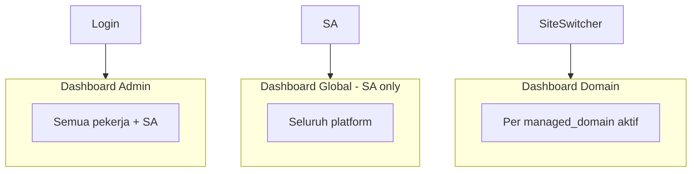

# 27 — Desain Admin Panel: UI, Navigasi, Tiga Dashboard, Responsif

> **Bukan** toko online — CMS untuk mengelola **ribuan domain portfolio** (`managed_domain`), konten, SEO per domain, plugin (shortlink, Pixel), dan **Settings** sistem.  
> Stack: [05](./05-admin-panel-htmx.md) · HTMX: [17](./17-kontrak-htmx-dan-komponen-ui.md) · RBAC: [11](./11-rbac-dan-permission-share.md) · Model domain: [09](./09-model-domain-host-dan-subdomain.md) · Pages: [15](./15-setup-cloudflare-integrasi.md)

---

## 1. Koreksi: Bukan Toko, Bukan Jobs (belum dibahas)

| Item | Status di navigasi |
|------|-------------------|
| Toko / Cart / Produk / Pesanan | **Tidak ada** — bukan model CMS ini |
| **Operasi massal** | **Belum** — tidak tampil di menu sampai ada Plan modulnya |
| **Jobs / antrian** | **Belum** — tidak tampil di menu sampai ada Plan modulnya |

**Pixel `AddToCart`** = event iklan untuk situs owner; bukan menu admin.

---

## 2. Dua “Dunia” Data (penting untuk SEO vs Settings)

| Dunia | Contoh | Dikelola di admin |
|-------|--------|-------------------|
| **Domain portfolio** (`managed_domain`) | `toko-abc.com`, ribuan domain pekerja | **Domain Panel** — drawer domain, Konten, **SEO grup §4** |
| **Domain produk / host** | `seosementara.org`, `bola.`, `url.` | **Settings** — Host, Cloudflare, meta apex ([09](./09-model-domain-host-dan-subdomain.md)) |

**SEO & pertumbuhan** di sidebar (§4) = **hanya** untuk **Domain Panel** (satu `managed_domain` aktif).  
**Bukan** untuk subdomain produk (`bola.seosementara.org`) dan **bukan** pengganti Settings meta host.

---

## 3. Tiga Jenis Dashboard (Wajib Dipisah)



### 3.1 Dashboard Global

| Aspek | Nilai |
|-------|--------|
| **URL** | `/admin/dashboard/global` |
| **Siapa** | **Hanya Super Admin** |
| **Scope** | Seluruh platform (agregat cache) |
| **Isi contoh** | Total domain, pekerja, health API/Tunnel/Pages, error rate |

Worker → **403** atau redirect ke Dashboard Admin.

### 3.2 Dashboard Admin (per akun)

| Aspek | Nilai |
|-------|--------|
| **URL** | `/admin/dashboard` (default login) |
| **Siapa** | Worker + Super Admin |
| **Scope** | Domain milik + dibagikan ke saya |
| **Isi contoh** | Jumlah domain, undangan pending, notifikasi, aktivitas terbaru akun |

### 3.3 Dashboard Domain (per `managed_domain`)

| Aspek | Nilai |
|-------|--------|
| **URL** | `/admin/dashboard/domain` |
| **Siapa** | Owner, share, atau SA |
| **Scope** | Satu domain portfolio aktif |
| **Isi contoh** | Ringkasan post, shortlink, pixel status domain, SEO ringkas |

**Alur:** Login → Dashboard Admin → site switcher → Dashboard Domain / Konten / SEO.

### 3.4 Ringkasan akses

| Dashboard | Super Admin | Worker |
|-----------|-------------|--------|
| Global | ✅ | ❌ |
| Admin | ✅ | ✅ |
| Domain | ✅ | ✅ (yang berhak) |

---

## 4. Navigasi — Bersih & Berkelompok (revisi v1.1)

Sidebar **6 grup** (+ user footer). Tanpa Operasi massal, Jobs, Toko, Tools.

### 4.1 Struktur grup (final)

```
[Logo]  Site switcher (managed_domain)
─────────────────────────────────────────

▼ Ringkasan
    Dashboard Admin
    Dashboard Domain          (butuh domain aktif)
    Dashboard Global          (SA only)

▼ Domain
    Domain saya
    Dibagikan ke saya
    Tambah domain
    Semua domain              (SA only)
    ── dari list / baris domain:
       [Drawer] Kelola domain  → §4.2

▼ Konten                      (Domain Panel — domain aktif)
    Post
    Halaman
    Kategori & tag
    Media

▼ SEO & pertumbuhan           (Domain Panel SAJA — §2)
    Meta & schema per domain
    Sitemap & robots
    Redirect manager
    (konten per-post → di editor Konten)

▼ Plugins
    Shortlink                 → [19]
    Pixel Hub                 → [20]

▼ Laporan                     (opsional fase berikutnya)
    Statistik domain
    Aktivitas

▼ Settings                    (sistem — Read / Edit / Write)
    → submenu §5

─────────────────────────────────────────
Notifikasi · User · Keluar
```

### 4.2 Domain drawer — Edit & kelola satu domain

Dari **daftar Domain** (saya / dibagikan / semua), setiap baris punya aksi **Kelola** → membuka **drawer kanan** (mobile: full sheet), bukan halaman terpisah untuk metadata ringan.

**Container:** `#domain-drawer` · `hx-get="/api/admin/domains/{id}/drawer"`

| Tab / section drawer | Fungsi | Permission |
|----------------------|--------|------------|
| **Edit domain** | Nama tampilan, hostname, status aktif, catatan operasi | Owner / co-admin sesuai share |
| **Edit tema domain** | Template/tema situs portfolio, preset layout, warna/logo domain | `domain.settings` atau owner |
| **Edit kepemilikan** | Owner saat ini; **transfer** (aksi SA) | Owner lihat; transfer **SA** [09](./09-model-domain-host-dan-subdomain.md) |
| **Pembagian** | Share, preset read/edit/co-admin, checklist [11](./11-rbac-dan-permission-share.md) | Owner / co-admin |
| **Edit SEO per domain** | Default title/description, robots default, schema situs | `seo.edit` pada domain |

Drawer **bukan** tempat CRUD post — post tetap di grup **Konten**.

```html
<!-- contoh trigger dari tabel domain -->
<button hx-get="/api/admin/domains/{{.ID}}/drawer"
        hx-target="#domain-drawer"
        hx-swap="innerHTML">
  Kelola
</button>
<aside id="domain-drawer" class="drawer" aria-label="Panel domain"></aside>
```

### 4.3 SEO & pertumbuhan — scope ketat

| Termasuk | Tidak termasuk |
|----------|----------------|
| SEO default **managed_domain** aktif | Meta **host** `seosementara.org` → **Settings → Meta** |
| Sitemap/robots **domain portfolio** | SEO subdomain `bola.` / `url.` → **Settings → Host** |
| Redirect **domain portfolio** | SEO halaman produk apex |

Grup sidebar **SEO** disabled jika site switcher kosong (sama seperti Konten).

### 4.4 Plugins (bukan Tools)

| Plugin | Path admin | Catatan |
|--------|------------|---------|
| Shortlink | `/admin/plugins/shortlink` | [19](./19-modul-url-shortlink.md) |
| Pixel Hub | `/admin/plugins/pixel` | [20](./20-pixel-admin-facebook-tiktok-gads.md) |

Plugin lain nanti (komentar, review, …) masuk grup **Plugins** setelah ada Plan modul — **tanpa** mengubah nama grup.

### 4.5 Settings (bukan Setup / Platform)

**Settings** = satu tempat **Read · Edit · Write** konfigurasi backend & infrastruktur produk. Istilah UI konsisten: form = Write, detail = Read, daftar = Read.

**Base URL:** `/admin/settings/` (ganti path lama `/admin/setup/` di implementasi).

| Hak | Siapa |
|-----|-------|
| Lihat Settings | Super Admin atau role dengan `settings.*` / `setup.*` (alias migrasi) |
| Ubah | `settings.edit` / Super Admin |

### 4.6 Aturan UX navigasi

| Aturan | Implementasi |
|--------|----------------|
| Maks. 2 level sidebar | Grup → item; drawer = panel ketiga untuk domain |
| Domain Panel | Konten + SEO butuh `managed_domain_id` aktif |
| SA only | Semua domain, Dashboard Global, transfer kepemilikan |
| Mobile | Sidebar drawer + domain drawer full width |
| Active state | Path + grup terbuka |

### 4.7 Topbar

| Elemen | Fungsi |
|--------|--------|
| Hamburger | Sidebar |
| Site switcher | Cari & pilih **managed_domain** |
| Notifikasi | Undangan share, dll. |
| User | Profil, keluar |

---

## 5. Settings — Submenu Lengkap (Read / Edit / Write)

### 5.1 Peta submenu

| Submenu | Path | Operasi | Isi |
|---------|------|---------|-----|
| **Ringkasan sistem** | `/admin/settings/backend` | Read | Health, versi, GIT_SHA → [13](./13-setup-backend-dan-sistem.md) |
| **RBAC** | `/admin/settings/backend/rbac` | R/W | Peran, pengguna admin |
| **Autentikasi** | `/admin/settings/backend/auth` | R/W | Session, password → [12](./12-autentikasi-dan-login-aman.md) |
| **Rate limit** | `/admin/settings/backend/ratelimit` | R/W | App + selaras CF |
| **Operasional** | `/admin/settings/backend/ops` | R/W | DB, cache, maintenance |
| **Media & storage** | `/admin/settings/backend/media` | R/W | Limit upload, path |
| **API & webhook** | `/admin/settings/backend/api` | R/W | Keys, Turnstile |
| **Cloudflare — Koneksi** | `/admin/settings/cloudflare/koneksi` | R/W | Token, test → [15](./15-setup-cloudflare-integrasi.md) |
| **Cloudflare — Domain & env** | `/admin/settings/cloudflare/domain` | R/W | Env vars apex |
| **Cloudflare — Tunnel** | `/admin/settings/cloudflare/tunnel` | R/W | Route `/api/*` |
| **Cloudflare — Pages** | `/admin/settings/cloudflare/pages` | R/W | Deploy UI (free plan) |
| **Cloudflare — DNS** | `/admin/settings/cloudflare/dns` | R/W | Record zone produk |
| **Host & subdomain produk** | `/admin/settings/host` | R/W | **SA** — `bola.`, `url.` (bukan portfolio) |
| **Meta global produk** | `/admin/settings/meta` | R/W | SEO apex `seosementara.org` |
| **Notifikasi platform** | `/admin/settings/notifications` | R/W | Channel internal |

**Redirect migrasi:** `/admin/setup/*` → `/admin/settings/*` (301 atau HTMX alias).

### 5.2 Layout Settings

```
┌─────────────────────────────────────────┐
│ Settings > Cloudflare > Tunnel          │
├──────────────┬──────────────────────────┤
│ Subnav       │ #main (form HTMX)        │
│ Settings     │ Read / Edit / Write      │
└──────────────┴──────────────────────────┘
```

Partial: `nav-settings-sub.html` (vertikal, sticky di desktop).

---

## 6. Framework & Hosting UI

| Komponen | Pilihan |
|----------|---------|
| Interaktivitas | **HTMX 2.x** |
| Partial | **Go templates** → `/api/admin/*` |
| Shell | **Cloudflare Pages (free)** — CSS, htmx, layout |
| API | **Tunnel** → Go · same origin |

---

## 7. Desain Responsif (Android · Tablet · Desktop)

| Breakpoint | Perilaku |
|------------|----------|
| &lt; 640px | Sidebar drawer; **domain drawer** full screen; tabel → kartu |
| 640–1024px | Sidebar collapse opsional |
| ≥ 1024px | Sidebar 240px; domain drawer ~400px kanan |

Touch target min. **44px**. Form 1 kolom di mobile.

---

## 8. Partial & komponen baru

| Partial | Fungsi |
|---------|--------|
| `domain-drawer.html` | Tab: domain, tema, kepemilikan, pembagian, SEO |
| `nav-sidebar.html` | 6 grup §4.1 |
| `nav-settings-sub.html` | Subnav Settings |
| `nav-plugins.html` | Entri shortlink + pixel (jika subnav perlu) |
| `dashboard-*.html` | Tiga dashboard |

---

## 9. Kontrak API (ringkas)

| Endpoint | Partial |
|----------|---------|
| `GET /api/admin/dashboard` | `dashboard-admin.html` |
| `GET /api/admin/dashboard/domain` | `dashboard-domain.html` |
| `GET /api/admin/dashboard/global` | `dashboard-global.html` |
| `GET /api/admin/domains/{id}/drawer` | `domain-drawer.html` |
| `GET/POST /api/admin/settings/...` | Form Settings (R/W) |

---

## 10. Perbedaan dengan revisi sebelumnya

| Sebelum (v1.0) | Sekarang (v1.1) |
|----------------|-----------------|
| Tools + operasi massal + jobs | **Plugins** — shortlink + Pixel saja |
| Setup / Platform | **Settings** — `/admin/settings/` |
| SEO ambigu | **Hanya Domain Panel** (`managed_domain`) |
| Domain hanya list | List + **drawer** kelola domain/tema/share/SEO |
| Operasi massal di menu | **Dihapus** sampai ada Plan |

---

## 11. Checklist implementasi

- [ ] Nav 6 grup §4.1 — tanpa jobs/operasi massal
- [ ] `#domain-drawer` + 5 section §4.2
- [ ] SEO grup gate `managed_domain_id`
- [ ] Path `/admin/settings/*` + redirect dari `/admin/setup/*`
- [ ] Plugins: `/admin/plugins/shortlink`, `/admin/plugins/pixel`
- [ ] Pisah copy UI: “domain portfolio” vs “host produk”
- [ ] Responsif + uji Android

---

## 12. Dokumen terkait

| Plan | Isi |
|------|-----|
| [03](./03-menu-dan-modul-cms.md) | Menu modul (selaraskan) |
| [05](./05-admin-panel-htmx.md) | HTMX admin |
| [09](./09-model-domain-host-dan-subdomain.md) | Portfolio vs host produk |
| [11](./11-rbac-dan-permission-share.md) | Drawer pembagian |
| [13](./13-setup-backend-dan-sistem.md) | Isi Settings backend |
| [14](./14-setup-meta-dan-seo.md) | Meta: domain vs host vs halaman |
| [15](./15-setup-cloudflare-integrasi.md) | CF di Settings |

**Versi:** 1.1 — Plugins, Settings, domain drawer, SEO domain-panel only, tanpa jobs (Mei 2026)
