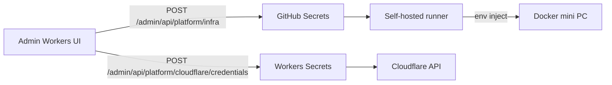

# 28 — Platform: GitHub + Workers + Docker inject (tanpa `.env`)

> **Status:** Implementasi aktif (2026-05). Menggantikan alur manual `.env` di mini PC.  
> Terkait: [15-setup-cloudflare](./15-setup-cloudflare-integrasi.md), [16-deploy](./16-deploy-dan-lingkungan.md), [mini-pc/DEPLOY.md](../mini-pc/DEPLOY.md)

## 1. Prinsip

| # | Prinsip |
|---|---------|
| 1 | **GitHub** = pusat kode, image GHCR, secrets infra |
| 2 | **Tidak ada `.env`** di mini PC production |
| 3 | **Admin Workers URL** = titik setup operator |
| 4 | **Cloudflare Global API Key** → **Workers Secrets** |
| 5 | **DB + MASTER_ENCRYPTION_KEY** → **GitHub Secrets** → runner inject Docker |

## 2. Alur

## 3. Endpoint Worker (platform API)

| Method | Path | Fungsi |
|--------|------|--------|
| GET | `/admin/api/platform/setup/status` | Status bootstrap |
| POST | `/admin/api/platform/infra` | Tulis GitHub Secrets + trigger Deploy Mini PC |
| POST | `/admin/api/platform/cloudflare/credentials` | Simpan ke Workers Secrets via CF API |

## 4. Bootstrap sekali

1. Pasang self-hosted runner di mini PC  
2. GitHub Environment `production`: `GITHUB_SETUP_TOKEN`, cred Wrangler deploy  
3. Deploy Workers (`deploy-admin.yml`)  
4. Admin → Infra & GitHub → isi DB + encryption key  
5. Admin → Cloudflare Koneksi → Global API Key  

## 5. Yang tetap di PostgreSQL (bukan `.env`)

Domain env, tunnel routes, Pages metadata — lewat Go API setelah API hidup ([15](./15-setup-cloudflare-integrasi.md)).

## 6. Deprecation

| Dihapus | Pengganti |
|---------|-----------|
| `mini-pc/env.example`, `.env` di disk | GitHub Secrets + admin Infra |
| `scripts/bootstrap-cloudflare.ps1` | Admin Cloudflare + Workers Secrets |
| `scripts/mini-pc-remote-deploy.ps1` (versi .env) | `scripts/mini-pc-deploy.ps1` |
| Credential CF di `.env` mini PC | Workers Secrets |
