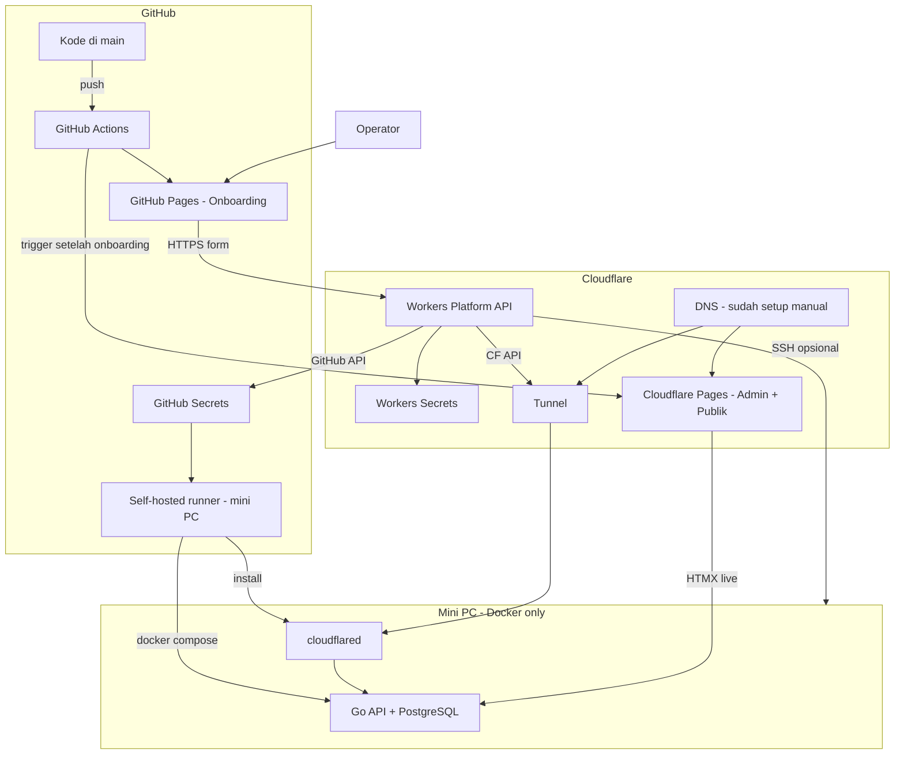

# 28 — Platform Bootstrap: GitHub Pages Onboarding + Cloudflare + Mini PC

> **Status:** Keputusan arsitektur final (Mei 2026).  
> **Prasyarat UI:** [29-frontend-admin-dan-onboarding.md](./29-frontend-admin-dan-onboarding.md)  
> Terkait: [15-setup-cloudflare-integrasi.md](./15-setup-cloudflare-integrasi.md), [16-deploy-dan-lingkungan.md](./16-deploy-dan-lingkungan.md)

---

## 1. Prinsip Platform

| # | Prinsip |
|---|---------|
| 1 | **GitHub** = pusat kode; deploy otomatis via Actions — **tanpa** menjalankan UI di laptop lokal |
| 2 | **Onboarding** = **GitHub Pages** saja (setup infra pertama kali) |
| 3 | **Admin CMS** = **Cloudflare Pages** (operasional sehari-hari) |
| 4 | **Mini PC = Docker saja** — tidak ada source code / `.env` di disk |
| 5 | **Secrets** = GitHub Secrets (DB, encryption) + Workers Secrets (Cloudflare API) |
| 6 | **DNS domain produk** sudah di Cloudflare Dashboard — onboarding **verifikasi**, bukan wizard DNS penuh |
| 7 | Operator **tidak** wajib buka dashboard Cloudflare / SSH manual setelah onboarding |

---

## 2. Pemisahan UI (Wajib)

| Aplikasi | Hosting | Folder repo | URL contoh | Fungsi |
|----------|---------|-------------|------------|--------|
| **Onboarding** | **GitHub Pages** | `Frontend-Onboarding/public/` | `https://<org>.github.io/Seosementara/` | Setup pertama: CF API, SSH mini PC, runner, tunnel, deploy |
| **Admin CMS** | **Cloudflare Pages** | `Frontend-Ui-Admin/public/` | `https://seosementara.org/admin/` | Kelola domain, konten, SEO, Settings |
| **Frontend publik** | **Cloudflare Pages** | `Frontend-Publik/public/` | `https://seosementara.org/` | UI pengunjung + subdomain |

**Bukan lagi:** onboarding di dalam `Frontend-Ui-Admin` / Cloudflare Pages admin.

---

## 3. Diagram Bootstrap Pertama Kali

---

## 4. Urutan Bootstrap (Tanpa Localhost)

| # | Langkah | Siapa eksekusi | Keterangan |
|---|---------|----------------|------------|
| 0 | Push repo ke GitHub | Developer | Onboarding otomatis online di GitHub Pages |
| 1 | Deploy **Workers Platform API** | GitHub Actions (sekali) | Butuh CF token minimal di GitHub Secrets **atau** langkah 2 isi token |
| 2 | Buka **GitHub Pages onboarding** | Operator | Isi Global API Key / Token, Account ID, Zone ID |
| 3 | Verifikasi domain & zone | Workers → CF API | DNS sudah ada di dashboard CF |
| 4 | Koneksi mini PC | Form: IP, port, user, password/key | Workers/API jalankan test SSH + perintah setup |
| 5 | Register GitHub runner | Workers → GitHub API + SSH | Runner di mini PC |
| 6 | Install cloudflared + buat Tunnel | Workers → CF API + SSH | Routes: `/api/*`, wildcard subdomain |
| 7 | Simpan DB password + encryption key | Workers → GitHub Secrets | Inject ke Docker Postgres |
| 8 | Deploy backend Docker | GitHub Actions via runner | Image GHCR |
| 9 | Deploy Admin + Publik ke CF Pages | GitHub Actions (trigger onboarding) | `Frontend-Ui-Admin`, `Frontend-Publik` |
| 10 | Redirect operator | Onboarding → URL admin CF Pages | Bootstrap selesai |

**Tidak ada** langkah `npx serve` atau dev lokal untuk onboarding produksi.

---

## 5. Workers Platform API

Base path (edge): `/admin/api/platform/*`

| Method | Path | Fungsi |
|--------|------|--------|
| GET | `/setup/status` | Status: CF, runner, tunnel, DB, deploy admin |
| POST | `/cloudflare/credentials` | Simpan API Key/Token → Workers Secrets |
| POST | `/cloudflare/credentials/test` | Validasi + auto-fill Account/Zone |
| POST | `/cloudflare/tunnel/create` | Buat tunnel + routes via CF API |
| POST | `/cloudflare/tunnel/install` | SSH: install/restart cloudflared |
| POST | `/github/pat` | Simpan PAT → GitHub Environment |
| POST | `/github/runner/register` | Daftar self-hosted runner |
| POST | `/infra/database` | DB password, encryption key → GitHub Secrets |
| POST | `/infra/ssh/test` | Test koneksi SSH mini PC |
| POST | `/infra/ssh/exec` | Jalankan script setup terbatas (hardening wajib) |
| POST | `/deploy/admin-pages` | Trigger workflow deploy CF Pages admin |
| POST | `/deploy/public-pages` | Trigger workflow deploy CF Pages publik |
| POST | `/deploy/backend` | Trigger workflow Docker backend |

Onboarding UI (GitHub Pages) memanggil endpoint di atas — **bukan** `/api/admin/*` Go (belum ada saat first boot).

---

## 6. Onboarding — Langkah Form (GitHub Pages)

| Step | Judul | Field utama |
|------|-------|-------------|
| 1 | Cloudflare | Global API Key atau API Token, Account ID, Zone ID, domain utama |
| 2 | Verifikasi domain | Status zone + DNS (read-only) |
| 3 | Mini PC | IP, port SSH, username, password / private key |
| 4 | GitHub | PAT (repo scope), konfirmasi runner |
| 5 | Tunnel | Nama tunnel, preview routes, tombol Apply |
| 6 | Database | Password PostgreSQL, master encryption key |
| 7 | Deploy | Trigger backend + CF Pages; progress |
| 8 | Selesai | Link ke admin Cloudflare Pages |

Setelah selesai: flag `bootstrap_complete` di Workers KV / GitHub repo variable.

---

## 7. Admin CMS (Cloudflare Pages) — Setelah Bootstrap

| Perilaku | Detail |
|----------|--------|
| Login | `/admin/login` → session via Go API (Tunnel) |
| Bootstrap | **Tidak ada** wizard penuh — hanya banner jika setup belum selesai + link ke GitHub Pages onboarding |
| Settings | Cloudflare, Host, RBAC — **kelola ulang** infra (bukan first boot) |
| Path UI | `/admin/settings/*` ([27](./27-admin-panel-desain-ui-navigasi.md)) |

---

## 8. GitHub Actions (Wajib)

| Workflow | Trigger | Output |
|----------|---------|--------|
| `deploy-github-pages-onboarding.yml` | Push `main` (path `Frontend-Onboarding/**`) | GitHub Pages onboarding |
| `deploy-cloudflare-admin.yml` | `workflow_dispatch` atau `repository_dispatch` dari Workers | CF Pages admin |
| `deploy-cloudflare-public.yml` | sama | CF Pages publik |
| `deploy-backend.yml` | sama | Build GHCR + deploy via runner |
| `deploy-workers-platform.yml` | Push / manual | Workers Platform API |

GitHub Pages onboarding **tidak butuh** Cloudflare secret untuk dirinya sendiri (hanya `GITHUB_TOKEN` bawaan).

---

## 9. Mini PC — Isi Disk

| Ada | Tidak ada |
|-----|-----------|
| Docker + container (API, Postgres, worker) | Folder repo Git |
| cloudflared | File `.env` |
| Self-hosted runner agent | Source code / zip deploy manual |
| Volume data Postgres & media | Binary Go hasil build lokal di disk permanen |

Secrets inject saat `docker compose up` dari GitHub Secrets via runner.

---

## 10. SSH dari Onboarding

Browser **tidak** SSH langsung. Alur:

1. Form onboarding (GitHub Pages) → POST Workers Platform API  
2. Workers (atau microservice backend bootstrap) → SSH ke mini PC  
3. Eksekusi: install runner, cloudflared, pull image  

**Keamanan:** password/key tidak disimpan di HTML; encrypt di Workers; rotasi setelah setup; prefer API Token scoped vs Global API Key.

---

## 11. Cloudflare — Asumsi DNS

| Sudah manual (dashboard CF) | Dikerjakan onboarding via API |
|---------------------------|-------------------------------|
| Zone domain produk | Verifikasi zone |
| Record apex / wildcard | Buat/update **Tunnel** hostname routes |
| Proxy orange cloud | Connector status |

Onboarding **tidak** menggantikan seluruh DNS management — hanya tunnel + Pages custom domain jika perlu.

---

## 12. Yang Dihapus / Tidak Dipakai

| Dihapus | Pengganti |
|---------|-----------|
| `.env` / `mini-pc/env.example` di disk | GitHub Secrets + Workers Secrets |
| Onboarding di `/admin/bootstrap.html` (CF Pages) | `Frontend-Onboarding/` → GitHub Pages |
| Deploy binary ke `/opt/seosementara/bin/` | Docker GHCR |
| Preview wajib via `localhost` / `npx serve` | GitHub Pages + CF Pages dari CI |
| `scripts/bootstrap-cloudflare.ps1` | Onboarding UI + Workers API |
| Referensi `mini-pc/DEPLOY.md` | Dokumen ini + [16](./16-deploy-dan-lingkungan.md) |

---

## 13. Dokumen Terkait

| Plan | Isi |
|------|-----|
| [29](./29-frontend-admin-dan-onboarding.md) | Folder & konfig frontend |
| [15](./15-setup-cloudflare-integrasi.md) | Settings Cloudflare (post-bootstrap) |
| [16](./16-deploy-dan-lingkungan.md) | CI/CD & rollback |
| [27](./27-admin-panel-desain-ui-navigasi.md) | Navigasi admin CF Pages |

**Versi:** 2.0 — Mei 2026
