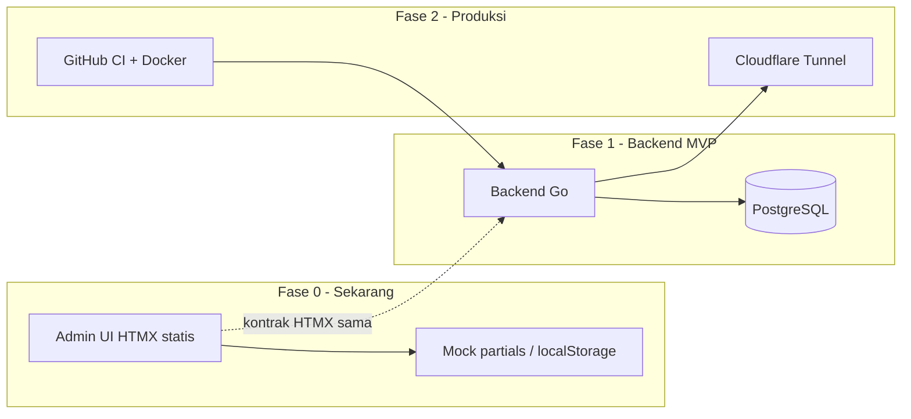
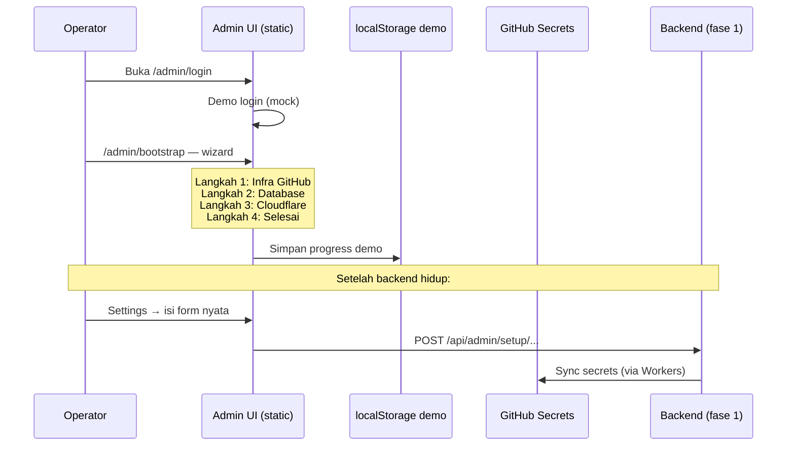

# 29 — Bootstrap Pertama Kali: Admin UI Tanpa Backend

> **Status:** Fase implementasi aktif (Mei 2026).  
> **Prasyarat:** [28-platform-github-workers.md](./28-platform-github-workers.md), [27-admin-panel-desain-ui-navigasi.md](./27-admin-panel-desain-ui-navigasi.md), [17-kontrak-htmx-dan-komponen-ui.md](./17-kontrak-htmx-dan-komponen-ui.md)

---

## 1. Kondisi Awal Sistem (First Boot)

Saat pertama kali di-deploy, sistem **belum siap operasional**. Kondisi wajib dipahami:

| # | Kondisi | Artinya |
|---|---------|---------|
| 1 | **Belum ada database** | PostgreSQL kosong / belum di-provision; tidak ada `users`, `managed_domains`, settings |
| 2 | **Tidak boleh `.env` di disk** | Mini PC production: secrets via GitHub Secrets + inject Docker ([28](./28-platform-github-workers.md)) |
| 3 | **Belum terhubung Cloudflare Tunnel** | API belum reachable dari internet; `cloudflared` belum running |

**Konsekuensi:** Admin panel **tidak bisa** bergantung pada backend Go atau API `/api/admin/*` pada fase ini.

---

## 2. Strategi: Admin UI Dulu (UI-First Bootstrap)



| Urutan | Deliverable | Folder |
|--------|-------------|--------|
| **1 (sekarang)** | Admin UI lengkap, mobile-friendly, mock data | `Frontend-Ui-Admin/` |
| 2 | Backend Go + migrasi DB | `Backend/` |
| 3 | Hubungkan HTMX → API nyata | ganti mock → `/api/admin/*` |
| 4 | Tunnel + bootstrap infra dari Settings | [15](./15-setup-cloudflare-integrasi.md) |

**Prinsip:** Semua konfigurasi sistem (DB, Cloudflare, secrets) **nantinya** diisi dari **Settings** di admin panel — bukan file `.env` manual. UI fase 0 sudah menyiapkan halaman-halaman itu dengan data demo.

---

## 3. Apa yang Dibangun di Fase 0

### 3.1 Admin UI HTMX (tanpa Golang)

| Item | Detail |
|------|--------|
| Stack | HTML5 + HTMX 2.x + CSS + JS ringan |
| Hosting | Cloudflare Pages (static) — **tanpa** butuh Tunnel untuk preview UI |
| Data | Mock static partials di `/mock-api/` + `localStorage` untuk demo state |
| Backend | **Tidak ada** — semua `hx-get` mengarah ke file HTML statis |

### 3.2 Halaman wajib (selaras Plan/27)

| Grup | Halaman |
|------|---------|
| Auth | Login |
| Bootstrap | Wizard setup pertama kali (DB, infra, Cloudflare) |
| Ringkasan | Dashboard Admin, Domain, Global |
| Domain | List, tab milik/dibagikan/tambah |
| Konten | Post, Halaman, Kategori & tag, Media |
| SEO | Meta & schema, Sitemap, Redirect |
| Plugins | Shortlink, Pixel Hub |
| Settings | Backend, RBAC, Auth, Rate limit, Ops, Cloudflare (5 submenu), Host, Meta global, Notifikasi |

### 3.3 Pola UI (Plan/17 + Plan/27)

- Sidebar gelap, area `#main` terang
- **`#app-drawer`** universal untuk Edit/Create
- Responsif: sidebar drawer di mobile, `#app-drawer` full width
- Touch target min. 44px

---

## 4. Alur Bootstrap Operator (First Time)

Operator baru membuka sistem **tanpa DB dan tanpa Tunnel**:



### Langkah wizard bootstrap (`/admin/bootstrap.html`)

| Step | Judul | Isi form (nanti → API) |
|------|-------|------------------------|
| 1 | Infra & GitHub | GitHub PAT, environment production |
| 2 | Database | Host DB, password, encryption key → GitHub Secrets |
| 3 | Cloudflare | API Token, Account ID, domain utama |
| 4 | Tunnel | Perintah install cloudflared (read-only sampai BE ada) |
| 5 | Selesai | Ringkasan + link ke Settings |

**Fase 0:** form  submit menampilkan toast *"Tersimpan lokal (demo) — backend belum aktif"*.

**Fase 1+:** form submit ke `POST /api/admin/platform/bootstrap` ([28](./28-platform-github-workers.md)).

---

## 5. Mock API vs API Nyata

| Aspek | Fase 0 (mock) | Fase 1+ (backend) |
|-------|---------------|-------------------|
| URL | `/mock-api/admin/.../*.html` | `/api/admin/...` |
| Response | File HTML statis | Go `html/template` |
| Auth | Skip / demo user | Session cookie |
| Simpan form | localStorage + toast | PostgreSQL |
| Konfigurasi | Demo | `system_settings` + encrypted tables |

**Migrasi:** Ganti base path di satu config JS:

```javascript
// assets/js/config.js
window.SSEO_API_MODE = 'mock'; // 'mock' | 'live'
window.SSEO_API_BASE = window.SSEO_API_MODE === 'mock' ? '/mock-api' : '';
```

---

## 6. Larangan Fase 0

| Larangan | Alasan |
|----------|--------|
| Kode Golang / Backend | User request: UI dulu |
| File `.env` di repo atau mini PC | [28](./28-platform-github-workers.md) |
| Asumsi DB sudah ada | Bootstrap wizard handles empty state |
| Hardcode secret di HTML | Form kosong + placeholder; demo pakai localStorage |

---

## 7. Deploy UI Saja (Tanpa Tunnel)

| Target | Cara |
|--------|------|
| Preview lokal | `npx serve Frontend-Ui-Admin/public -p 3000` |
| Cloudflare Pages | Project `seosementara-admin`; root `Frontend-Ui-Admin/public` |
| URL | `https://xxx.pages.dev/admin/login.html` |

Backend dan Tunnel **tidak wajib** untuk preview UI fase 0.

---

## 8. Checklist Fase 0

- [x] Dokumen bootstrap (file ini)
- [ ] Admin UI: layout + CSS mobile-friendly
- [ ] Semua halaman Plan/27 (mock data)
- [ ] Drawer universal `#app-drawer`
- [ ] Wizard `/admin/bootstrap.html`
- [ ] Mock partials `/mock-api/`
- [ ] README `Frontend-Ui-Admin/README.md`
- [ ] Backend Go — **fase berikutnya**

---

## 9. Dokumen Terkait

| Plan | Isi |
|------|-----|
| [27](./27-admin-panel-desain-ui-navigasi.md) | Navigasi & drawer |
| [17](./17-kontrak-htmx-dan-komponen-ui.md) | Kontrak HTMX (target fase 1) |
| [28](./28-platform-github-workers.md) | Secrets tanpa `.env` |
| [08](./08-roadmap-implementasi.md) | Roadmap — sesuaikan fase 0 |

**Versi:** 1.0 — Mei 2026
